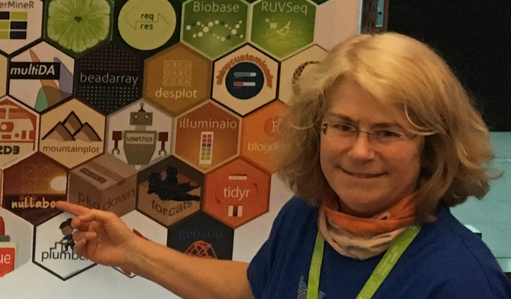
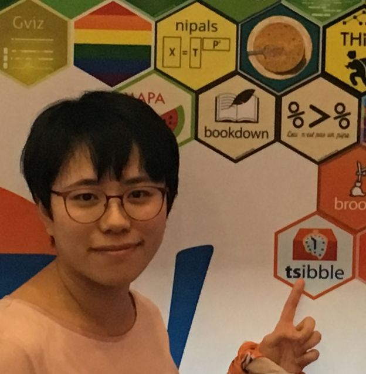
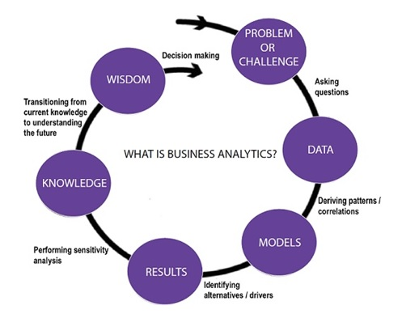
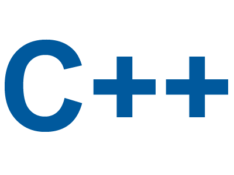

```{r setup, include=FALSE}
library(knitr)
knitr::opts_chunk$set(tidy = FALSE, 
                      message = FALSE,
                      warning = FALSE,
                      echo = FALSE)
options(htmltools.dir.version = FALSE)
```


class: split-three 
.column[.split-33[
.pad10px[
# Who are we?
]
]]
.column[.split-50[
.row[

<br>
Di Cook <br> *Chief examiner*
]
.row[

<br>
Earo Wang <br> *Teaching Associate*
]
]]
.column[.split-50[
.row[

<br>
Cameron Roach <br> *Teaching Associate* 
]
.row[

<br>
Zina Quryakos <br> *Teaching Associate*
]
]]

<!--
Colour scheme: green #3F9F7A 63, 159, 122
              orange #CA6627 202, 102, 39
-->

---
# Textbook

James, Witten, Hastie and Tibshirani (2012) An Introduction to Statistical Learning. Springer.

[http://www.statlearning.com](http://www.statlearning.com)

- Free pdf online
- Data sets in associated R package *ISLR*
- R code for examples

---
# Semester outline

- Week 1: Introduction to statistical learning, Chapter 2
- Week 2: Linear regression, Chapter 3
- Week 3: Resampling, Chapter 5
- Week 4: Dimension reduction, Chapter 10.2 + instructor's notes
- Week 5: Visualisation, Instructor's notes
- Week 6: Classification,  Chapters 8, 7
- Week 7: Classification, Chapter 9
- Week 8: Ensembles and boosted models, Chapter 8.2
- Week 9: Regularization methods, Chapter 6
- Week 10: Model assessment, Instructor's notes
- Week 11: Clustering, Chapter 10
- Week 12: Project presentations

---
# Assessment

- Final exam 60%
- Four assignments, 4% each (due weeks 3, 5, 7, 9)
- Tutorial quizzes (10) 4% total (start of each tutorial)
- Project 20% (due week 12)

---
# Communication

- Website: https://monba.dicook.org
    - Lecture notes
    - Assignments
    - Data
- Moodle
    - Marks
    - Discussion board, questions
    - Assignment turn in
    
    
---
# What is business analytics?

.blue[Business analytics] is the scientific process of learning from data, transforming data into insight for making better decisions

- .orange[Broader] than .blue[business intelligence] which focuses on describing and predicting performance.
- .orange[Broader] than .blue[econometrics] which typically starts from theory (hypotheses or models), and analysts assess if the data supports or refutes.
- .orange[Narrower] than .blue[data science] as we are primarily focusing on business problems.

---

<video src="videos/rob.mp4" style="width: 100%" controls />

---
class: split-40

.column[.pad10x[
# Flavours of 

.img-fill[]
]]
.column[.padtop50px[

- Financial Analytics
- Human Resource Analytics	
- Marketing Analytics
- Health Care Analytics
- Supply Chain Analytics
- Analytics for Government and Nonprofits
- Sport Analytics
- Web Analytics
]]
---
class: split-three
.column[.pad10x[
# Related fields

How these other disciplines relate to business analytics

*.blue[These are my sound bites, to create some distinction but in practice there is a lot of overlap between activities]*

]]

.column[.split-50[
.row[
.font1[*.blue[Statistics] measuring, controlling, and communicating uncertainty, typically with probabilistic models and antecedent hypotheses*
]]
.row[
.font1[*.blue[Data science] what can the data tell us: cleaning, validation, transformation, visualisation, models, related to exploratory data analysis*
]]
]]


.column[.split-50[
.row[
.font1[*.blue[Machine learning] construction and study of predictive algorithms that improve automatically through experience*
]]
.row[
.font1[*.blue[Data mining] algorithms for discovering patterns in data, including data storage and access, focused more on prediction*
]]
]]


---
# Top jobs

Annual job ratings can be found here 

https://www.careercast.com/jobs-rated/2018-jobs-rated-report

---
class: split-40
.column[.padtop50px[
# Skills needed
]]
.column[

]

---


<video src="videos/obama-datascience.mp4" style="width: 100%" controls />

---
# Thinking out loud

.font1[
*What sort of personality makes for an effective data scientist? Definitely curiosity…. The biggest question in data science is ‘Why?’ Why is this happening? If you notice that there’s a pattern, ask, “Why?” Is there something wrong with the data or is this an actual pattern going on? Can we conclude anything from this pattern? A natural curiosity will definitely give you a good foundation.*
.font_small[.orange[-- Carla Gentry, Data Scientist at Talent Analytics]]

*[Data scientists are] able to think of ways to use data to solve problems that otherwise would have been unsolved, or solved using only intuition.*
.font_small[.orange[-- Peter Skomoroch, Former Principal Data Scientist at LinkedIn]]
]

---
# Thinking out loud

.font1[
*Always ask yourself how the data can be used to positively impact the lives around you, and use that to guide your design and development.*
.font_small[.orange[-- hanjiXiong, Chief Scientist at Experian’s Global DataLab]]

*Data analysts who don’t organize their transformation pipelines often end up not being able to repeat their analyses, so the advice I would give to myself is the same advice often given to traditional scientists: make your experiments repeatable!*
.font_small[.orange[-- Mike Driscoll, Founder & CEO at Metamarkets]]

.footnote[.font_tiny[.blue[All quotes come from https://www.kdnuggets.com/2017/05/42-essential-quotes-data-science-thought-leaders.html/2 which has the links to original sources.]]]
]
---
class: split-40
.column[.padtop50px[
# The business analytics process
]]

.column[



.footnote[.font_tiny[Source: http://www.stern.nyu.edu/programs-admissions/executive-education/short-courses/schedule/short-course-program-7]]
]

---
# Learning objectives for this class

- .blue[Select and develop] appropriate models for regression, classification or clustering 
- .blue[Estimate and simulate] from a variety of statistical models, and measure the uncertainty of a prediction using resampling methods
-  Manage large data sets in a modern software environment, and .blue[explain and interpret] the analyses undertaken clearly and effectively
- .blue[Apply] business analytic tools to produce innovative solutions in finance, marketing, economics and related areas

.blue[Teaching and learning approach: Two 1-hour lectures and a one 1.5 hour lab class each week for 12 weeks.]

---
class: split-60

.column[.padtop50px[
# Programming languages




]]
.column[.padtop50px[
# Languages used in this class


]]

---
class: split-50
.column[.padtop50px[
# After this course


.blue[**ETC3555 - Statistical Machine Learning**]

.font_small[This unit covers the methods and practice of statistical machine learning for modern data analysis problems. Topics covered will include recommender systems, social networks, text mining, matrix decomposition and completion, and sparse multivariate methods. All computing will be conducted using the R programming language.

Prerequisites: ETC3250 or FIT3154]
]]
.column[.padtop50px[
.blue[**ETC5550 - Advanced Statistical Modelling**] 

.font_small[This unit introduces extensions of linear regression models for handling a wide variety of data analysis problems. Three extensions will be considered: generalised linear models for handling counts and binary data; mixed-effect models for handling data with a grouped or hierarchical structure; and non-parametric regression for handling non-linear relationships. All computing will be conducted using R.

Prerequisites: ETC2410, ETC2420, ETC3440 or equivalent.]
]]
---
layout: false
# `r set.seed(2019); emo::ji("technologist")` Made by a human with a computer

### Slides at [https://monba.dicook.org](https://monba.dicook.org).
### Code and data at [https://github.com/dicook/Business_Analytics](https://github.com/dicook/Business_Analytics).
<br>

### Created using [R Markdown](https://rmarkdown.rstudio.com) with flair by [**xaringan**](https://github.com/yihui/xaringan), and [**kunoichi** (female ninja) style](https://github.com/emitanaka/ninja-theme).

<br> 
<a rel="license" href="http://creativecommons.org/licenses/by-sa/4.0/"></a><br />This work is licensed under a <a rel="license" href="http://creativecommons.org/licenses/by-sa/4.0/">Creative Commons Attribution-ShareAlike 4.0 International License</a>.
