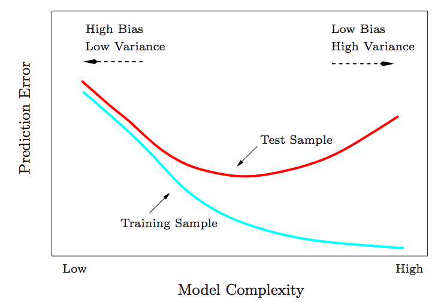

```{r setup, include=FALSE}
library(knitr)
knitr::opts_chunk$set(tidy = FALSE, 
                      message = FALSE,
                      warning = FALSE,
                      echo = FALSE)
options(htmltools.dir.version = FALSE)
```

class: split-30

.column[.padtop50px[
## Outline

- Introduction
    - Learning from data


]]
.column[.nopadding[


- .blue[Better understand] or .blue[make predictions] about a certain
phenomenon under study

- .blue[Construct a model] of that phenomenon by finding relations between several variables

- If phenomenon is complex or depends on a large number of variables, an .blue[analytical solution] might not be available

- However, we can  .blue[collect data] and learn a model that  .blue[approximates] the true underlying phenomenon

]]
---
class: split-30
.column[.padtop50px[
## Outline

- Introduction
    - Learning from data

]]
.column[.top50px[

```{r fig.width=10, fig.height=3, fig.align='center'}
library(tidyverse)
library(gapminder)
library(gridExtra)
p1 <- ggplot(gapminder, aes(x=year, y=lifeExp)) + 
  geom_point() + geom_smooth() + 
  xlab("predictor") + 
  ylab("response") +
  ggtitle("Regression") +
  theme(aspect.ratio=1)
flea <- read_csv("http://www.ggobi.org/book/data/flea.csv")
p2 <- ggplot(flea, aes(x=tars1, y=aede1, colour = species)) + 
  geom_point() + 
  scale_colour_brewer(palette = "Dark2") +
  xlab("Var 1") + ylab("Var 2") +
  ggtitle("Classification") +
  theme(aspect.ratio=1, legend.position="None")
p3 <- ggplot(flea, aes(x=tars1, y=aede1)) + 
  geom_point() + xlab("Var 1") + ylab("Var 2") +  
  ggtitle("Clustering") +
  theme(aspect.ratio=1)
grid.arrange(p1, p2, p3, ncol=3)
```

$\mathcal{D} = \{(x_i, y_i)\}_{i = 1}^N, ~~~ \mbox{where}~ x_i = (x_{i1}, \dots, x_{ip})^{T}$

.blue[Statistical learning] provides a framework for constructing models from $\mathcal{D}$

]]

---
class: split-30
.column[.padtop50px[
## Outline

- Introduction
    - Different learning problems

]]
.column[.nopadding[

- Supervised learning, $y_i$ .orange[available] for all $x_i$
    - Regression (or prediction)
    - Classification
- Unsupervised learning, $y_i$ .orange[unavailable] for all $x_i$
- Semi-supervised learning, $y_i$ available only for few $x_i$
- Other types of learning: reinforcement learning, online learning, active learning, etc. 


.blue[Identification of the best learning problem is important in practice]

]]

---
class: split-30
.column[.padtop50px[
## Outline

- Introduction
- Supervised learning

]]
.column[.top50px[

$\mathcal{D} = \{(y_i, x_i)\}_{i = 1}^N$ 

where $(y_i, x_i) \sim P(Y, X) = P(X) \underbrace{P(Y|X)}_{}$ where $P(Y, X)$ means that these arise from some probability distribution. $``\sim"$ means distributed as, arise from. Typically, we only are interested in $P(Y|X)$, the distribution of $Y$ conditional on $X$.
]]

---
class: split-30
.column[.padtop50px[
## Outline

- Introduction
- Supervised learning

]]
.column[.nopadding[

- $Y = (X_1, \dots, X_q)$: response (output) (could be multivariate, $q=1$ for us)
- $X = (X_1, \dots, X_p)$: set of $p$ predictors (input)

We seek a function $h(X)$ for predicting $Y$ given values of the input $X$. This function is computed using $\mathcal{D}$.
]]

---
class: split-30
.column[.padtop50px[
## Outline

- Introduction
- Supervised learning

]]
.column[.top50px[

$\mathcal{D} = \{(y_i, x_i)\}_{i = 1}^N \mbox{ where } (y_i, x_i) \sim P(Y, X)$

We are interested in minimizing the expected .orange[out-of-sample] prediction error:  $\mbox{Err}_{\mbox{out}}(h) = E[L(Y, h(X))]$

where $L(y, {\hat{y}})$ is a non-negative real-valued .orange[loss function]. Examples include $L(y, \hat{y}) = (y - \hat{y})^2$ and $L(y, \hat{y}) = I(y \neq \hat{y})$.
]]

---
class: split-30
.column[.padtop50px[
## Outline

- Introduction
- Supervised learning
    - Regression

]]
.column[.top50px[

We often assume that our data arose from a statistical model

$Y=f(X) + \varepsilon,$ where $f$ is the true unknown function, $\varepsilon$ is the random error term with $E[\varepsilon] = 0$ and is independent of $X$.

- The additive error model is a useful approximation to the truth
- $f(x) = E[Y|X = x]$
- Not a deterministic relationship: $Y \neq f(X)$
]]

---
class: split-30
.column[.padtop50px[
## Outline

- Introduction
- Supervised learning
    - Regression

]]
.column[.nopadding[


]]

---
class: split-30
.column[.padtop50px[
## Outline

- Introduction
- Supervised learning
    - Regression

]]
.column[.nopadding[


]]
---
class: split-30
.column[.padtop50px[
## Outline

- Introduction
- Supervised learning
    - Regression
    - Why?

]]
.column[.nopadding[

- **Prediction**: 
    - $\hat{y}_{*} = \hat f(x_{*})$ for a new observation $x_{*}$
- **Inference (or explanation)**:
    - Which predictors are associated with the response?
    - What is the relationship between the response and each predictor?
]]

---
class: split-30
.column[.padtop50px[
## Outline

- Introduction
- Supervised learning
    - Regression
    - Why?
    - Estimation

]]
.column[.top50px[


Linear model: $\hat f(\mbox{education}, \mbox{seniority}) =$ 
$~~~~~~~~\hat \beta_0 + \hat \beta_1 \times \mbox{education} + \hat \beta_2 \times \mbox{seniority}$

''Why would we ever choose to use a **more restrictive method** instead of a **very flexible approach**?''

]]

---
class: split-30
.column[.padtop50px[
## Outline

- Introduction
- Supervised learning
    - Regression
    - Why?
    - Estimation

]]
.column[.nopadding[


]]
---
class: split-30
.column[.padtop50px[
## Outline

- Introduction
- Supervised learning
    - Regression
    - Why?
    - Estimation
    - Classification
    - Estimation

]]
.column[.nopadding[


]]

---
class: split-30
.column[.padtop50px[
## Outline

- Introduction
- Supervised learning
    - Regression
    - Why?
    - Estimation
    - Classification
    - Estimation
    - Methods

]]
.column[.nopadding[

```{r}
library(emo)
```

- **Parametric methods**
    - Assumption about the form of $f$, e.g. linear
    - `r set.seed(1000); emo::ji("smile")` The problem of estimating $f$ reduces to estimating a set of parameters
    - `r set.seed(1000); emo::ji("smile")` Usually a good starting point for many learning problems
    - `r set.seed(1000); emo::ji("frown")` Poor performance if linearity assumption is wrong
- **Non-parametric methods**
    - `r set.seed(1000); emo::ji("smile")` No *explicit* assumptions about the  form of $f$, e.g. nearest neighbours: $\hat Y(x) = \frac1k \sum_{x_i \in N_k(x)} y_i$
    - `r set.seed(1000); emo::ji("smile")` High flexibility: it can potentially fit a range of shapes
    - `r set.seed(1000); emo::ji("frown")` A large number of observations is required to estimate $f$ with good accuracy

]]

---
class: split-30
.column[.padtop50px[
## Outline


- Introduction
- Supervised learning
    - Regression
    - Why?
    - Estimation
    - Classification
    - Estimation
    - Methods
    - Interpretability vs flexibility

]]
.column[.nopadding[


 
 ]]

---
class: split-30
.column[.padtop50px[
## Outline


- Introduction
- Supervised learning
- Assessing model accuracy
    - Regression
]]
.column[.top50px[

Suppose we have a regression model $y=f(x)+\varepsilon$. .orange[Estimate]
$\hat{f}$ from some .orange[training data], $Tr=\{x_i,y_i\}_1^n$.

One common measure of accuracy is:

**Training Mean Squared Error**

$MSE_{Tr} = \mathop{\mbox{Ave}}\limits_{i\in Tr}[y_i-\hat{f}(x_i)]^2 = \frac{1}{n}\sum_{i=1}^n [(y_i-\hat{f}(x_i)]^2$


]]

---
class: split-30
.column[.padtop50px[
## Outline


- Introduction
- Supervised learning
- Assessing model accuracy
    - Regression
]]
.column[.top50px[

Suppose we have a regression model $y=f(x)+\varepsilon$. .orange[Estimate]
$\hat{f}$ from some .orange[training data], $Tr=\{x_i,y_i\}_1^n$.

One common measure of accuracy is:

**Training Mean Squared Error**

$MSE_{Tr} = \mathop{\mbox{Ave}}\limits_{i\in Tr}[y_i-\hat{f}(x_i)]^2 = \frac{1}{n}\sum_{i=1}^n [(y_i-\hat{f}(x_i)]^2$


Measure .orange[real accuracy] using .orange[test data] $Te=\{x_j,y_j\}_1^m$

**Test Mean Squared Error**

$MSE_{Te} = \mathop{\mbox{Ave}}\limits_{j\in Te}[y_j-\hat{f}(x_j)]^2 = \frac{1}{m}\sum_{j=1}^m [(y_j-\hat{f}(x_j)]^2$


]]

---
class: split-30
.column[.padtop50px[
## Outline

- Introduction
- Supervised learning
- Assessing model accuracy
    - Regression
        - Training vs Test MSEs
]]
.column[.top50px[

- In general, the more .orange[flexible] a method is, the .orange[lower] its
.orange[training MSE] will be. i.e. it will “fit” the training data very well.

- However, the .orange[test MSE] may be .orange[higher] for a more .orange[flexible] method than for a simple approach like linear regression. 

- Flexibility also makes interpretation more difficult. There is
a trade-off between .orange[flexibility] and .orange[model interpretability].

]]

---

class: split-30
.column[.padtop50px[
## Outline

- Introduction
- Supervised learning
- Assessing model accuracy
    - Regression
        - Training vs Test MSEs
        - Example
]]

.column[.top50px[
.split-two[
.row[

]
.row[
.split-50[
.column[
<br>
<br>
<br>

.black[true curve]<br>
.orange[linear regression]<br>
.blue[Smoothing] splines
]
.column[
<br>
<br>
<br>

.gray[Training MSE]<br>
.red[Test MSE]<br>
.black[Dashed: Minimum test MSE]
]
]
]
]

]]

---
class: split-30
.column[.padtop50px[
## Outline

- Introduction
- Supervised learning
- Assessing model accuracy
    - Regression
        - Training vs Test MSEs
        - Example
]]

.column[.top50px[
.split-two[
.row[

]
.row[
.split-50[
.column[
<br>
<br>
<br>

.black[true curve]<br>
.orange[linear regression]<br>
.blue[Smoothing] splines
]
.column[
<br>
<br>
<br>

.gray[Training MSE]<br>
.red[Test MSE]<br>
.black[Dashed: Minimum test MSE]
]
]
]
]

]]

---
class: split-30
.column[.padtop50px[
## Outline

- Introduction
- Supervised learning
- Assessing model accuracy
    - Regression
        - Training vs Test MSEs
        - Example
]]

.column[.top50px[
.split-two[
.row[

]
.row[
.split-50[
.column[
<br>
<br>
<br>

.black[true curve]<br>
.orange[linear regression]<br>
.blue[Smoothing] splines
]
.column[
<br>
<br>
<br>

.gray[Training MSE]<br>
.red[Test MSE]<br>
.black[Dashed: Minimum test MSE]
]
]
]
]

]]


---
class: split-30
.column[.padtop50px[
## Outline

- Introduction
- Supervised learning
- Assessing model accuracy
    - Regression
        - Training vs Test MSEs
        - Example
        - Bias-variance tradeoff 
]]

.column[.top50px[

There are two competing forces that govern the
choice of learning method: .orange[bias] and .orange[variance]. 

.orange[Bias]
is the error that is introduced by modeling a 
complicated problem by a simpler problem.


- For example, linear regression assumes a linear relationship when few real relationships are exactly linear.
- In general, the .orange[more flexible] a method is, the .orange[less bias] it will have. 

[This site](https://degreesofbelief.roryquinn.com/bias-variance-tradeoff) has a lovely explanation, if you don't like mine.
]]

---
class: split-30
.column[.padtop50px[
## Outline

- Introduction
- Supervised learning
- Assessing model accuracy
    - Regression
        - Training vs Test MSEs
        - Example
        - Bias-variance tradeoff 
]]

.column[.top50px[
There are two competing forces that govern the
choice of learning method: .orange[bias] and .orange[variance]. 

.orange[Variance]
refers to how much your estimate would change if you had different training data.


- In general, the .orange[more flexible] a method is, the .orange[more variance] it has. 
- The .orange[size] of the training data has an impact on the variance 


]]
---

## MSE decomposition

If $Y = f(x) + \varepsilon$ and $f(x)=\mbox{E}[Y\mid X=x]$, then the expected **test** MSE for a new $Y$ at $x_0$ will be equal to

$E[(Y-\hat{f}(x_0))^2] = [\mbox{Bias}(\hat{f}(x_0))]^2 + \mbox{Var}(\hat{f}(x_0)) + \mbox{Var}(\varepsilon)$

Test MSE = Bias $^2$ + Variance + Irreducible variance

- The expectation averages over the variability of $Y$ as well as the variability in the training data.
- As the flexibility of $\hat{f}$ increases, its variance increases and its bias decreases.
-  Choosing the flexibility based on average test MSE amounts to a .orange[bias-variance trade-off]


---
.nopadding[


.blue[squared bias], .orange[variance], Var(ε) (dashed line), and .red[test MSE] for the three data sets shown earlier. The vertical dotted line indicates the flexibility level corresponding to the smallest test MSE.
]
---
class: split-30
.column[.nopadding[
## Outline

- Introduction
- Supervised learning
- Assessing model accuracy
    - Regression
        - Training vs Test MSEs
        - Example
        - Bias-variance tradeoff 
        - Optimal prediction
]]

.column[.top50px[

The optimal MSE is obtained when 

$\hat{f}=f = \mbox{E}[Y\mid X=x].$

Then .orange[bias=variance=0] and

$\mbox{MSE} = \mbox{irreducible variance}$

This is called the .orange[oracle predictor] because it is not achievable in practice.

]]

---
class: split-30
.column[.padtop50px[
## Outline

- Introduction
- Supervised learning
- Assessing model accuracy
    - Classification

]]

.column[.nopadding[

Here the response variable $Y$ is .orange[qualitative].

- e.g., email is one of ${\cal C} = (\mbox{spam},\mbox{ham})$
- e.g., voters are one of ${\cal C} = (\mbox{Liberal},\mbox{Labor},\mbox{Green},\mbox{National},\mbox{Other})$

Our goals are:
1. Build a classifier $C(x)$ that assigns a class label from ${\cal C} = \{\mathcal{C}_1, \dots, \mathcal{C}_K\}$ to a future unlabeled observation $x$.
2. Such a classifier will divide the input space into regions $\mathcal{R}_k$ called decision regions, one for each class, such that all points in $\mathcal{R}_k$ are assigned to class $\mathcal{C}_k$
3. Assess the uncertainty in each classification (i.e., the probability of misclassification).
4. Understand the roles of the different predictors among $X = (X_1,X_2,\dots,X_p)$.
]]

---
class: split-30
.column[.padtop50px[
## Outline

- Introduction
- Supervised learning
- Assessing model accuracy
    - Classification

]]

.column[.padtop50px[

Recall that we want to minimize the expected prediction error

$E_{(Y, X)}[L(Y, C(X))]$

where $L(y, {\hat{y}})$ is a non-negative real-valued .orange[loss function]. 


In classification, the output $Y$ is a .orange[categorical variable], and our loss function can be represented by a $K \times K$ matrix $L$, where $K = \mbox{card}(\mathcal{C})$. $L(k, l)$ is the price paid for classifying $C_k$ as $C_l$. 

]]

---
class: split-30
.column[.padtop50px[
## Outline

- Introduction
- Supervised learning
- Assessing model accuracy
    - Classification
    - Optimal classifier

]]

.column[.padtop50px[

We want to minimize the expected prediction error

$E_{(Y, X)}[L(Y, C(X))] =$ <br>
$~~~E_{X} \left[\sum_{k = 1}^K L(C_k, C(X)) P(C_k|X) \right]$

It suffices to minimize the error pointwise:

$C^{*}(x) = \operatorname{argmin}_{c \in \mathcal{C}} \sum_{k = 1}^K L(C_k, c) P(C_k|X = x)$


]]
---
class: split-30
.column[.padtop50px[
## Outline

- Introduction
- Supervised learning
- Assessing model accuracy
    - Classification
    - Optimal classifier

]]

.column[.top50px[

If we use the zero-one loss, i.e. $L(y, \hat{y}) = I(y \neq \hat{y})$ then 
	
$\sum_{k = 1}^K L(C_k, c) P(C_k|X = x)$<br>
$~~~~~~ = \sum_{k = 1}^K  P(C_k|X = x) - P(c|X = x)$<br>
$~~~~~~ = 1 - P(c|X = x)$
<br>
<br>

$C^{*}(x) = \operatorname{argmin}_{c \in \mathcal{C}} \sum_{k = 1}^K L(C_k, c) P(C_k|X = x)$<br>
$~~~~~~ = \operatorname{argmin}_{c \in \mathcal{C}} 1 - P(c|X = x)$<br>
$~~~~~~ = \operatorname{argmax}_{c \in \mathcal{C}} P(c|X = x)$
<br>
<br>

or
<br>

$C^{*}(x) = C_k \mbox{ if } P(C_k|X = x) = \operatorname{max}_{c \in \mathcal{C} } P(c|X = x)$

]]

---
class: split-30
.column[.padtop50px[
## Outline

- Introduction
- Supervised learning
- Assessing model accuracy
    - Classification
    - Optimal classifier

]]

.column[.top50px[

Let ${\cal C} = \{\mathcal{C}_1, \dots, \mathcal{C}_K\}$, and let

$p_k(x) = \text{P}(Y = C_k\mid X = x),\qquad k = 1, 2, \dots , K.$

These are the .orange[conditional class probabilities] at $x$. 

Then the .orange[Bayes] classifier at $x$ is

$C(x) = C_j \quad \mbox{ if } p_j(x) = \max\{p_1(x), p_2(x), \dots, p_K(x)\}$


- This gives the minimum average test error rate. 
- It is an oracle predictor because we do not usually know $p_k(x)$.

]]


---
class: split-30
.column[.padtop50px[
## Outline

- Introduction
- Supervised learning
- Assessing model accuracy
    - Classification
    - Optimal classifier
    - Bayes error 

]]

.column[.top50px[ 

$1-\text{E}\left(\max_j \text{P}(Y = C_j | X)\right)$

- The .orange[Bayes error rate] is the lowest possible error rate that could be achieved if we knew exactly the .orange[true] probability distribution of the data.
- It is analagous to the irreducible error in regression.
- On test data, no classifier can get lower error rates than the Bayes error rate.
- In reality, the Bayes error rate is not known exactly.

]]

---
class: split-30
.column[.padtop50px[
## Outline

- Introduction
- Supervised learning
- Assessing model accuracy
    - Classification
    - Optimal classifier
    - Bayes error 
    - Bayes optimal 

]]

.column[.top50px[ 


]]

---
class: split-30
.column[.padtop50px[
## Outline

- Introduction
- Supervised learning
- Assessing model accuracy
    - Classification
    - Optimal classifier
    - Bayes error 
    - Bayes optimal 

]]

.column[.top50px[ 
.orange[Compute] $\hat{C}$ from some .orange[training data], $Tr=\{x_i,y_i\}_1^n$.

In place of MSE, we now use the error rate (fraction of misclassifications).

*Training Error Rate*

$\text{Error rate}_{Tr} = \frac{1}{n}\sum_{i=1}^n I(y_i \ne \hat{C}(x_i))$

Measure .orange[real accuracy] using .orange[test data] $Te=\{x_j,y_j\}_1^m$

*Test Error Rate*

$\text{Error rate}_{Te} = \frac{1}{m}\sum_{j=1}^m I(y_j \ne \hat{C}(x_j))$

]]

---
class: split-30
.column[.padtop50px[
## Outline

- Introduction
- Supervised learning
- Assessing model accuracy
    - Classification
    - Optimal classifier
    - Bayes error 
    - Bayes optimal
    - kNN
]]

.column[.top50px[ 

One of the simplest classifiers. Given a test observation $x_0$:

- Find the $K$ nearest points to $x_0$ in the training data: ${\cal N}_0$.
- Estimate conditional probabilities
$=P(Y = C_j \mid X=x_0) = \frac{1}{K}\sum_{i\in {\cal N}_0} I(y_i = C_j).$
- Classify $x_0$ to class with largest probability.

]]

---
class: split-30
.column[.padtop50px[
## Outline

- Introduction
- Supervised learning
- Assessing model accuracy
    - Classification
    - Optimal classifier
    - Bayes error 
    - Bayes optimal
    - kNN
]]

.column[.top50px[ 


]]
---
class: split-30
.column[.padtop50px[
## Outline

- Introduction
- Supervised learning
- Assessing model accuracy
    - Classification
    - Optimal classifier
    - Bayes error 
    - Bayes optimal
    - kNN
]]

.column[.top50px[ 


]]

---
class: split-30
.column[.padtop50px[
## Outline

- Introduction
- Supervised learning
- Assessing model accuracy
    - Classification
    - Optimal classifier
    - Bayes error 
    - Bayes optimal
    - kNN
]]

.column[.top50px[ 


]]

---
class: split-30
.column[.padtop50px[
## Outline

- Introduction
- Supervised learning
- Assessing model accuracy
    - Classification
    - Optimal classifier
    - Bayes error 
    - Bayes optimal
    - kNN
]]

.column[.top50px[ 


]]
---
### A fundamental picture





---
layout: false
# `r set.seed(2019); emo::ji("technologist")` Made by a human with a computer

### Slides at [https://monba.dicook.org](https://monba.dicook.org).
### Code and data at [https://github.com/dicook/Business_Analytics](https://github.com/dicook/Business_Analytics).
<br>

### Created using [R Markdown](https://rmarkdown.rstudio.com) with flair by [**xaringan**](https://github.com/yihui/xaringan), and [**kunoichi** (female ninja) style](https://github.com/emitanaka/ninja-theme).

<br> 
<a rel="license" href="http://creativecommons.org/licenses/by-sa/4.0/"></a><br />This work is licensed under a <a rel="license" href="http://creativecommons.org/licenses/by-sa/4.0/">Creative Commons Attribution-ShareAlike 4.0 International License</a>.
