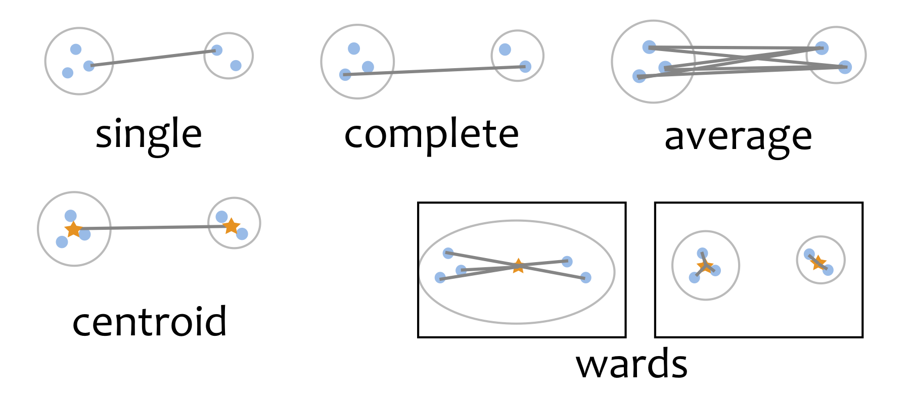

```{r setup, include=FALSE}
library(knitr)
knitr::opts_chunk$set(tidy = FALSE, 
                      message = FALSE,
                      warning = FALSE,
                      echo = FALSE, 
                      fig.width=8,
                      fig.height=6,
                      fig.align = "center",
                      fig.retina = 2)
options(htmltools.dir.version = FALSE)
library(magick)
```


class: split-30
layout: false

.column[.pad10px[
## Outline

- .orange[Hierarchical clustering]


]]
.column[.top50px[

<br>
- .orange[Agglomeration]: Begin with all observations in singleton clusters. Sequentially .orange[join] points into clusters, until all are in one cluster. 
- .orange[Divisive]: Begin with all observtions in one cluster, adn sequentially .orange[divide] until all observations are in singleton clusters. 
- Produces a tree diagram illustrating the process, called a .orange[dendrogram].

]]

---
class: split-50
layout: false


.column[.pad10px[.content[

Some new data `r emo::ji("cartwheel")`

```{r}
library(tidyverse)
library(tourr)
library(gridExtra)
library(emo)
library(knitr)
library(kableExtra)

set.seed(20190514)
df <- tibble(lbl=letters[1:12], 
             x1=sample(1:10, 12, replace=TRUE),
             x2=sample(1:10, 12, replace=TRUE))
df[1:4,2] <- df[1:4,2] + 12
df[5:8,3] <- df[5:8,3] + 12
kable(df) %>%
  kable_styling("striped", position = "center", 
                row_label_position = "c", 
                font_size=24) %>%
  row_spec(0, color = "white", background = "#3F9F7A") %>%
  column_spec(1:3, border_right=TRUE, width="2cm") 
```
]]]
.column[.pad50px[.content[

```{r out.width="100%", fig.width=4, fig.height=4}
ggplot(data=df, aes(x1, x2)) + geom_text(aes(label=lbl)) + 
  xlab("") + ylab("") + theme_bw() + 
  theme(aspect.ratio=1) 
```
]]]

---
class: split-50
layout: false


.column[.pad10px[.content[

$n\times n$ distance matrix `r set.seed(1) ;emo::ji("ruler")`

```{r}
d <- as.matrix(round(dist(df[,2:3], diag=TRUE, upper=TRUE),1))
colnames(d) <- df$lbl
rownames(d) <- df$lbl
kable(d) %>%
  kable_styling("striped", position = "center", 
                row_label_position = "c", 
                font_size=24) %>%
  row_spec(0, color = "white", background = "#3F9F7A") %>%
  column_spec(1, color = "white", background = "#3F9F7A") %>%
  column_spec(1:12, border_right=TRUE, width="1cm") 
```
]]]
.column[.pad50px[.content[

```{r out.width="100%", fig.width=4, fig.height=4}
ggplot(data=df, aes(x1, x2)) + geom_text(aes(label=lbl)) + 
  xlab("") + ylab("") + theme_bw() + 
  theme(aspect.ratio=1) 
```
]]]
---
class: split-50
layout: false

.column[.pad50px[.content[

```{r out.width="100%", fig.width=4, fig.height=4}
ggplot(data=df, aes(x1, x2)) + geom_text(aes(label=lbl)) + 
  xlab("") + ylab("") + theme_bw() + 
  theme(aspect.ratio=1) 
```
]]]
.column[.pad50px[.content[
```{r out.width="100%", fig.width=4, fig.height=4}
library(ggdendro)
df_hc <- hclust(as.dist(d), method="average")
ggdendrogram(df_hc, rotate = TRUE, size = 4)
```

]]]
---
class: split-50
layout: false


.column[.pad10px[.content[

```{r out.width="100%", fig.width=4, fig.height=4}
df$cl11 <- factor(c(1,2,2,1,1,1,1,1,1,1,1,1))
ggplot(data=df, aes(x=x1, y=x2, colour=cl11)) +
  geom_text(aes(label=lbl)) + 
  scale_color_brewer("", palette="Dark2") +
  xlab("") + ylab("") + theme_bw() + 
  theme(aspect.ratio=1, legend.position="none") 
```
]]]
.column[.pad50px[.content[
```{r out.width="100%", fig.width=4, fig.height=4}
ggdendrogram(df_hc, rotate = TRUE, size = 4)
```
]]]

---
class: middle center

# `r set.seed(2019); emo::ji("thinking")`

What is the .orange[distance] between the new .orange[cluster (b,c)] and all of the other observations?

---


class: split-30
layout: false

.column[.pad10px[
## Outline

- [Hierarchical clustering](#2)
- .orange[Linkage]


]]
.column[.top50px[

Between points .orange[in] the cluster to points .orange[not in] the cluster. 

- .orange[Single]: minimum distance between points in the different clusters
- .orange[Complete]: maximum distance between points in the different clusters
- .orange[Average]: average of distances between points in the different clusters
- .orange[Centroid]: distances between the average of the different clusters
- .orange[Wards]: minimizes the total within-cluster variance

]]
---
class: split-60
layout: false


.column[.pad50px[.content[

<br>
```{r}
kable(d) %>%
  kable_styling("striped", position = "center", 
                row_label_position = "c", 
                font_size=24) %>%
  row_spec(0, color = "white", background = "#3F9F7A") %>%
  column_spec(1, color = "white", background = "#3F9F7A") %>%
  column_spec(1:12, border_right=TRUE, width="1cm") %>%
  column_spec(3:4, color="#CA6627") %>%
  row_spec(2:3, color="#CA6627")

```
]]]
.column[.pad50px[.content[

.orange[Distance (linkage) between (c,d) and a]

Single: 4.2 or 5.7 $\rightarrow$ .orange[4.2] <br>
Complete: 4.2 or 5.7 $\rightarrow$ .orange[5.7] <br>
Average: (4.2 + 5.7)/2 = .orange[4.95] <br>
Centroid: .orange[4.9] <br>
mean of (b,c) is (17.5, 4.5) <br>
          mean of a (14, 1) <br>
          $\sqrt{(17.5-14)^2 + (4.5-1)^2}$ <br>
Wards: Your turn to calculate it `r set.seed(1) ;emo::ji("shrug")`

```{r eval=FALSE}
df %>% filter(lbl %in% c("a", "d", "e", "f", "g", "h", "i", "j", "k", "l")) %>% select(-lbl) %>% summarise_all(mean)
```
]]]
---



---
class: split-60
layout: false


.column[.pad10px[.content[

.orange[Single] linkage reduced distance matrix

```{r}
d2 <- d[-3,-3]
d2[2,3] <- d2[3,2] <- 2.2
d2[2,4] <- d2[4,2] <- 15.8
d2[2,7] <- d2[7,2] <- 18.6
colnames(d2)[2] <- "(c,d)"
rownames(d2)[2] <- "(c,d)"
kable(d2) %>%
  kable_styling("striped", position = "center", 
                row_label_position = "c", 
                font_size=24) %>%
  row_spec(0, color = "white", background = "#3F9F7A") %>%
  column_spec(1, color = "white", background = "#3F9F7A") %>%
  column_spec(1:12, border_right=TRUE, width="1cm") %>%
  column_spec(3, color="#CA6627") %>%
  row_spec(2, color="#CA6627")
```
]]]
.column[.pad50px[.content[

<br>
<br>
Now which distance is the smallest?

<br>

d would be joined to (c,d) at the next step

]]]
---
class: split-60
layout: false


.column[.pad10px[.content[
.orange[Average] linkage reduced distance matrix

```{r}
d3 <- d[-3,-3]
d3[2,] <- round(apply(d[2:3,], 2, mean)[-2],1)
d3[,2] <- d3[2,]
d3[2,2] <- 0
colnames(d3)[2] <- "(c,d)"
rownames(d3)[2] <- "(c,d)"
kable(d3) %>%
  kable_styling("striped", position = "center", 
                row_label_position = "c", 
                font_size=24) %>%
  row_spec(0, color = "white", background = "#3F9F7A") %>%
  column_spec(1, color = "white", background = "#3F9F7A") %>%
  column_spec(1:12, border_right=TRUE, width="1cm") %>%
  column_spec(3, color="#CA6627") %>%
  row_spec(2, color="#CA6627")
```


]]]
.column[.pad50px[.content[
<br>
<br>

Now which distance is the smallest?

<br>

e and h would be joined at the next step

]]]
---

```{r out.width="100%", fig.width=10, fig.height=6}
df_hc1 <- hclust(as.dist(d), method="single")
p1 <- ggdendrogram(df_hc1, rotate = TRUE, size = 4) + ggtitle("single")
df_hc2 <- hclust(as.dist(d), method="complete")
p2 <- ggdendrogram(df_hc2, rotate = TRUE, size = 4) + ggtitle("complete")
df_hc3 <- hclust(as.dist(d), method="average")
p3 <- ggdendrogram(df_hc3, rotate = TRUE, size = 4) + ggtitle("average")
df_hc4 <- hclust(as.dist(d), method="centroid")
p4 <- ggdendrogram(df_hc4, rotate = TRUE, size = 4) + ggtitle("centroid")
df_hc5 <- hclust(as.dist(d), method="ward.D2")
p5 <- ggdendrogram(df_hc5, rotate = TRUE, size = 4) + ggtitle("wards")
grid.arrange(p1, p2, p3, p4, p5, ncol=3)
```

---


class: split-30
layout: false

.column[.pad10px[
## Outline

- [Hierarchical clustering](#2)
- [Linkage](#7)
- .orange[Dendrogram]


]]
.column[.top50px[

<br>

- Each .orange[leaf] of the dendrogram represents one observation
- Leaves .orange[fuse] into branches and branches fuse, either with leaves or other branches.	
- Fusions .orange[lower in the tree] mean the groups of observations are more similar to each other. 
<br>
<br>

.orange[Cut the tree] to partition the data into $k$ clusters
]]
---

```{r out.width="100%", fig.width=10, fig.height=6}
df$cl1 <- factor(cutree(df_hc1, 3))
df$cl2 <- factor(cutree(df_hc2, 3))
df$cl3 <- factor(cutree(df_hc3, 3))
df$cl4 <- factor(cutree(df_hc4, 3))
df$cl5 <- factor(cutree(df_hc5, 3))
p1 <- ggplot(data=df, aes(x=x1, y=x2, colour=cl1)) +
  geom_text(aes(label=lbl)) + 
  scale_color_brewer("", palette="Dark2") +
  xlab("") + ylab("") + theme_bw() + 
  theme(aspect.ratio=1, legend.position="none") + ggtitle("single")
p2 <- ggplot(data=df, aes(x=x1, y=x2, colour=cl2)) +
  geom_text(aes(label=lbl)) + 
  scale_color_brewer("", palette="Dark2") +
  xlab("") + ylab("") + theme_bw() + 
  theme(aspect.ratio=1, legend.position="none") + 
  ggtitle("complete")
p3 <- ggplot(data=df, aes(x=x1, y=x2, colour=cl3)) +
  geom_text(aes(label=lbl)) + 
  scale_color_brewer("", palette="Dark2") +
  xlab("") + ylab("") + theme_bw() + 
  theme(aspect.ratio=1, legend.position="none") + 
  ggtitle("average")
p4 <- ggplot(data=df, aes(x=x1, y=x2, colour=cl4)) +
  geom_text(aes(label=lbl)) + 
  scale_color_brewer("", palette="Dark2") +
  xlab("") + ylab("") + theme_bw() + 
  theme(aspect.ratio=1, legend.position="none") + 
  ggtitle("centroid")
p5 <- ggplot(data=df, aes(x=x1, y=x2, colour=cl5)) +
  geom_text(aes(label=lbl)) + 
  scale_color_brewer("", palette="Dark2") +
  xlab("") + ylab("") + theme_bw() + 
  theme(aspect.ratio=1, legend.position="none") + 
  ggtitle("wards")
grid.arrange(p1, p2, p3, p4, p5, ncol=3)
```

---


class: split-30
layout: false

.column[.pad10px[
## Outline

- [Hierarchical clustering](#2)
- [Linkage](#7)
- [Dendrogram](#13)
- .orange[Pros and cons]

]]
.column[.top50px[

<br>
- Single linkage tends to "chain" the data into long stringy clusters, can avoid confusion from nuisance variables but gets confused by "inliers" (outliers between clusters)
- Complete linkage tends to be confused by nuisance variables, but not by inliers
- Wards tends to create spherical homogeneously shaped clusters, a little similar to $k$-means

No one perfect method for all problems, but Wards tends to be a good starting point. 

]]
---
class: split-50
layout: false


.column[.pad10px[

```{r out.width="100%", fig.width=4, fig.height=4}
set.seed(20190514)
x <- (runif(20)-0.5)*4
y <- x
df <- data.frame(x1=scale(c(rnorm(50, -3), rnorm(50, 3), x)), 
                 x2=scale(c(rnorm(50, -3), rnorm(50, 3), y)))
ggplot(data=df, aes(x1, x2)) + geom_point() +
  theme_bw() + theme(aspect.ratio=1)
```
]]
.column[.pad50px[

.orange[Nuisance cases] "Hansel and Gretel data"

Points that are between major clusters of data. This affects some linkage methods, eg single, which will tend to "chain" through the data grouping everything together.
]]

---

```{r out.width="100%", fig.width=10, fig.height=6}
df_dist <- dist(df)
df_hc1 <- hclust(df_dist, method="single")
df_hc2 <- hclust(df_dist, method="complete")
df_hc3 <- hclust(df_dist, method="average")
df_hc4 <- hclust(df_dist, method="centroid")
df_hc5 <- hclust(df_dist, method="ward.D2")
p1 <- ggdendrogram(df_hc1, rotate = TRUE, size = 4) + ggtitle("single")
p2 <- ggdendrogram(df_hc2, rotate = TRUE, size = 4) + ggtitle("complete")
p3 <- ggdendrogram(df_hc3, rotate = TRUE, size = 4) + ggtitle("average")
p4 <- ggdendrogram(df_hc4, rotate = TRUE, size = 4) + ggtitle("centroid")
p5 <- ggdendrogram(df_hc5, rotate = TRUE, size = 4) + ggtitle("wards")
grid.arrange(p1, p2, p3, p4, p5, ncol=3)
```

---

```{r out.width="100%", fig.width=10, fig.height=6}
df$cl1 <- factor(cutree(df_hc1, 2))
df$cl2 <- factor(cutree(df_hc2, 2))
df$cl3 <- factor(cutree(df_hc3, 2))
df$cl4 <- factor(cutree(df_hc4, 2))
df$cl5 <- factor(cutree(df_hc5, 2))
p1 <- ggplot(data=df, aes(x=x1, y=x2, colour=cl1)) +
  geom_point() + 
  scale_color_brewer("", palette="Dark2") +
  xlab("") + ylab("") + theme_bw() + 
  theme(aspect.ratio=1, legend.position="none") + ggtitle("single")
p2 <- ggplot(data=df, aes(x=x1, y=x2, colour=cl2)) +
  geom_point() + 
  scale_color_brewer("", palette="Dark2") +
  xlab("") + ylab("") + theme_bw() + 
  theme(aspect.ratio=1, legend.position="none") + 
  ggtitle("complete")
p3 <- ggplot(data=df, aes(x=x1, y=x2, colour=cl3)) +
  geom_point() + 
  scale_color_brewer("", palette="Dark2") +
  xlab("") + ylab("") + theme_bw() + 
  theme(aspect.ratio=1, legend.position="none") + 
  ggtitle("average")
p4 <- ggplot(data=df, aes(x=x1, y=x2, colour=cl4)) +
  geom_point() + 
  scale_color_brewer("", palette="Dark2") +
  xlab("") + ylab("") + theme_bw() + 
  theme(aspect.ratio=1, legend.position="none") + 
  ggtitle("centroid")
p5 <- ggplot(data=df, aes(x=x1, y=x2, colour=cl5)) +
  geom_point() + 
  scale_color_brewer("", palette="Dark2") +
  xlab("") + ylab("") + theme_bw() + 
  theme(aspect.ratio=1, legend.position="none") + 
  ggtitle("wards")
grid.arrange(p1, p2, p3, p4, p5, ncol=3)
```

---

class: split-50
layout: false


.column[.pad10px[

```{r out.width="100%", fig.width=4, fig.height=4}
set.seed(20190512)
df <- data.frame(x1=scale(c(rnorm(50, -4), rnorm(50, 4))), 
                 x2=scale(c(rnorm(100))))
ggplot(data=df, aes(x1, x2)) + geom_point() +
  theme_bw() + theme(aspect.ratio=1)
```
]]
.column[.pad50px[

.orange[Nuisance variables] 

Variables that don't contribute to the clustering but are included in the distance calculations.
]]

---

```{r out.width="100%", fig.width=10, fig.height=6}
df_dist <- dist(df)
df_hc1 <- hclust(df_dist, method="single")
df_hc2 <- hclust(df_dist, method="complete")
df_hc3 <- hclust(df_dist, method="average")
df_hc4 <- hclust(df_dist, method="centroid")
df_hc5 <- hclust(df_dist, method="ward.D2")
p1 <- ggdendrogram(df_hc1, rotate = TRUE, size = 4) + ggtitle("single")
p2 <- ggdendrogram(df_hc2, rotate = TRUE, size = 4) + ggtitle("complete")
p3 <- ggdendrogram(df_hc3, rotate = TRUE, size = 4) + ggtitle("average")
p4 <- ggdendrogram(df_hc4, rotate = TRUE, size = 4) + ggtitle("centroid")
p5 <- ggdendrogram(df_hc5, rotate = TRUE, size = 4) + ggtitle("wards")
grid.arrange(p1, p2, p3, p4, p5, ncol=3)
```

---

```{r out.width="100%", fig.width=10, fig.height=6}
df$cl1 <- factor(cutree(df_hc1, 2))
df$cl2 <- factor(cutree(df_hc2, 2))
df$cl3 <- factor(cutree(df_hc3, 2))
df$cl4 <- factor(cutree(df_hc4, 2))
df$cl5 <- factor(cutree(df_hc5, 2))
p1 <- ggplot(data=df, aes(x=x1, y=x2, colour=cl1)) +
  geom_point() + 
  scale_color_brewer("", palette="Dark2") +
  xlab("") + ylab("") + theme_bw() + 
  theme(aspect.ratio=1, legend.position="none") + ggtitle("single")
p2 <- ggplot(data=df, aes(x=x1, y=x2, colour=cl2)) +
  geom_point() + 
  scale_color_brewer("", palette="Dark2") +
  xlab("") + ylab("") + theme_bw() + 
  theme(aspect.ratio=1, legend.position="none") + 
  ggtitle("complete")
p3 <- ggplot(data=df, aes(x=x1, y=x2, colour=cl3)) +
  geom_point() + 
  scale_color_brewer("", palette="Dark2") +
  xlab("") + ylab("") + theme_bw() + 
  theme(aspect.ratio=1, legend.position="none") + 
  ggtitle("average")
p4 <- ggplot(data=df, aes(x=x1, y=x2, colour=cl4)) +
  geom_point() + 
  scale_color_brewer("", palette="Dark2") +
  xlab("") + ylab("") + theme_bw() + 
  theme(aspect.ratio=1, legend.position="none") + 
  ggtitle("centroid")
p5 <- ggplot(data=df, aes(x=x1, y=x2, colour=cl5)) +
  geom_point() + 
  scale_color_brewer("", palette="Dark2") +
  xlab("") + ylab("") + theme_bw() + 
  theme(aspect.ratio=1, legend.position="none") + 
  ggtitle("wards")
grid.arrange(p1, p2, p3, p4, p5, ncol=3)
```

---


class: split-30
layout: false

.column[.pad10px[
## Outline

- [Hierarchical clustering](#2)
- [Linkage](#7)
- [Dendrogram](#13)
- [Pros and cons](#16)
- .orange[Example]

]]
.column[.top50px[

```{r eval=FALSE}
data(flea)
scale2 <- function(x, na.rm = FALSE) (x - mean(x, na.rm = na.rm)) / sd(x, na.rm)
flea <- flea %>% mutate_if(is.numeric, list(scale2))
fpp <- save_history(flea[,1:6], guided_tour(lda_pp(flea$species), max.tries = 100),
  max = 100, rescale=FALSE)
fproj <- as_tibble(as.matrix(flea[,1:6])%*%matrix(fpp[1:6, 1:2, 10], ncol=2, byrow=FALSE))
save(fproj, file="data/fproj.rda")
```

Flea data: 6 variables, 74 cases. Shown here is the best 2D projection showing the three true clusters.

Data has a mix of nuisance variables and observations.

```{r out.width="50%", fig.width=4, fig.height=4}
load("data/fproj.rda")
ggplot(fproj, aes(x=V1, y=V2)) + geom_point() +
  theme_bw() +
  theme(aspect.ratio=1) +
  xlab("") + ylab("")
```

]]

---

```{r out.width="100%", fig.width=10, fig.height=6}
df_dist <- dist(flea)
df_hc1 <- hclust(df_dist, method="single")
df_hc2 <- hclust(df_dist, method="complete")
df_hc3 <- hclust(df_dist, method="average")
df_hc4 <- hclust(df_dist, method="centroid")
df_hc5 <- hclust(df_dist, method="ward.D2")
p1 <- ggdendrogram(df_hc1, rotate = TRUE, size = 4) + ggtitle("single")
p2 <- ggdendrogram(df_hc2, rotate = TRUE, size = 4) + ggtitle("complete")
p3 <- ggdendrogram(df_hc3, rotate = TRUE, size = 4) + ggtitle("average")
p4 <- ggdendrogram(df_hc4, rotate = TRUE, size = 4) + ggtitle("centroid")
p5 <- ggdendrogram(df_hc5, rotate = TRUE, size = 4) + ggtitle("wards")
grid.arrange(p1, p2, p3, p4, p5, ncol=3)
```
---

```{r out.width="100%", fig.width=10, fig.height=6}
fproj$cl1 <- factor(cutree(df_hc1, 3))
fproj$cl2 <- factor(cutree(df_hc2, 3))
fproj$cl3 <- factor(cutree(df_hc3, 3))
fproj$cl4 <- factor(cutree(df_hc4, 3))
fproj$cl5 <- factor(cutree(df_hc5, 3))
p1 <- ggplot(data=fproj, aes(x=V1, y=V2, colour=cl1)) +
  geom_point() + 
  scale_color_brewer("", palette="Dark2") +
  xlab("") + ylab("") + theme_bw() + 
  theme(aspect.ratio=1, legend.position="none") + ggtitle("single")
p2 <- ggplot(data=fproj, aes(x=V1, y=V2, colour=cl2)) +
  geom_point() + 
  scale_color_brewer("", palette="Dark2") +
  xlab("") + ylab("") + theme_bw() + 
  theme(aspect.ratio=1, legend.position="none") + 
  ggtitle("complete")
p3 <- ggplot(data=fproj, aes(x=V1, y=V2, colour=cl3)) +
  geom_point() + 
  scale_color_brewer("", palette="Dark2") +
  xlab("") + ylab("") + theme_bw() + 
  theme(aspect.ratio=1, legend.position="none") + 
  ggtitle("average")
p4 <- ggplot(data=fproj, aes(x=V1, y=V2, colour=cl4)) +
  geom_point() + 
  scale_color_brewer("", palette="Dark2") +
  xlab("") + ylab("") + theme_bw() + 
  theme(aspect.ratio=1, legend.position="none") + 
  ggtitle("centroid")
p5 <- ggplot(data=fproj, aes(x=V1, y=V2, colour=cl5)) +
  geom_point() + 
  scale_color_brewer("", palette="Dark2") +
  xlab("") + ylab("") + theme_bw() + 
  theme(aspect.ratio=1, legend.position="none") + 
  ggtitle("wards")
grid.arrange(p1, p2, p3, p4, p5, ncol=3)
```
---

Dendrogram in $p$-dimensions (Wards and average linkage)

```{r eval=FALSE}
# Function to generate edges of dendrogram
hierfly <- function(data, h=NULL, metric="euclidean", method="ward.D2", scale=TRUE) {
  if (scale) data <- rescaler(data)
  id <- 1:nrow(data)
  cat <- sapply(data, is.factor)
  if (is.null(h))
    h <- hclust(dist(data[,!cat], metric), method)
  #h <- hclust(dist(data, metric), method)
  data_hc <- data

  data_hc$ORDER <- order(h$order)
  data_hc$HEIGHT <- 0
  data_hc$LEVEL <- 0
  data_hc$POINTS <- 1

  #newr_df <- NULL
  for (i in 1:nrow(h$merge)) {
    newr <- combinerows(data_hc[as.character(-h$merge[i,]),], cat)
    #newr <- combinerows(data_hc[as.character(-h$merge[i,]),], rownames(data))
    #newr$id <- nrow(data_hc) + i
    newr$HEIGHT <- h$height[i]
    newr$LEVEL <- i
    rownames(newr) <- as.character(-i)

    data_hc <- rbind(data_hc, newr)
  }
  data_hc$id <- 1:nrow(data_hc)
  data_hc$node <- (as.numeric(rownames(data_hc)) < 0) + 0

  vars <- c("ORDER", "POINTS")

  leaves <- subset(data_hc, node == 0)
  nodes <- subset(data_hc, node == 1)

  # < 0 = observation, > 0 = cluster
  edges <- h$merge
  edges[edges > 0] <- edges[edges > 0] + nrow(leaves)
  edges[edges < 0] <- abs(edges[edges < 0])

  return(list(data=data_hc, edges=edges))
}

# Utility functions
combinerows <- function(df, cat) {
  same <- function(x) if (length(unique(x)) == 1) x[1] else x[2]
  points <- df$POINTS

  cont <- as.data.frame(lapply(df[, !cat, drop=FALSE] * points,
                               sum)) / sum(points)
  cat <- as.data.frame(lapply(df[, cat, drop=FALSE], same))

  df <- if (nrow(cont) > 0 && nrow(cat) > 0) {
    cbind(cont, cat)
  } else if (nrow(cont) > 0) {
    cont
  } else {
    cat
  }
  df$POINTS <- sum(points)
  df
}

rescaler <- function(df) {
  is_numeric <- vapply(df, is.numeric, logical(1))
  df[is_numeric] <- lapply(df[is_numeric], rescale01)
  df
}

rescale01 <- function(x) {
  rng <- range(x, na.rm = TRUE)
  (x - rng[1]) / (rng[2] - rng[1])
}
```

```{r eval=FALSE}
# Make the dendrogram in p-D. Need to add nodes, and edges
flea_clw <- flea %>% mutate(cl = factor(cutree(df_hc5, 3)))
flea_cla <- flea %>% mutate(cl = factor(cutree(df_hc3, 3)))
flea_w_hfly <- hierfly(flea_clw, df_hc5)
flea_a_hfly <- hierfly(flea_cla, df_hc3)
```

```{r eval=FALSE}
# Build it all
library(RColorBrewer)
library(plotly)
library(htmltools)

pal <- brewer.pal(length(unique(flea_w_hfly$data$cl)), "Dark2")
colw <- pal[flea_w_hfly$data$cl]
cola <- pal[flea_a_hfly$data$cl]
glyphs <- c(16, 46)
pchw <- glyphs[flea_w_hfly$data$node+1]
pcha <- glyphs[flea_a_hfly$data$node+1]

# Use plotly to make animation
bases <- save_history(flea_w_hfly$data[, 1:6], max = 10)
tour_path <- interpolate(bases, 0.1)
d <- dim(tour_path)
hcw <- NULL
hcwe <- NULL
hca <- NULL
hcae <- NULL
for (i in 1:d[3]) {
  cat(i, "\n")
  d1 <- as.matrix(flea_w_hfly$data[,1:6]) %*% matrix(tour_path[,,i], ncol=2)
  colnames(d1) <- c("x", "y")
  d1 <- apply(d1, 2, function(x) x-mean(x))
  hcw <- rbind(hcw, cbind(d1, flea_w_hfly$data$cl, flea_w_hfly$data$node,                           rep(i+10, nrow(d1)))) # Add 10 bc plotly can't count single digits
  d2 <- as.matrix(flea_a_hfly$data[,1:6]) %*% matrix(tour_path[,,i], ncol=2)
  colnames(d2) <- c("x", "y")
  d2 <- apply(d2, 2, function(x) x-mean(x))
  hca <- rbind(hca, cbind(d2, flea_a_hfly$data$cl, flea_a_hfly$data$node,                           rep(i+10, nrow(d2))))
  e1 <- cbind(d1[flea_w_hfly$edges[,1],1],
              d1[flea_w_hfly$edges[,2],1],
              d1[flea_w_hfly$edges[,1],2],
              d1[flea_w_hfly$edges[,2],2],
              flea_w_hfly$data$cl[flea_w_hfly$edges[,1]],
              rep(i+10, nrow(flea_w_hfly$edges)))
  colnames(e1) <- c("x", "xend", "y", "yend", "cl", "indx")
  hcwe <- rbind(hcwe, e1)
  e2 <- cbind(d2[flea_a_hfly$edges[,1],1],
              d2[flea_a_hfly$edges[,2],1],
              d2[flea_a_hfly$edges[,1],2],
              d2[flea_a_hfly$edges[,2],2],
              flea_a_hfly$data$cl[flea_a_hfly$edges[,1]],
              rep(i+10, nrow(flea_a_hfly$edges)))
  colnames(e2) <- c("x", "xend", "y", "yend", "cl", "indx")
  hcae <- rbind(hcae, e2)
}
colnames(hcw)[3:5] <- c("cl", "node", "indx")
colnames(hca)[3:5] <- c("cl", "node", "indx")
hcw <- as_tibble(hcw)
hca <- as_tibble(hca)
hcw$cl <- as.factor(hcw$cl)
hca$cl <- as.factor(hca$cl)
hcw$node <- as.factor(hcw$node)
hca$node <- as.factor(hca$node)
hcwe <- as_tibble(hcwe)
hcae <- as_tibble(hcae)
hcwe$cl <- as.factor(hcwe$cl)
hcae$cl <- as.factor(hcae$cl)
# Plot it and make it into an animation
# Wards
p <- ggplot() +
  geom_segment(data = hcwe, aes(x=x, xend=xend, y=y, yend=yend, frame = indx, colour=cl)) +
  geom_point(data = hcw, aes(x = x, y = y, frame = indx, colour=cl, shape=node), size=1) +
  scale_shape_manual(values=c(16, 46)) +
  theme_void() +
  coord_fixed() +
  theme(legend.position="none") +
  scale_color_brewer("", palette="Dark2")
pg <- ggplotly(p, width=450, height=450) %>% animation_opts(200, redraw = FALSE, easing = "linear", transition=0)
save_html(pg, file="cluster_ward.html")
# Average
p <- ggplot() +
  geom_segment(data = hcae, aes(x=x, xend=xend, y=y, yend=yend, frame = indx, colour=cl)) +
  geom_point(data = hca, aes(x = x, y = y, frame = indx, colour=cl, shape=node), size=1) +
  scale_shape_manual(values=c(16, 46)) +
  theme_void() +
  coord_fixed() +
  theme(legend.position="none") +
  scale_color_brewer("", palette="Dark2")
pg <- ggplotly(p, width=450, height=450) %>% animation_opts(200, redraw = FALSE, easing = "linear", transition=0)
save_html(pg, file="cluster_average.html")
```

.pull-left[
<iframe src="cluster_ward.html" width="400" height="500" scrolling="yes" seamless="seamless" frameBorder="0"> </iframe>
]
.pull-right[
<iframe src="cluster_average.html" width="400" height="500" scrolling="yes" seamless="seamless" frameBorder="0"> </iframe>
]

---

layout: false
# `r set.seed(2019); emo::ji("technologist")` Made by a human with a computer

### Slides at [https://monba.dicook.org](https://monba.dicook.org).
### Code and data at [https://github.com/dicook/Business_Analytics](https://github.com/dicook/Business_Analytics).
<br>

### Created using [R Markdown](https://rmarkdown.rstudio.com) with flair by [**xaringan**](https://github.com/yihui/xaringan), and [**kunoichi** (female ninja) style](https://github.com/emitanaka/ninja-theme).

<br> 
<a rel="license" href="http://creativecommons.org/licenses/by-sa/4.0/"></a><br />This work is licensed under a <a rel="license" href="http://creativecommons.org/licenses/by-sa/4.0/">Creative Commons Attribution-ShareAlike 4.0 International License</a>.
