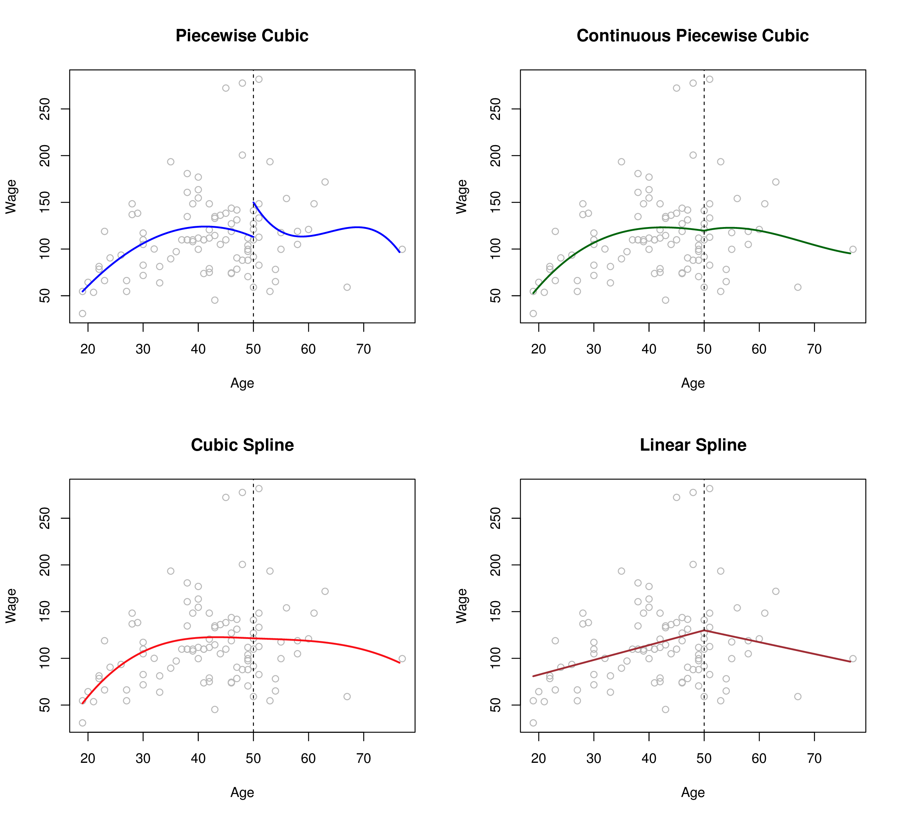
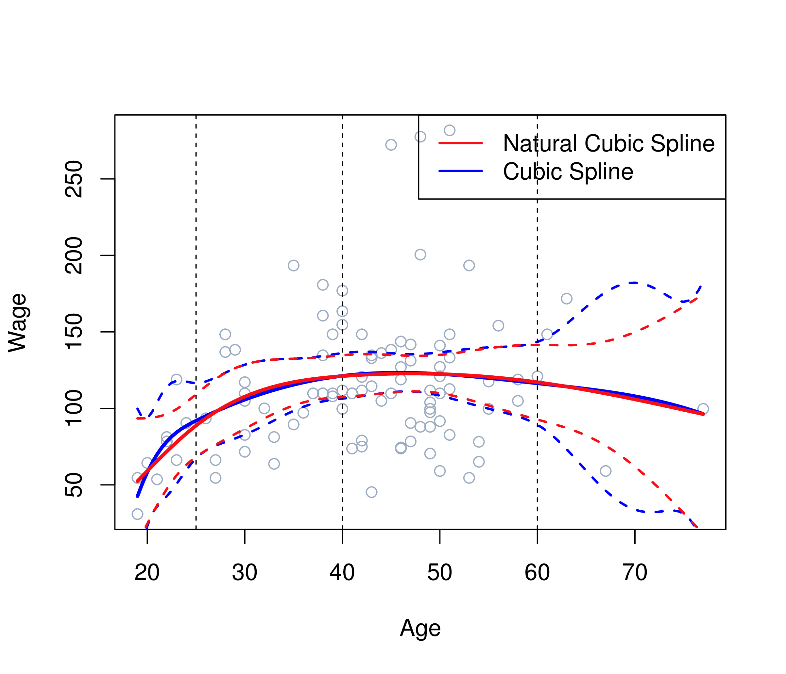
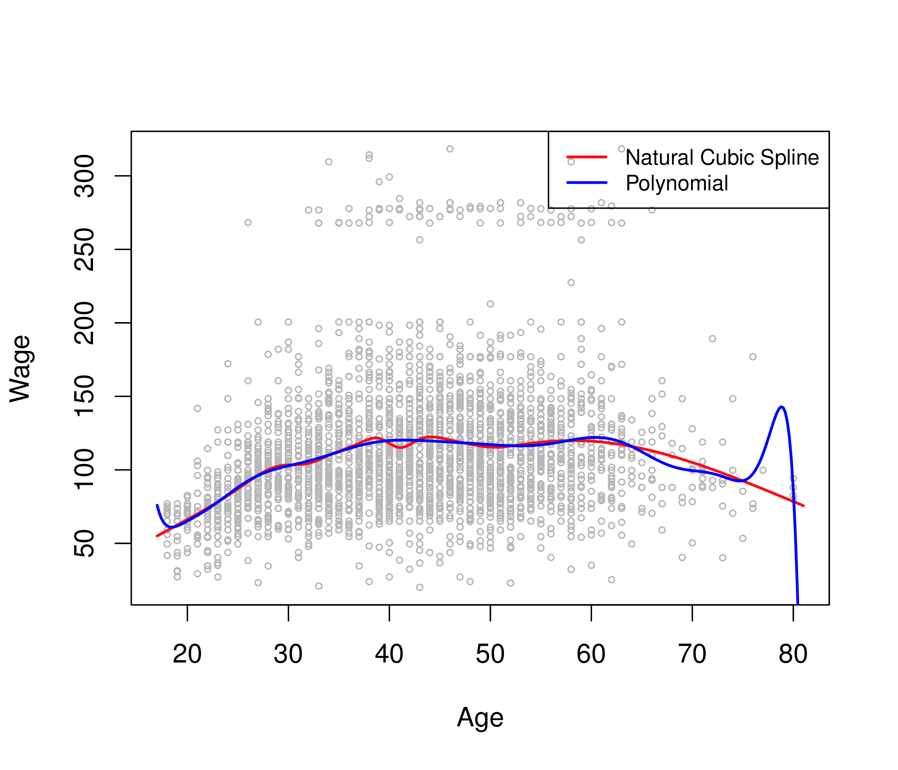
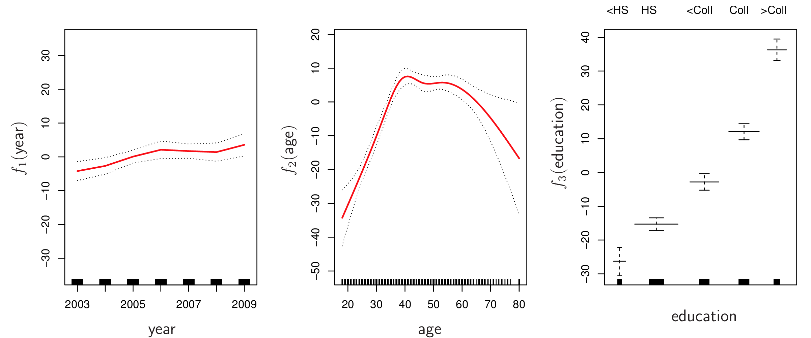

```{r setup, include=FALSE}
library(knitr)
knitr::opts_chunk$set(tidy = FALSE, 
                      message = FALSE,
                      warning = FALSE,
                      echo = FALSE, 
                      fig.retina = 2)
options(htmltools.dir.version = FALSE)
```

class: split-30

.column[.pad10px[
## Outline

- .green[Moving beyond linearity]


]]
.column[.top50px[

```{r}
library(tidyverse)
library(ISLR)
ggplot(Wage, aes(x=age, y=wage)) + geom_point() + geom_smooth(method="lm")
```

]]

---
class: split-30

.column[.pad10px[
## Outline

- .green[Moving beyond linearity]
    - splines and GAMs

]]
.column[.top50px[

```{r fig.width=12}
library(splines)
library(gridExtra)
library(rpart)
p1 <- ggplot(Wage, aes(x=age, y=wage)) + geom_point() + 
  geom_smooth(method = "glm", formula = y ~ splines::bs(x, df = 4), colour="orange", size=1.5)
rt <- rpart(wage~age, data=Wage)
Wage <- Wage %>% mutate(wagert = predict(rt, Wage))
p2 <- ggplot(Wage, aes(x=age, y=wage)) + geom_point() + 
  geom_line(aes(y=wagert), colour="orange", size=1.5)
grid.arrange(p1, p2, ncol=2)
```
]]

---
class: split-30

.column[.pad10px[
## Outline

- .green[Moving beyond linearity]
    - splines and GAMs
    - and more

]]
.column[.top50px[
The truth is rarely linear, 
but often the linearity assumption is good enough. 

When it's not ...

- .orange[polynomials],
- step functions,
- .orange[splines],
- local regression, and
- .orange[generalized additive models]

offer a lot of flexibility, without losing the ease and interpretability of linear models.
]]

---
class: split-30

.column[.pad10px[
## Outline

- Moving beyond linearity
- .green[polynomials]
    - basis functions
]]
.column[.top50px[

Instead of fitting a linear model (in $X$), we fit the model

$$y_i = \beta_0 + \beta_1 b_1(x_i) + \beta_2 b_2(x_i) + \dots + \beta_K b_K(x_i) + e_i,$$

where $b_1(X), b_2(X), \dots, b_K(X)$ are a family of functions or transformations that can be applied to a variable $X$, and $i = 1, \dots, n$.

- Polynomial regression: $b_k(x_i) = x_i^k$
- Piecewise constant functions: $b_k(x_i) = I(c_k \leq x_i \leq c_{k+1})$


]]

---
class: split-30

.column[.pad10px[
## Outline

- Moving beyond linearity
- .green[polynomials]
    - basis functions
]]
.column[.top50px[

```{r basis-functions, out.width=800, out.height=500, fig.width=8, fig.height=5}
x <- seq(-1,1,l=100)
df <- tibble(x, x1=x, x2=x^2, x3=x^3, x4=x^4, x5=x^5)
df_m <- df %>% gather(poly, value, x1:x5)
ggplot(df_m, aes(x=x, y=value, colour=poly)) + 
  geom_line(aes(linetype=poly)) + 
  scale_colour_brewer(palette="Dark2") +
  ylab("b(x)") + theme_bw()
```

x1 $=x$, x2= $x^2$, x3= $x^3$, x4= $x^4$, x5= $x^5$

]]

---
class: split-30

.column[.pad10px[
## Outline

- Moving beyond linearity
- polynomials
- .green[splines]
    - knots
]]
.column[.top50px[

Knots: $\kappa_1,\dots,\kappa_K$.

A spline is a continuous function $f(x)$ consisting of polynomials between each consecutive pair of "knots" $x=\kappa_j$ and $x=\kappa_{j+1}$.

- Parameters constrained so that $f(x)$ is continuous.
- Further constraints imposed to give continuous derivatives.

]]

---
class: split-30

.column[.pad10px[
## Outline

- Moving beyond linearity
- polynomials
- .green[splines]
    - knots
    - piecewise poly
]]
.column[.top50px[
Piecewise cubic polynomial with a single knot at a point $c$:

$$\hat{y}_i = \left\{ \begin{array}{l} 
\beta_{01}+\beta_{11}x_i+\beta_{21}x_i^2+\beta_{31}^2~~~if~x_i< c\\
\beta_{02}+\beta_{12}x_i+ \beta_{22}x_i^2+\beta_{32}^2~~~if~x_i \geq c\end{array}\right\}$$

]]
---
class: split-30

.column[.pad10px[
## Outline

- Moving beyond linearity
- polynomials
- .green[splines]
    - knots
    - piecewise poly

]]
.column[.top50px[

```{r}
library(magick)
if (!file.exists("images/7.3.png"))
  image_write(image_read("http://www-bcf.usc.edu/~gareth/ISL/Chapter7/7.3.pdf", density = 300), "images/7.3.png", 
      format = "png", density = 300)
```

<a href="http://www-bcf.usc.edu/~gareth/ISL/Chapter7/7.3.pdf" target="_BLANK">  </a>

.font_tiny[(Chapter7/7.3.pdf)]
]]

---
class: split-30

.column[.pad10px[
## Outline

- Moving beyond linearity
- polynomials
- .green[splines]
    - knots
    - piecewise poly
    - basis fns

]]
.column[.top50px[

- Truncated power basis
- Predictors: $x$, ..., $x^p$, $(x-\kappa_{1})_+^p$, ..., $(x-\kappa_{K})_+^p$

Then the regression is piecewise order- $p$ polynomials.
- $p-1$ continuous derivatives.
- Usually choose $p=1$ or $p=3$.
- $p+K+1$ degrees of freedom

]]

---
class: split-30

.column[.pad10px[
## Outline

- Moving beyond linearity
- polynomials
- .green[splines]
    - knots
    - piecewise poly
    - basis fns

]]
.column[.top50px[

```{r truncated, out.width=800, out.height=500, fig.width=8, fig.height=5}
x <- seq(-1,1,l=100)
df <- tibble(x, x1=x, x2=x^2, x3=x^3, x4=pmax((x+0.5)^3,0), x5=pmax((x-0.5)^3,0))
df_m <- df %>% gather(poly, value, x1:x5)
ggplot(df_m, aes(x=x, y=value, colour=poly)) + 
  geom_line(aes(linetype=poly)) + 
  scale_colour_brewer(palette="Dark2") +
  ylab("b(x)") + theme_bw()
```

x1 $=x$, x2= $x^2$, x3= $x^3$, x4= $(x+0.5)^3_+$, x5= $(x-0.5)^3_+$

]]

---
class: split-30

.column[.pad10px[
## Outline

- Moving beyond linearity
- polynomials
- .green[splines]
    - knots
    - piecewise poly
    - basis fns
    - natural

]]
.column[.top50px[
- Splines based on truncated power bases have high variance at the outer range of the predictors.
- Natural splines are similar, but have additional .orange[boundary constraints]: the function is linear at the boundaries. This reduces the variance.

Degrees of freedom $\verb|df|=K$.

Create predictors using $\verb|ns|$ function in R (automatically chooses knots given $\verb|df|$).
]]

---
class: split-30

.column[.pad10px[
## Outline

- Moving beyond linearity
- polynomials
- .green[splines]
    - knots
    - piecewise poly
    - basis fns
    - natural

]]
.column[.top50px[

```{r}
if (!file.exists("images/7.4.png"))
  image_write(image_read("http://www-bcf.usc.edu/~gareth/ISL/Chapter7/7.4.pdf", density = 300), "images/7.4.png", 
      format = "png", density = 300)
```

<a href="http://www-bcf.usc.edu/~gareth/ISL/Chapter7/7.4.pdf" target="_BLANK">  </a>

.font_tiny[(Chapter7/7.4.pdf)]
]]

---
class: split-30

.column[.pad10px[
## Outline

- Moving beyond linearity
- polynomials
- .green[splines]
    - knots
    - piecewise poly
    - basis fns
    - natural

]]
.column[.top50px[

```{r}
if (!file.exists("images/7.7.png"))
  image_write(image_read("http://www-bcf.usc.edu/~gareth/ISL/Chapter7/7.7.pdf", density = 300), "images/7.7.png", 
      format = "png", density = 300)
```

<a href="http://www-bcf.usc.edu/~gareth/ISL/Chapter7/7.7.pdf" target="_BLANK">  </a>

.font_tiny[(Chapter7/7.7.pdf)]
]]

---
class: split-30

.column[.pad10px[
## Outline

- Moving beyond linearity
- polynomials
- .green[splines]
    - knots
    - piecewise poly
    - basis fns
    - natural

]]
.column[.top50px[

Natural cubic splines

```{r natural, out.width=800, out.height=500, fig.width=8, fig.height=5}
x <- seq(-1,1,l=100)
xb <- ns(x, df=5)
df <- tibble(x, x1=xb[,1], x2=xb[,2], x3=xb[,3], x4=xb[,4], x5=xb[,5])
df_m <- df %>% gather(poly, value, x1:x5)
ggplot(df_m, aes(x=x, y=value, colour=poly)) + 
  geom_line(aes(linetype=poly)) + 
  scale_colour_brewer(palette="Dark2") +
  ylab("b(x)") + theme_bw()
```

]]

---
class: split-30

.column[.pad10px[
## Outline

- Moving beyond linearity
- polynomials
- .green[splines]
    - knots
    - piecewise poly
    - basis fns
    - natural
    - knots

]]
.column[.top50px[

Knot placement

- Strategy 1: specify $\verb|df|$ (equivalently $K$) and let $\verb|ns|$ place them at appropriate quantiles of the observed $X$.
- Strategy 2: choose $K$ and their locations.

]]

---
class: split-30

.column[.pad10px[
## Outline

- Moving beyond linearity
- polynomials
- .green[splines]
    - knots
    - piecewise poly
    - basis fns
    - natural
    - knots

]]
.column[.top50px[

DF = 2 (linear fit)

```{r splinesdf, out.width=800, out.height=500, fig.width=8, fig.height=5}
hits <- Hitters %>% filter(CHits > 9) %>% 
  filter(!is.na(Salary)) %>%
  mutate(logSalary = log10(Salary), logCHits = log10(CHits))
fit1 <- lm(logSalary~logCHits, data=hits)
fit2 <- lm(logSalary~ns(logCHits, df=3), data=hits)
fit3 <- lm(logSalary~ns(logCHits, df=8), data=hits)
fit4 <- lm(logSalary~ns(logCHits, df=15), data=hits)
fit5 <- lm(logSalary~ns(logCHits, df=50), data=hits)
newdat <- data.frame(logCHits=seq(1.5, 4.0, 0.1))
newdat$fit1 <- predict(fit1, newdat)
newdat$fit2 <- predict(fit2, newdat)
newdat$fit3 <- predict(fit3, newdat)
newdat$fit4 <- predict(fit4, newdat)
newdat$fit5 <- predict(fit5, newdat)
ggplot(hits, aes(x=logCHits, y=logSalary)) + 
  geom_point() +
  geom_line(data=newdat, aes(x=logCHits, y=fit1), colour="blue") + 
  ylim(c(1.5,3.2))
```

]]

---
class: split-30

.column[.pad10px[
## Outline

- Moving beyond linearity
- polynomials
- .green[splines]
    - knots
    - piecewise poly
    - basis fns
    - natural
    - knots

]]
.column[.top50px[

DF = 3

```{r splinesdf2, out.width=800, out.height=500, fig.width=8, fig.height=5}

ggplot(hits, aes(x=logCHits, y=logSalary)) + 
  geom_point() +
  geom_line(data=newdat, aes(x=logCHits, y=fit2), colour="blue") + 
  ylim(c(1.5,3.2))
```

]]

---
class: split-30

.column[.pad10px[
## Outline

- Moving beyond linearity
- polynomials
- .green[splines]
    - knots
    - piecewise poly
    - basis fns
    - natural
    - knots

]]
.column[.top50px[

DF = 8

```{r splinesdf3, out.width=800, out.height=500, fig.width=8, fig.height=5}

ggplot(hits, aes(x=logCHits, y=logSalary)) + 
  geom_point() +
  geom_line(data=newdat, aes(x=logCHits, y=fit3), colour="blue") + 
  ylim(c(1.5,3.2))
```

]]

---
class: split-30

.column[.pad10px[
## Outline

- Moving beyond linearity
- polynomials
- .green[splines]
    - knots
    - piecewise poly
    - basis fns
    - natural
    - knots

]]
.column[.top50px[

DF = 15

```{r splinesdf4, out.width=800, out.height=500, fig.width=8, fig.height=5}

ggplot(hits, aes(x=logCHits, y=logSalary)) + 
  geom_point() +
  geom_line(data=newdat, aes(x=logCHits, y=fit4), colour="blue") + 
  ylim(c(1.5,3.2))
```

]]
---
class: split-30

.column[.pad10px[
## Outline

- Moving beyond linearity
- polynomials
- .green[splines]
    - knots
    - piecewise poly
    - basis fns
    - natural
    - knots

]]
.column[.top50px[

DF = 50

```{r splinesdf5, out.width=800, out.height=500, fig.width=8, fig.height=5}

ggplot(hits, aes(x=logCHits, y=logSalary)) + 
  geom_point() +
  geom_line(data=newdat, aes(x=logCHits, y=fit5), colour="blue") + 
  ylim(c(1.5,3.2))
```

]]

---
class: split-30

.column[.pad10px[
## Outline

- Moving beyond linearity
- polynomials
- splines
- .green[Generalised additive models (GAMs)]
    - Curse of dimensionality

]]
.column[.top50px[

Why is it hard to fit models of the form

$$y = f(x_1,x_2,\dots,x_p) + e?$$
- Data is very sparse in high-dimensional space.
- Model assumes $p$-way interactions which are hard to estimate.


]]

---
class: split-30

.column[.pad10px[
## Outline

- Moving beyond linearity
- polynomials
- splines
- .green[Generalised additive models (GAMs)]
    - Curse of dimensionality
    - Additive functions

]]
.column[.top50px[

.boxshadow[.content[
$y_i=\beta_0+f_1(x_{i,1})+f_2(x_{i,2})+...+f_p(x_{p,1})+e_i$
]]

where each f is a smooth univariate function.

Allows for flexible nonlinearities in several variables, but retains
the additive structure of linear models.

]]

---
class: split-30

.column[.pad10px[
## Outline

- Moving beyond linearity
- polynomials
- splines
- .green[Generalised additive models (GAMs)]
    - Curse of dimensionality
    - Additive functions

]]
.column[.top50px[

$$wage = \beta_0 + f_1(year) + f_2(age) + f_3(education) + \varepsilon$$

```{r}
if (!file.exists("images/7.11.png"))
  image_write(image_read("http://www-bcf.usc.edu/~gareth/ISL/Chapter7/7.11.pdf", density = 300), "images/7.11.png", 
      format = "png", density = 300)
```

<a href="http://www-bcf.usc.edu/~gareth/ISL/Chapter7/7.11.pdf" target="_BLANK">  </a>


.font_tiny[(Chapter7/7.11.pdf)]
]]

---
class: split-30

.column[.pad10px[
## Outline

- Moving beyond linearity
- polynomials
- splines
- .green[Generalised additive models (GAMs)]
    - Curse of dimensionality
    - Additive functions
    - Generalisation

]]
.column[.top50px[
- Can fit a GAM simply using, e.g. natural splines:
- Coefficients not that interesting; fitted functions are. 
- Use `plot.gam` from `gam` package.
-  Can mix terms --- some linear, some nonlinear --- and use
`anova()` to compare models.
- GAMs are additive, although low-order interactions can be
included in a natural way using, e.g. bivariate smoothers or
interactions of the form `ns(age,df=5):ns(year,df=5)`.

]]

---
class: split-30 vmiddle

.column[.top50px[

## Outline
- Moving beyond linearity
- polynomials
- splines
- .green[Generalised additive models (GAMs)]
    - Curse of dimensionality
    - Additive functions
    - Generalisation
    - Interaction
]]
.column[.top50px[
- Additive models assume no interactions. 
- Add bivariate smooths for two-way interactions.
- Graphically check for interactions using faceting.
]]

---
layout: false
# `r set.seed(2019); emo::ji("technologist")` Made by a human with a computer

### Slides at [https://monba.dicook.org](https://monba.dicook.org).
### Code and data at [https://github.com/dicook/Business_Analytics](https://github.com/dicook/Business_Analytics).
<br>

### Created using [R Markdown](https://rmarkdown.rstudio.com) with flair by [**xaringan**](https://github.com/yihui/xaringan), and [**kunoichi** (female ninja) style](https://github.com/emitanaka/ninja-theme).

<br> 
<a rel="license" href="http://creativecommons.org/licenses/by-sa/4.0/"></a><br />This work is licensed under a <a rel="license" href="http://creativecommons.org/licenses/by-sa/4.0/">Creative Commons Attribution-ShareAlike 4.0 International License</a>.
