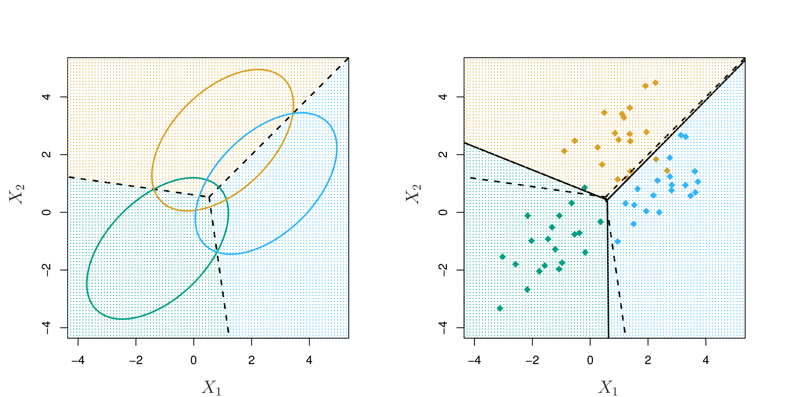
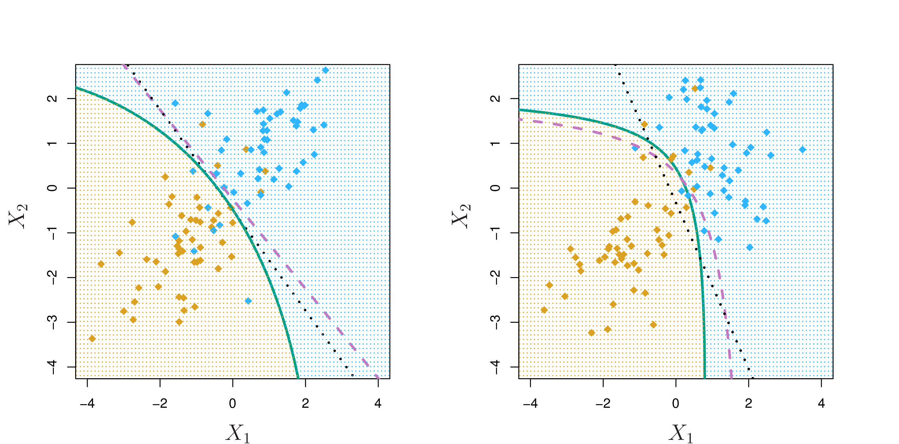

```{r setup, include=FALSE}
library(knitr)
knitr::opts_chunk$set(tidy = FALSE, 
                      message = FALSE,
                      warning = FALSE,
                      echo = FALSE, 
                      fig.width=8,
                      fig.height=6,
                      fig.align = "center",
                      fig.retina = 2)
options(htmltools.dir.version = FALSE)
library(magick)
```

class: split-30
layout: false

.column[.pad10px[
## Outline

- .green[Classification]
    - Categorical response

]]
.column[.top50px[

In classification, the output $Y$ is a .orange[categorical variable]. For example,

- Loan approval: $Y \in \{successful, unsuccessful\}$ 
- Type of business culture: $Y \in \{clan, adhocracy, market, hierarchical\}$
- Historical document author: $Y \in \{Austen, Dickens, Imitator\}$
- Email: $Y \in \{spam, ham\}$

Map the categories to a numeric variable, or possibly a binary matrix.

]]

---
layout: true
class: shuriken-full white 

.blade1.bg-green[.content.center.vmiddle[
A person arrives at the emergency room with a set of symptoms that could possibly be attributed to one of three medical conditions. Which of the three conditions does the individual have?
]]
.blade2.bg-purple[.content.center.vmiddle[
An online banking service must be able to determine whether or not a transaction being performed on the site is fraudulent, on the basis of the user’s IP address, past transaction history, and so forth.
]]
.blade3.bg-deep-orange[.content.center.vmiddle[
On the basis of DNA sequence data for a number of patients with and without a given disease, a biologist would like to figure out which DNA mutations are deleterious (disease-causing) and which are not.
]]
.blade4.bg-pink[.content.center.vmiddle[
An email comes into the server. Should it be moved into the inbox or the junk mail mox, based on header text, sender, origin, time of day, ...?
]]

---

class: hide-blade2 hide-blade3 hide-blade4 hide-hole

---

class: hide-blade3 hide-blade4 hide-hole
count: false

---

class: hide-blade4 hide-hole
count: false

---

class: hide-hole
count: false

---

count: false 

---
layout: false

class: split-30
layout: false

.column[.pad10px[
## Outline

- .green[Classification]
    - Categorical response
    - Why not linear reg?

]]
.column[.top50px[

```{r out.width=800}
library(tidyverse)
set.seed("15032019")
n <- 244; n1 <- 55
x <- c(rnorm(n1, -1), rnorm(n-n1, 1))
y <- c(rep(0, n1), rep(1, n-n1))
df <- tibble(x, y)
ggplot(df, aes(x=x, y=y)) + 
  geom_point() + 
  geom_smooth(method="lm") +
  ylim(c(-1, 2))
```

]]

---
class: split-30

.column[.pad10px[
## Outline

- Classification
- .green[Logistic regression]
]]
.column[.top50px[
```{r out.width=800}
ggplot(df, aes(x=x, y=y)) + 
  geom_point() + 
  geom_smooth(method="lm", se=FALSE) +
  ylim(c(-1, 2)) +
  geom_smooth(method="glm", method.args = list(family = "binomial"), colour = "orange")
```
]]

---
class: split-30

.column[.pad10px[
## Outline

- Classification
- .green[Logistic regression]
    - Logistic function
]]
.column[.top50px[

$$f(x) = \frac{e^{\beta_0+\beta_1x}}{1+e^{\beta_0+\beta_1x}}$$

```{r out.width=600}
x <- seq(-2, 2, 0.1)
y <- exp(1+3*x)/(1+exp(1+3*x))
df2 <- tibble(x, y)
ggplot(df2, aes(x=x, y=y)) + 
  geom_line() 
```

]]

---
class: split-30

.column[.pad10px[
## Outline

- Classification
- .green[Logistic regression]
    - Logistic function
]]
.column[.top50px[

.split-50[.column[

Transform the function: 

$$~~~~f(x) = \frac{e^{\beta_0+\beta_1x}}{1+e^{\beta_0+\beta_1x}}$$

$\rightarrow  f(x) = \frac{1}{1/e^{\beta_0+\beta_1x}+1}$

$\rightarrow  1/f(x) = 1/e^{\beta_0+\beta_1x}+1$

$\rightarrow 1/f(x) - 1 = 1/e^{\beta_0+\beta_1x}$

$\rightarrow  \frac{1}{1/f(x) - 1} = e^{\beta_0+\beta_1x}$

$\rightarrow ~~ ...$
]
.column[

$\rightarrow ~~ ...$

$\rightarrow \frac{f(x)}{1 - f(x)} = e^{\beta_0+\beta_1x}$

$\rightarrow \log_e\frac{f(x)}{1 - f(x)} = \beta_0+\beta_1x$

<br>
<br>


The left-hand side $\log_e\frac{f(x)}{1 - f(x)}$ is called the .orange[log-odds ratio] or logit.

```{r}
library(anicon)
faa("dice", animate="bounce", color="orange", size="lg", speed="slow")
```

]]]

]]
---
class: split-30

.column[.pad10px[
## Outline

- Classification
- .green[Logistic regression]
    - Logistic function
    - Logistic model - GLM
]]
.column[.top50px[

.boxshadow[
The fitted model is then written as:

.content[
$\log_e\frac{P(Y=1|X)}{1 - P(Y=1|X)} = \beta_0+\beta_1X$
]]

and then 

$$P(Y=0|X) = 1 - P(Y=1|X)$$

*Multiple categories*: This formula can be extended to more than binary response variables. Writing the equation is not simple, but follows from the above, extending it to provide probabilities for each level/category. The sum of all  probabilities is 1.


]]

---
class: split-30

.column[.pad10px[
## Outline

- Classification
- .green[Logistic regression]
    - Logistic function
    - Logistic model - GLM
    - Interpretation
]]
.column[.top50px[

- Linear regression	
    - $\beta_1$ gives the average change in $Y$ associated with a one-unit increase in $X$
- Logistic regression
    - Increasing $X$ by one unit changes the log odds by $\beta_1$, or equivalently it multiplies the odds by $e^{\beta_1}$
    - However, because the model is not linear in $X$, $\beta_1$ does not correspond to the change in response associated with a one-unit increase in $X$
    
]]

---
class: split-30

.column[.pad10px[
## Outline

- Classification
- .green[Logistic regression]
    - Logistic function
    - Logistic model - GLM
    - Interpretation
    - Estimation
]]
.column[.top50px[

Maximum Likelihood Estimation

Given the logistic $p(x_i) = \frac{1}{e^{-(\beta_0+\beta_1x})+1}$

We choose parameters $\beta_0, \beta_1$ to maximize the likelihood of the data given the model. The likelihood function is

$$\mathcal{l}_n(\beta_0, \beta_1) = \prod_{y_i=1,i}^n p(x_i)\prod_{y_i=0,i}^n (1-p(x_i)).$$

It is more convenient to maximize the *log-likelihood*:

$$\text{max}_{\beta_0, \beta_1} ~ l_n(\beta_0, \beta_1) =  - \sum_{i = 1}^n \log(1 + e^{-(\beta_0+\beta_1x}) )$$


]]

---
class: split-30

.column[.pad10px[
## Outline

- Classification
- .green[Logistic regression]
    - Logistic function
    - Logistic model - GLM
    - Interpretation
    - Estimation
    - Making predictions
]]
.column[.top50px[

With estimates from the model fit, $\hat{\beta_0}, \hat{\beta_1}$, predict the response using:


$$\hat{p}(x) = \frac{e^{\hat{\beta_0}+ \hat{\beta_1}x}}{1+e^{\hat{\beta_0}+ \hat{\beta_1}x}}$$

It is a proportion, but can be rounded to 0 or 1 for class prediction.

]]

---
class: split-30

.column[.pad10px[
## Outline

- Classification
- .green[Logistic regression]
    - Logistic function
    - Logistic model - GLM
    - Interpretation
    - Estimation
    - Making predictions
    - Example
]]
.column[.top50px[

Simulated data to predict which customers will default on their credit card debt.

```{r}
library(ISLR)
data(Default)
simcredit <- Default %>% 
  mutate(default_bin = ifelse(default=="Yes", 1, 0))
ggplot(simcredit, aes(x=balance, y=default_bin)) + geom_point() +
  geom_smooth(method="glm", method.args = list(family = "binomial"), colour = "orange") + ylab("default")
```

]]

---
class: split-30

.column[.pad10px[
## Outline

- Classification
- .green[Logistic regression]
    - Logistic function
    - Logistic model - GLM
    - Interpretation
    - Estimation
    - Making predictions
    - Example
]]
.column[.top50px[

```{r echo=TRUE}
library(broom)
fit <- glm(default~balance, data=simcredit, family="binomial")
tidy(fit)
```

```{r}
faa("broom", animate="passing", color="orange", size="lg")
```

]]

---
class: split-30

.column[.pad10px[
## Outline

- Classification
- .green[Logistic regression]
    - Logistic function
    - Logistic model - GLM
    - Interpretation
    - Estimation
    - Making predictions
    - Example
]]
.column[.top50px[

```{r echo=TRUE}
glance(fit)
```
]]

---
class: split-30

.column[.pad10px[
## Outline

- Classification
- .green[Logistic regression]
    - Logistic function
    - Logistic model - GLM
    - Interpretation
    - Estimation
    - Making predictions
    - Example
]]
.column[.top50px[

```{r echo=TRUE, fig.width=6, fig.height=4, out.width=500}
simcredit_fit <- augment(fit, simcredit, type.predict="response")
ggplot(simcredit_fit, aes(x=balance, y=default_bin)) + 
  geom_point() +
  geom_ribbon(aes(ymin=.fitted-2*.se.fit, ymax=.fitted+2*.se.fit), 
              fill = "orange", alpha=0.3) +
  geom_line(aes(y=.fitted), colour = "orange") + 
  ylab("default")

```
]]
---
class: split-30

.column[.pad10px[
## Outline

- Classification
- Logistic regression
- .green[Linear discriminant analysis]
]]
.column[.top50px[

Logistic regression involves directly modeling $Pr(Y = k|X = x)$ using the logistic function. Rounding the probabilities produces class predictions, in two class problems; selecting the class with the highest probability produces class predictions in multi-class problems.

Another approach for building a classification model is .orange[linear discriminant analysis]. This involves directly estimating the .orange[distribution of the predictors], separately for each class.

]]

---
class: split-30

.column[.pad10px[
## Outline

- Classification
- Logistic regression
- .green[Linear discriminant analysis]
    - Bayes theorem

]]
.column[.top50px[

Let $f_k(x)$ be the density function for predictor $x$ for class $k$. If $f$ is small, the probability that $x$ belongs to class $k$ is small, and conversely if $f$ is large.

Bayes theorem (for $K$ classes) states:

.boxshadow[
.content[

$$Pr(Y = k|X = x) = \frac{\pi_kf_k(x)}{\sum_{i=1}^K \pi_kf_k(x)}$$
]]


where $\pi_k = \text{Pr}(Y = k)$ is the prior probability that the observation comes from class $k$. We shorten $$Pr(Y=k|X=x)$$ to $$p_k(x)$$.

]]
---
class: split-30

.column[.pad10px[
## Outline

- Classification
- Logistic regression
- .green[Linear discriminant analysis]
    - Bayes theorem
    - When $p=1$
]]
.column[.top50px[

```{r out.width=800, fig.height=5}
library(ggpubr)
x <- seq(-4, 4, 0.1)
dx <- c(dnorm(x, -1), dnorm(x, 1))
y <- factor(c(rep(0, length(x)), rep(1, length(x))))
df_pop <- tibble(x=c(x,x), dx, y)
df_means <- df %>% group_by(y) %>% 
  summarise(x=mean(x)) %>%
  bind_rows(c(y=1, x=mean(x)))
p1 <- ggplot() + 
  geom_rug(data=df, aes(x=x, y=0, colour=factor(y)), alpha=0.7) +
  geom_line(data=df_pop, aes(x=x, y=dx, colour=y)) + 
  scale_color_brewer("", palette="Dark2") +
  geom_vline(xintercept=0, colour="grey40", linetype=2) +
  xlab("density") + ggtitle("Population")
p2 <- ggplot(df, aes(x=x, fill=factor(y))) + 
        geom_histogram(binwidth=0.67, alpha=0.8) + 
  scale_fill_brewer("", palette="Dark2") +
  scale_colour_brewer("", palette="Dark2") +
  facet_wrap(~y, ncol=1, scales="free_y") + 
  geom_vline(data=df_means, aes(xintercept=x, 
                                colour=factor(y)), linetype=2) +
  geom_vline(xintercept=df_means$x[3], colour="grey40", linetype=2) +
  ggtitle("Data")
ggarrange(p1, p2, ncol=2, common.legend = TRUE)
```

]]

---
class: split-30

.column[.pad10px[
## Outline

- Classification
- Logistic regression
- .green[Linear discriminant analysis]
    - Bayes theorem
    - When $p=1$
]]
.column[.top50px[

We assume $f_k(x)$ is .orange[Normal] or Gaussian:

$$f_k(x) = \frac{1}{\sqrt{2 \pi} \sigma_k} \text{exp}~ \left( - \frac{1}{2 \sigma^2_k} (x - \mu_k)^2 \right)$$

where $\mu_k$ and $\sigma^2_k$ are the mean and variance parameters for the $k$th class. Further assume that $\sigma_1^2 = \sigma_2^2 = \dots = \sigma_K^2$; then the conditional probabilities are 

$$p_k(x) = \frac{\pi_k \frac{1}{\sqrt{2 \pi} \sigma} \text{exp}~ \left( - \frac{1}{2 \sigma^2} (x - \mu_k)^2 \right) }{ \sum_{l = 1}^K \pi_l \frac{1}{\sqrt{2 \pi} \sigma} \text{exp}~ \left( - \frac{1}{2 \sigma^2} (x - \mu_l)^2 \right) }$$


]]

---
class: split-30

.column[.pad10px[
## Outline

- Classification
- Logistic regression
- .green[Linear discriminant analysis]
    - Bayes theorem
    - When $p=1$
]]
.column[.top50px[
The Bayes classifier is assign new observation $X=x_0$ to the class with the highest $p_k(x_0)$. A simplification of $p_k(x_0)$ yields the .orange[discriminant functions]: 

$$\delta_k(x) = x_0 \frac{\mu_k}{\sigma^2} - \frac{\mu_k^2}{2 \sigma^2} + log(\pi_k)$$
and the rule Bayes classifier will assign $x_0$ to the class with the largest value. 

]]

---
class: split-30

.column[.pad10px[
## Outline

- Classification
- Logistic regression
- .green[Linear discriminant analysis]
    - Bayes theorem
    - When $p=1$
]]
.column[.top50px[

When $K = 2$ and $\pi_1 = \pi_2$, then the Bayes classifier is :

*Assign* $x_0$ *to class 1, if* 

$$\delta_1(x) > \delta_2(x)$$

$$x_0 \frac{\mu_1}{\sigma^2} - \frac{\mu_1^2}{2 \sigma^2} + log(\pi) > x_0 \frac{\mu_2}{\sigma^2} - \frac{\mu_2^2}{2 \sigma^2} + log(\pi) $$

which simplifies to 

$$x_0 > \frac{\mu_1+\mu_2}{2}$$
.boxshadow[
.content[
This is estimated on the data with 
$x_0 > \frac{\bar{x}_1 + \bar{x}_2}{2}$.
]]

]]

---
class: split-30

.column[.pad10px[
## Outline

- Classification
- Logistic regression
- .green[Linear discriminant analysis]
    - Bayes theorem
    - When $p=1$
    - Multivariate
]]
.column[.top50px[

To indicate that a p-dimensional random variable X has a multivariate Gaussian distribution with $E[X] = \mu$ and $\text{Cov}(X) = \Sigma$, we write $X \sim N(\mu, \Sigma)$.

The multivariate normal density function is:

$$f(x) = \frac{1}{(2\pi)^{p/2}|\Sigma|^{1/2}} \exp\{-\frac{1}{2}(x-\mu)'\Sigma^{-1}(x-\mu)\}$$

with $x, \mu$ are $p$-dimensional vectors, $\Sigma$ is a $p\times p$ variance-covariance matrix. 

]]
---
class: split-30

.column[.pad10px[
## Outline

- Classification
- Logistic regression
- .green[Linear discriminant analysis]
    - Bayes theorem
    - When $p=1$
    - Multivariate
]]
.column[.top50px[
The discriminant functions are:

$$\delta_k(x) = x'\Sigma^{-1}\mu_k - \frac{1}{2}\mu_k'\Sigma^{-1}\mu_k + \pi_k$$

and Bayes classifier is .orange[assign a new observation] $x_0$ .orange[to the class with the highest] $\delta_k(x_0)$.

When $K=2$ and $\pi_1=\pi_2$ this reduces to 

Assign observation $x_0$ to class 1 if 

$$x_0'\Sigma^{-1}(\mu_1-\mu_2) > \frac{1}{2}(\mu_1+\mu_2)'\Sigma^{-1}(\mu_1-\mu_2)$$

]]
---
class: split-30

.column[.pad10px[
## Outline

- Classification
- Logistic regression
- .green[Linear discriminant analysis]
    - Bayes theorem
    - When $p=1$
    - Multivariate
]]
.column[.top50px[

.orange[Discriminant space]: a benefit of LDA is that it provides a low-dimensional projection of the $p$-dimensional space, where the groups are the most separated. For $K=2$, this is

$$\Sigma^{-1}(\mu_1-\mu_2)$$

For $K>2$, the discriminant space is found be taking an eigen-decomposition of $\Sigma^{-1}\Sigma_B$, where

$$\Sigma_B = \frac{1}{K}\sum_{i=1}^{K} (\mu_i-\mu)(\mu_i-\mu)'$$

]]

---
class: split-30

.column[.pad10px[
## Outline

- Classification
- Logistic regression
- .green[Linear discriminant analysis]
    - Bayes theorem
    - When $p=1$
    - Multivariate
]]
.column[.top50px[

```{r}
library(magick)
if (!file.exists("images/4.6.png"))
  image_write(image_read("http://www-bcf.usc.edu/~gareth/ISL/Chapter4/4.6.pdf", density = 300), "images/4.6.png", 
      format = "png", density = 300)
```

The dashed lines are the Bayes decision boundaries. Ellipses
that contain 95% of the probability for each of the three classes are shown.

<a href="http://www-bcf.usc.edu/~gareth/ISL/Chapter4/4.6.pdf" target="_BLANK">  </a>

.font_tiny[(Chapter4/4.6.pdf)]
]]

---
class: split-30

.column[.pad10px[
## Outline

- Classification
- Logistic regression
- .green[Linear discriminant analysis]
    - Bayes theorem
    - When $p=1$
    - Multivariate
    - Quadratic
]]
.column[.top50px[

A quadratic boundary is obtained by relaxing the assumption of equal variance-covariance, and assume that $\Sigma_k \neq \Sigma_l, ~~k\neq l, k,l=1,...,K$

```{r}
library(magick)
if (!file.exists("images/4.9.png"))
  image_write(image_read("http://www-bcf.usc.edu/~gareth/ISL/Chapter4/4.9.pdf", density = 300), "images/4.9.png", 
      format = "png", density = 300)
```

<a href="http://www-bcf.usc.edu/~gareth/ISL/Chapter4/4.9.pdf" target="_BLANK">  </a>

.font_tiny[(Chapter4/4.9.pdf)]

]]
---
layout: false
# `r set.seed(2019); emo::ji("technologist")` Made by a human with a computer

### Slides at [https://monba.dicook.org](https://monba.dicook.org).
### Code and data at [https://github.com/dicook/Business_Analytics](https://github.com/dicook/Business_Analytics).
<br>

### Created using [R Markdown](https://rmarkdown.rstudio.com) with flair by [**xaringan**](https://github.com/yihui/xaringan), and [**kunoichi** (female ninja) style](https://github.com/emitanaka/ninja-theme).

<br> 
<a rel="license" href="http://creativecommons.org/licenses/by-sa/4.0/"></a><br />This work is licensed under a <a rel="license" href="http://creativecommons.org/licenses/by-sa/4.0/">Creative Commons Attribution-ShareAlike 4.0 International License</a>.
