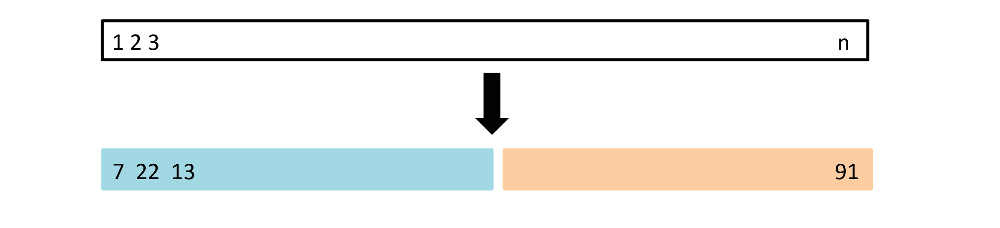
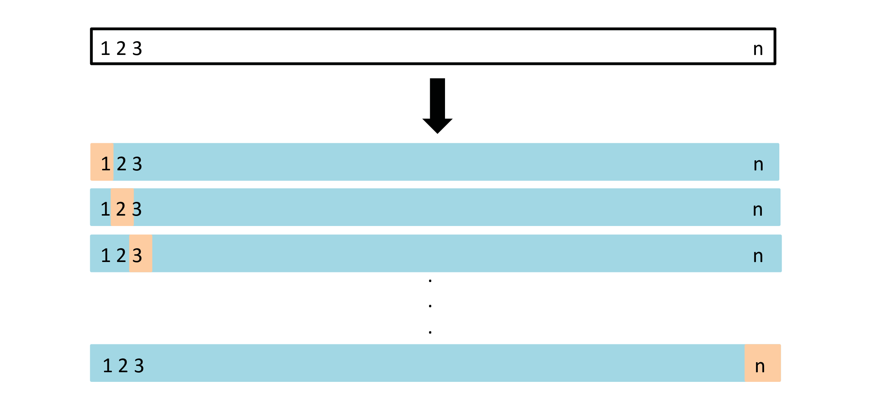
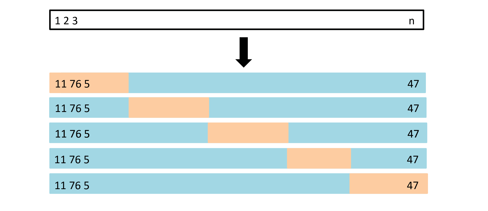
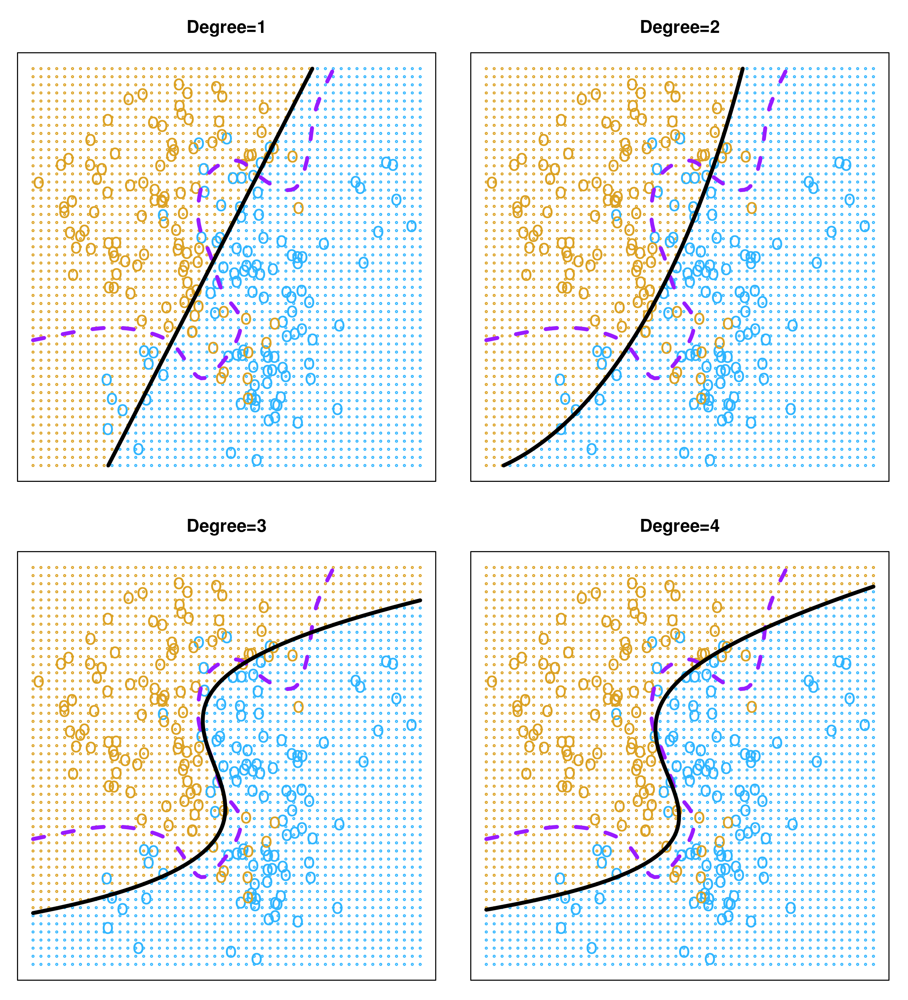
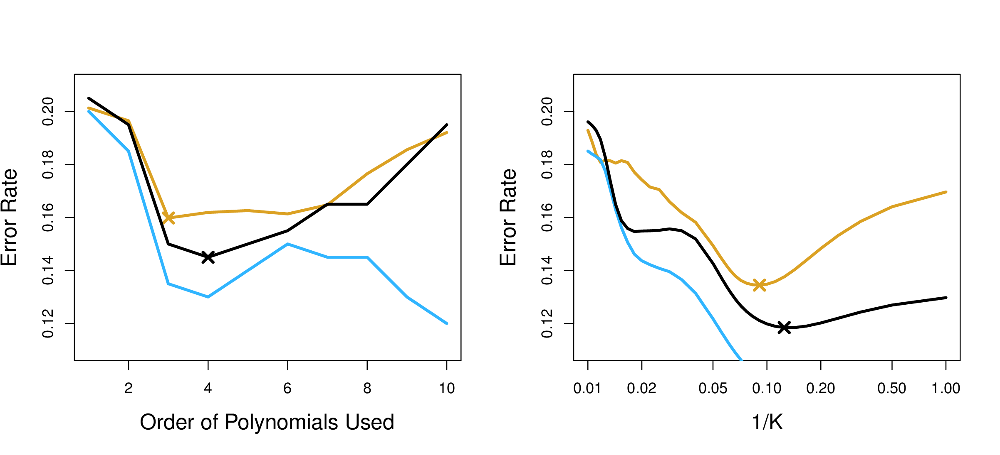
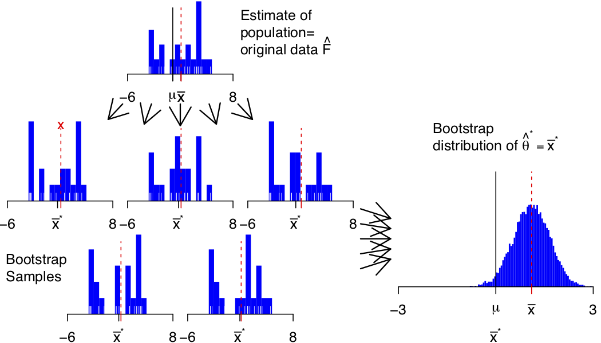
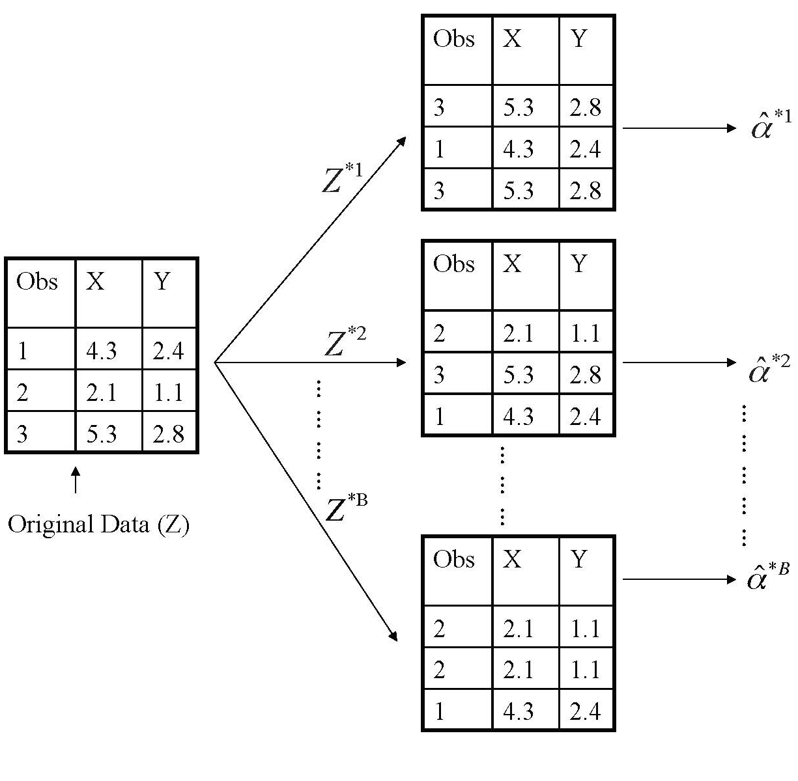

```{r setup, include=FALSE}
library(knitr)
knitr::opts_chunk$set(tidy = FALSE, 
                      message = FALSE,
                      warning = FALSE,
                      echo = FALSE, 
                      fig.width=8,
                      fig.height=6,
                      fig.align = "center",
                      fig.retina = 2)
options(htmltools.dir.version = FALSE)
```

class: split-30
layout: false

.column[.pad10px[
## Outline

- .green[Validating models]
    - validation set 

]]
.column[.top50px[

```{r}
library(magick)
if (!file.exists("images/5.1.png"))
  image_write(image_read("http://www-bcf.usc.edu/~gareth/ISL/Chapter5/5.1.pdf", density = 300), "images/5.1.png", 
      format = "png", density = 300)
```

<a href="http://www-bcf.usc.edu/~gareth/ISL/Chapter5/5.1.pdf" target="_BLANK">  </a>

A set of $n$ observations are randomly split into a training set (blue, containing observations 7, 22, 13, ...) and a validation set (yellow, all other observations not in training set).

Drawback: Only one split of data made, may not adequately estimate test error. 

.font_tiny[(Chapter5/5.1.pdf)]

]]

---
class: split-30

.column[.pad10px[
## Outline

- .green[Validating models]
    - validation set 

]]
.column[.top50px[

Want to choose best degree of polynomial, for $mpg=\beta_0+\beta_1f(horsepower)+\varepsilon$

```{r}
# The Validation Set Approach
library(ISLR)
library(broom)
library(modelr)
library(tidyverse)
set.seed(1111)
train <- sample(392,196)
head(sort(train), 15)
fit1 <- lm(mpg~horsepower, data=Auto, subset=train)
fit2 <- lm(mpg~poly(horsepower, 2), data=Auto, subset=train)
fit3 <- lm(mpg~poly(horsepower, 3), data=Auto, subset=train)
fit4 <- lm(mpg~poly(horsepower, 4), data=Auto, subset=train)
testerr <- tibble(x=1:4, 
                  mse=c(mse(fit1, Auto[-train,]),
                        mse(fit2, Auto[-train,]),
                        mse(fit3, Auto[-train,]),
                        mse(fit4, Auto[-train,])))
ggplot(testerr, aes(x=x, y=mse)) +
  geom_line() +
  ylim(c(15, 30)) +
  xlab("degree") + ggtitle("Test error: draw 1")
```

]]

---
class: split-30
count: false

.column[.pad10px[
## Outline

- .green[Validating models]
    - validation set 

]]
.column[.top50px[

Want to choose best degree of polynomial, for $mpg=\beta_0+\beta_1f(horsepower)+\varepsilon$

```{r}
train <- sample(392,196)
head(sort(train), 15)
fit1 <- lm(mpg~horsepower, data=Auto, subset=train)
fit2 <- lm(mpg~poly(horsepower, 2), data=Auto, subset=train)
fit3 <- lm(mpg~poly(horsepower, 3), data=Auto, subset=train)
fit4 <- lm(mpg~poly(horsepower, 4), data=Auto, subset=train)
testerr <- tibble(x=1:4, 
                  mse=c(mse(fit1, Auto[-train,]),
                        mse(fit2, Auto[-train,]),
                        mse(fit3, Auto[-train,]),
                        mse(fit4, Auto[-train,])))
ggplot(testerr, aes(x=x, y=mse)) +
  geom_line() +
  ylim(c(15, 30)) +
  xlab("degree") + ggtitle("Test error: draw 2")
```
]]

---
class: split-30
count: false

.column[.pad10px[
## Outline

- .green[Validating models]
    - validation set 

]]
.column[.top50px[

Want to choose best degree of polynomial, for $mpg=\beta_0+\beta_1f(horsepower)+\varepsilon$

```{r}
train <- sample(392,196)
head(sort(train), 15)
fit1 <- lm(mpg~horsepower, data=Auto, subset=train)
fit2 <- lm(mpg~poly(horsepower, 2), data=Auto, subset=train)
fit3 <- lm(mpg~poly(horsepower, 3), data=Auto, subset=train)
fit4 <- lm(mpg~poly(horsepower, 4), data=Auto, subset=train)
testerr <- tibble(x=1:4, 
                  mse=c(mse(fit1, Auto[-train,]),
                        mse(fit2, Auto[-train,]),
                        mse(fit3, Auto[-train,]),
                        mse(fit4, Auto[-train,])))
ggplot(testerr, aes(x=x, y=mse)) +
  geom_line() +
  ylim(c(15, 30)) +
  xlab("degree") + ggtitle("Test error: draw 3")
```
]]

---
class: split-30

.column[.pad10px[
## Outline

- .green[Validating models]
    - validation set 

]]
.column[.top50px[

Want to choose best degree of polynomial, for $mpg=\beta_0+\beta_1f(horsepower)+\varepsilon$

```{r}
train <- sample(392,196)
head(sort(train), 15)
fit1 <- lm(mpg~horsepower, data=Auto, subset=train)
fit2 <- lm(mpg~poly(horsepower, 2), data=Auto, subset=train)
fit3 <- lm(mpg~poly(horsepower, 3), data=Auto, subset=train)
fit4 <- lm(mpg~poly(horsepower, 4), data=Auto, subset=train)
testerr <- tibble(x=1:4, 
                  mse=c(mse(fit1, Auto[-train,]),
                        mse(fit2, Auto[-train,]),
                        mse(fit3, Auto[-train,]),
                        mse(fit4, Auto[-train,])))
ggplot(testerr, aes(x=x, y=mse)) +
  geom_line() +
  ylim(c(15, 30)) +
  xlab("degree") + ggtitle("Test error: draw 4")
```
]]

---
class: middle

```{r}
library(anicon)
faa("dice", animate="bounce", color="orange", size="lg", speed="slow")
```

The .orange[variability] between different draws of test sets can be .orange[large]. This can provide poor choice of model, or misleading estimate of error.

---
class: split-30

.column[.pad10px[
## Outline

- .green[Validating models]
    - validation set 
    - LOOCV

]]
.column[.top50px[
Leave-one-out (LOOCV) cross-validation: $n$ validation sets, each with .orange[ONE] observation left out.


```{r}
if (!file.exists("images/5.3.png"))
  image_write(image_read("http://www-bcf.usc.edu/~gareth/ISL/Chapter5/5.3.pdf", density = 300), "images/5.3.png", 
      format = "png", density = 300)
```

<a href="http://www-bcf.usc.edu/~gareth/ISL/Chapter5/5.3.pdf" target="_BLANK">  </a>


]]

---
class: split-30

.column[.pad10px[
## Outline

- .green[Validating models]
    - validation set 
    - LOOCV

]]
.column[.top50px[
Leave-one-out (LOOCV) cross-validation: $n$ validation sets, each with .orange[ONE] observation left out. For each set, $i=1, ..., n$, compute the $MSE_{i}$.

The LOOCV estimate for the test MSE is the average of these $n$ test error estimates:

$$CV_{(n)} = \frac{1}{n}\sum_{i=1}^n MSE_{i}$$

]]

---
class: split-30

.column[.pad10px[
## Outline

- .green[Validating models]
    - validation set 
    - LOOCV

]]
.column[.top50px[

There is a computational shortcut, for linear or polynomial models, where not all $n$ models need to be fitted. 

$$CV_{(n)} = \frac{1}{n}\sum_{i=1}^n \frac{(y_i-\hat{y})^2}{1-h_i}$$

where $h_i=\frac{1}{n}+\frac{(x_i-\bar{x})^2}{\sum_{i'}^n(x_{i'}-\bar{x})^2}$ (known as *leverage* from regression diagnostics).
]]

---
class: split-30

.column[.pad10px[
## Outline

- .green[Validating models]
    - validation set 
    - LOOCV
    - k-fold cross-validation

]]
.column[.top50px[

1. Divide the data set into k different parts.
2. Remove one part, fit the model on the remaining $k − 1$ parts, and compute the MSE on the omitted part.
3. Repeat $k$ times taking out a different part each time

```{r}
if (!file.exists("images/5.5.png"))
  image_write(image_read("http://www-bcf.usc.edu/~gareth/ISL/Chapter5/5.5.pdf", density = 300), "images/5.5.png", 
      format = "png", density = 300)
```

<a href="http://www-bcf.usc.edu/~gareth/ISL/Chapter5/5.5.pdf" target="_BLANK">  </a>

]]

---
class: split-30

.column[.pad10px[
## Outline

- .green[Validating models]
    - validation set 
    - LOOCV
    - k-fold cross-validation

]]
.column[.top50px[

1. Divide the data set into k different parts.
2. Remove one part, fit the model on the remaining $k − 1$ parts, and compute the MSE on the omitted part.
3. Repeat $k$ times taking out a different part each time

$$CV_{(k)} = \frac{1}{k}\sum_{i=1}^n \frac{(y_i-\hat{y})^2}{1-h_i}$$
- LOOCV is a special case of $k$-fold cross-validation.
- Bias-variance trade-off: 
    - one vaidation set overestimates test error, LOOCV approximately unbiased estimates, $k$-fold CV intermediate
    - LOOCV has higher variance than does $k$-fold CV
    - choice of $k=5$ or $10$ is a compromise

]]
---
class: split-30

.column[.pad10px[
## Outline

- .green[Validating models]
    - validation set 
    - LOOCV
    - k-fold cross-validation
    - classification

]]
.column[.top50px[

```{r}
if (!file.exists("images/5.7.png"))
  image_write(image_read("http://www-bcf.usc.edu/~gareth/ISL/Chapter5/5.7.pdf", density = 300), "images/5.7.png", 
      format = "png", density = 300)
```

<a href="http://www-bcf.usc.edu/~gareth/ISL/Chapter5/5.7.pdf" target="_BLANK">  </a>

]]

---
class: split-30

.column[.pad10px[
## Outline

- .green[Validating models]
    - validation set 
    - LOOCV
    - k-fold cross-validation
    - classification

]]
.column[.top50px[

```{r}
if (!file.exists("images/5.8.png"))
  image_write(image_read("http://www-bcf.usc.edu/~gareth/ISL/Chapter5/5.8.pdf", density = 300), "images/5.8.png", 
      format = "png", density = 300)
```

<a href="http://www-bcf.usc.edu/~gareth/ISL/Chapter5/5.8.pdf" target="_BLANK">  </a>

Black line is .black[10-fold CV]; .blue[training] and TRUE .orange[test] error for different choices of polynomial (left) and KNN classifier (right). 
]]

---
class: split-30

.column[.pad10px[
## Outline

- Validating models
- .green[Bootstrap]

]]
.column[.top50px[


]]

---
layout: true
class: shuriken-full white 

.blade1.bg-green[.content.center.vmiddle[
We obtain distinct data sets (with the same size as our original dataset) by .yellow[repeatedly sampling] observations from the original data set with replacement (nonparametric) or from an estimated model (parametric).
]]
.blade2.bg-deep-purple[.content.center[

]]
.blade3.bg-deep-orange[.content.center[

]]
.blade4.bg-pink[.content.center[
```{r}
if (!file.exists("images/5.11.png"))
  image_write(image_read("http://www-bcf.usc.edu/~gareth/ISL/Chapter5/5.11.pdf", density = 300), "images/5.11.png", 
      format = "png", density = 300)
```

<a href="http://www-bcf.usc.edu/~gareth/ISL/Chapter5/5.11.pdf" target="_BLANK">  </a>

]]

---

class: hide-blade2 hide-blade3 hide-blade4 hide-hole

---

class: hide-blade3 hide-blade4 hide-hole
count: false

---

class: hide-blade4 hide-hole
count: false

---

class: hide-hole
count: false

---

count: false 

---
layout: false
class: split-30

.column[.pad10px[
## Outline

- Validating models
- .green[Bootstrap]
    - procedure

]]
.column[.top50px[

- Draw $B$ independent bootstrap samples $X^{*(1)}, \dots, X^{*(B)}$ from $\hat P$:
$$X_1^{*(b)}, \dots, X_n^{*(b)} \sim \hat P \quad b = 1, \dots, B.$$ 	
- Evaluate the bootstrap replications:
$$\hat \theta^{*(b)} = s(X^{*(b)}) \quad b = 1, \dots, B.$$	
- Estimate the quantity of interest from the distribution of the $\hat \theta^{*(b)}$


]]

---
layout: false
class: split-30

.column[.pad10px[
## Outline

- Validating models
- .green[Bootstrap]
    - procedure
    - example

]]
.column[.top50px[


- Fit the model on a set of bootstrap samples, and then keep track of how well it predicts the original dataset
$$\text{Err}_{\text{boot}} = \frac1B \frac1N \sum_{b = 1}^B \sum_{i = 1}^N L(y_i, \hat f^{*b}(x_i))$$ 
- Each of these bootstrap data sets is created by sampling with replacement, and is the same size as our original dataset. As a result .orange[some observations may appear more than once in a given bootstrap data set and some not at all].

]]
---
layout: false
class: split-30

.column[.pad10px[
## Outline

- Validating models
- .green[Bootstrap]
    - procedure
    - example
    - out-of-bag

]]
.column[.top50px[

For estimating error,  only .orange[use predictions from bootstrap samples not containing that observation]. The leave-one-out bootstrap estimate of prediction error can be defined as
 
$$\text{Err}_{\text{loo-boot}} = \frac1N \sum_{i = 1}^N \frac{1}{|C^{-i}|}\sum_{b \in C^{-i}} \ L(y_i, \hat f^{*b}(x_i))$$

where $C^{-i}$ is the set of indices of the bootstrap samples $b$ that do not contain observation $i$.


]]
---
layout: false
class: split-30

.column[.pad10px[
## Outline

- Validating models
- .green[Bootstrap]
    - procedure
    - example
    - out-of-bag
    - uses and variations

]]
.column[.top50px[

- Common uses:
    - Computing standard errors for complex statistics
    - Prediction error estimation
    - Bagging (Bootstrap aggregating) ML models
- Types of bootstrap based on different assumptions:
    - block bootstrap
    - sieve bootstrap
    - smooth bootstrap
    - residual bootstrap
    - wild bootstrap
]]

---
layout: false
# `r set.seed(2019); emo::ji("technologist")` Made by a human with a computer

### Slides at [https://monba.dicook.org](https://monba.dicook.org).
### Code and data at [https://github.com/dicook/Business_Analytics](https://github.com/dicook/Business_Analytics).
<br>

### Created using [R Markdown](https://rmarkdown.rstudio.com) with flair by [**xaringan**](https://github.com/yihui/xaringan), and [**kunoichi** (female ninja) style](https://github.com/emitanaka/ninja-theme).

<br> 
<a rel="license" href="http://creativecommons.org/licenses/by-sa/4.0/"></a><br />This work is licensed under a <a rel="license" href="http://creativecommons.org/licenses/by-sa/4.0/">Creative Commons Attribution-ShareAlike 4.0 International License</a>.
