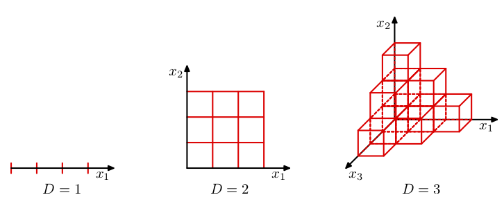

```{r setup, include=FALSE}
library(knitr)
knitr::opts_chunk$set(tidy = FALSE, 
                      message = FALSE,
                      warning = FALSE,
                      echo = FALSE, 
                      fig.width=8,
                      fig.height=6,
                      fig.align = "center",
                      fig.retina = 2)
options(htmltools.dir.version = FALSE)
library(magick)
```

class: middle
background-image: url(https://upload.wikimedia.org/wikipedia/commons/9/98/Andromeda_Galaxy_%28with_h-alpha%29.jpg)
background-position: 50% 50% class: center, bottom, inverse

.white[Space is big. You just won't believe how vastly, hugely, mind-bogglingly big it is. I mean, you may think it's a long way down the road to the chemist's, but that's just peanuts to space.] 

*.white[Douglas Adams, Hitchhiker's Guide to the Galaxy]*

---
class: split-30
layout: false

.column[.pad10px[
## Outline

- .green[High dimensions]
    - Definition

]]
.column[.top50px[

<br>
<br>

Remember, our data can be denoted as:

$\mathcal{D} = \{(x_i, y_i)\}_{i = 1}^N, ~~~ \mbox{where}~ x_i = (x_{i1}, \dots, x_{ip})^{T}$
<br>
<br>

then

.boxshadow[.orange[.content[Dimension]] .content[of the data is *p*,] .orange[.content[the number of variables.]]]


]]


---
class: split-30
layout: true

.column[.pad10px[
## Outline

- .green[High dimensions]
    - Definition
    - Cubes and spheres

]]
.column[.top50px[

.row[.content[
Space expands exponentially with dimension:


]]
.row[.content[
As dimension increases the .orange[volume of a sphere] of same radius as cube side length becomes much .orange[smaller than the volume of the cube]:


]]

]]

---
class: fade-row2-col2 

---
count: false

---
class: split-30
layout: true

.column[.pad10px[
## Outline

- .green[High dimensions]
    - Definition
    - Cubes and spheres
    - Sub-spaces

]]
.column[.top50px[
.row[.content[
<br>
<br>
Data will often be confined to a region of the space having lower .orange[intrinsic dimensionality]. The data lives in a low-dimensional subspace.
<br>
<br>
]]

.row[.content[
.orange[SO, reduce dimensionality], to the subspace containing the data.
]]

]]
---
class: fade-row2-col2 

---
count: false

---
class: split-30
layout: true

.column[.pad10px[
## Outline

- High dimensions
- .green[PCA]
    - Definition
]]
.column[.top50px[

.row[.content[
.boxshadow[
.content[
Principal component analysis (PCA) produces a low-dimensional representation of a
dataset. It finds a sequence of linear combinations of the
variables that have .orange[maximal variance], and are .orange[mutually uncorrelated]. It is an unsupervised learning method. 
]]
]]

.row[.content[
Why?

- We may have too many predictors for a regression. Instead, we can use the first few principal components. 
- Understanding relationships between variables.
- Data visualization. We can plot a small number of variables more easily than a large number of variables.
]]

]]
---
class: fade-row2-col2 

---
count: false
---
class: split-30
layout: true

.column[.pad10px[
## Outline

- High dimensions
- .green[PCA]
    - Definition
]]
.column[.top50px[

.row[.content[
### First principal component

The first principal component of a set of variables $x_1, x_2, \dots, x_p$ is the linear combination

.boxshadow[.content[
$$z_1 = \phi_{11}x_1 + \phi_{21} x_2 + \dots + \phi_{p1} x_p$$
]]

that has the largest variance such that  

.content[
$$\displaystyle\sum_{j=1}^p \phi^2_{j1} = 1$$
]
]]
.row[.content[
The elements $\phi_{11},\dots,\phi_{p1}$ are the .orange[loadings] of the first principal component.
]]

]]
---
class: fade-row2-col2 

---
count: false
---
class: split-30
layout: true

.column[.pad10px[
## Outline

- High dimensions
- .green[PCA]
    - Definition
    - Geometry
]]
.column[.top50px[

.row[.content[
- The loading vector $\phi_1 = [\phi_{11},\dots,\phi_{p1}]'$
defines direction in feature space along which data
vary most.
]]
.row[.content[
- If we project the $n$ data points ${x}_1,\dots,{x}_n$ onto this
direction, the projected values are the principal component
scores $z_{11},\dots,z_{n1}$.
]]
.row[.content[
- The second principal component is the linear combination $z_{i2} = \phi_{12}x_{i1} + \phi_{22}x_{i2} + \dots + \phi_{p2}x_{ip}$ that has maximal variance among all linear
combinations that are *uncorrelated* with $z_1$.
]]
.row[.content[
- Equivalent to constraining $\phi_2$ to be orthogonal (perpendicular) to $\phi_1$. And so on.
]]
.row[.content[
- There are at most $\min(n - 1, p)$ PCs.
]]
]]
---
class: fade-row2-col2 fade-row3-col2 fade-row4-col2 fade-row5-col2 

---
class: fade-row3-col2 fade-row4-col2 fade-row5-col2 
count: false

---
class: fade-row4-col2 fade-row5-col2 
count: false

---
class:fade-row5-col2 
count: false

---
count: false

---
class: split-30
layout: false

.column[.pad10px[
## Outline

- High dimensions
- .green[PCA]
    - Definition
    - Geometry
    - Example
]]
.column[.top50px[

```{r}
if (!file.exists("images/6.14.png"))
  image_write(image_read("http://www-bcf.usc.edu/~gareth/ISL/Chapter6/6.14.pdf", density = 300), "images/6.14.png", 
      format = "png", density = 300)
```

<a href="http://www-bcf.usc.edu/~gareth/ISL/Chapter6/6.14.pdf" target="_BLANK">  </a>

.green[First PC]; .blue[second PC]

.font_tiny[(Chapter6/6.14.pdf)]

]]

---
class: split-30
layout: false

.column[.pad10px[
## Outline

- High dimensions
- .green[PCA]
    - Definition
    - Geometry
    - Example
]]
.column[.top50px[

```{r}
if (!file.exists("images/6.15.png"))
  image_write(image_read("http://www-bcf.usc.edu/~gareth/ISL/Chapter6/6.15.pdf", density = 300), "images/6.15.png", 
      format = "png", density = 300)
```

<a href="http://www-bcf.usc.edu/~gareth/ISL/Chapter6/6.15.pdf" target="_BLANK">  </a>

If you think of the first few PCs like a linear model fit, and the others as the error, it is like regression, except that errors are orthogonal to model. 

.font_tiny[(Chapter6/6.15.pdf)]

]]

---
class: split-30
layout: false

.column[.pad10px[
## Outline

- High dimensions
- .green[PCA]
    - Definition
    - Geometry
    - Example
    - Computation
]]
.column[.top50px[
PCA can be thought of as fitting an $n$-dimensional ellipsoid to the data, where each axis of the ellipsoid represents a principal component. The new variables produced by principal components correspond to .orange[rotating] and .orange[scaling] the ellipse .orange[into a circle].

```{r eval=FALSE}
library(tidyverse)
f.norm.vec<-function(x) {
  x<-x/f.norm(x)
  x
}
f.norm<-function(x) { sqrt(sum(x^2)) }
f.gen.sphere<-function(n=100,p=5) {
  x<-matrix(rnorm(n*p),ncol=p)
  xnew<-t(apply(x,1,f.norm.vec))
  xnew
}
f.vc.ellipse <- function(vc, xm, n=500) {
  p<-ncol(vc)
  x<-f.gen.sphere(n,p)

  evc<-eigen(vc)
  vc2<-(evc$vectors)%*%diag(sqrt(evc$values))%*%t(evc$vectors)
  x<-x%*%vc2

  x + matrix(rep(xm, each=n),ncol=p)
}
df <- f.vc.ellipse(vc=matrix(c(1,0.8,0.8,2), ncol=2), xm=c(0,0), n=1000)
df <- as_tibble(df)
ev <- tibble(e1=c(0.4847685, -0.8746425), e2=c(0.8746425, 0.4847685),
                group=c("pc1","pc2"))
```

```{r eval=FALSE}
library(gganimate)
ggplot(df, aes(x=V1, y=V2)) + geom_point() + 
  xlim(c(-1.5, 1.5)) + ylim(c(-1.5, 1.5)) + 
  geom_abline(data=ev, aes(intercept=0, slope=e2/e1, colour=group), size=2) +
  scale_colour_brewer("", palette="Dark2") +
  theme(legend.position="none") +
  transition_states(group, 1, 1) + enter_grow() + exit_shrink() +
  labs(title = "{closest_state}")
```

```{r eval=FALSE}
df_pca <- prcomp(df, retx=T, center=T, scale=TRUE)
df_lines <- tibble(V1=c(seq(-1,1, 0.5), seq(-1,1, 0.5), c(-1.5, 1.5), c(0, 0)), 
                   V2=c(seq(-1,1, 0.5)*ev$e2[1]/ev$e1[1], 
                        seq(-1,1, 0.5)*ev$e2[2]/ev$e1[2], c(0, 0), c(-1.5, 1.5)),
                   pc=c(rep("pc1", 5), rep("pc2", 5), "pc1", "pc1", "pc2", "pc2"),
                   group=c(rep("raw data", 10), rep("principal components", 4)))
df_pc <- as_tibble(df_pca$x) %>%
  rename(V1=PC1, V2=PC2) %>%
  mutate(V1 = V1/df_pca$sdev[1], V2 = V2/df_pca$sdev[2])
ggplot(df_pc, aes(x=V1, y=V2)) + geom_point() + theme(aspect.ratio=1)
all <- bind_rows(df, df_pc) %>% 
  mutate(group=c(rep("raw data", 1000), rep("principal components", 1000))) %>%
  mutate(group = factor(group, levels=c("raw data", "principal components")))
p <- ggplot(all, aes(x=V1, y=V2)) + geom_point(size=1) + 
  geom_line(data=df_lines, aes(x=V1, y=V2, group=interaction(group, pc), colour=pc)) +
  scale_colour_brewer("", palette="Dark2") +
  xlim(c(-2, 2)) + ylim(c(-2, 2)) + 
  xlab("") + ylab("") +
  theme(aspect.ratio=1) +
  transition_states(group, 1, 1) + enter_grow() + exit_shrink() +
  labs(title = "{closest_state}")
anim_save(filename = "images/pc-demo.gif", animation = p, 
          start_pause = 15, width = 480, height = 480, res = 150)
```


]]

---
class: split-30
layout: false

.column[.pad10px[
## Outline

- High dimensions
- .green[PCA]
    - Definition
    - Geometry
    - Example
    - Computation
]]
.column[.top50px[
Suppose we have a $n\times p$ data set $X = [x_{ij}]$. 

- Centre each of the variables to have mean zero (i.e., the
column means of ${X}$ are zero).
-  $z_{i1} = \phi_{11}x_{i1} + \phi_{21} x_{i2} + \dots + \phi_{p1} x_{ip}$
- Sample variance of $z_{i1}$ is $\displaystyle\frac1n\sum_{i=1}^n z_{i1}^2$.


$$\mathop{\text{maximize}}_{\phi_{11},\dots,\phi_{p1}} \frac{1}{n}\sum_{i=1}^n 
\left(\sum_{j=1}^p \phi_{j1}x_{ij}\right)^{\!\!\!2} \text{ subject to }
\sum_{j=1}^p \phi^2_{j1} = 1$$
]]

---
class: split-30
layout: false

.column[.pad10px[
## Outline

- High dimensions
- .green[PCA]
    - Definition
    - Geometry
    - Example
    - Computation
]]
.column[.top50px[
1. Compute the covariance matrix (after scaling the columns of ${X}$)
$${C} = {X}'{X}$$

2. Find eigenvalues and eigenvectors:
$${C}={V}{D}{V}'$$ 
where columns of ${V}$ are orthonormal (i.e., ${V}'{V}={I}$)

3. Compute PCs: ${\Phi} = {V}$. ${Z} = {X}{\Phi}$.

]]

---
class: split-30
layout: false

.column[.pad10px[
## Outline

- High dimensions
- .green[PCA]
    - Definition
    - Geometry
    - Example
    - Computation
]]
.column[.top50px[


Singular Value Decomposition
$$X = U\Lambda V'$$


- $X$ is an $n\times p$ matrix
- $U$ is $n \times r$ matrix with orthonormal columns ( $U'U=I$ )
- $\Lambda$ is $r \times r$ diagonal matrix with non-negative elements.
- $V$ is $p \times r$ matrix with orthonormal columns ( $V'V=I$ ).

.boxshadow[.content[
It is always possible to uniquely decompose a matrix in this way.
]]

]]

---
class: split-30
layout: false

.column[.pad10px[
## Outline

- High dimensions
- .green[PCA]
    - Definition
    - Geometry
    - Example
    - Computation
]]
.column[.top50px[

1. Compute SVD: ${X} = {U}{\Lambda}{V}'$.

2. Compute PCs: ${\Phi} = {V}$. ${Z} = {X}{\Phi}$.

Relationship with covariance:

$${C} = {X}'{X}
       = {V}{\Lambda}{U}' {U}{\Lambda}{V}'
       = {V}{\Lambda}^2{V}'
       = {V}{D}{V}'$$
       

- Eigenvalues of ${C}$ are squares of singular values of ${X}$.
- Eigenvectors of ${C}$ are right singular vectors of ${X}$.
- The PC directions $\phi_1,\phi_2,\phi_3,\dots$ are the
right singular vectors of the matrix ${X}$.
]]

---
class: split-30
layout: true

.column[.pad10px[
## Outline

- High dimensions
- .green[PCA]
    - Definition
    - Geometry
    - Example
    - Computation
    - Total variance
 ]]
.column[.top50px[
.row[.content[
.orange[Total variance] in data (assuming variables centered at 0):

$$\text{TV} = \sum_{j=1}^p \text{Var}(x_j) = \sum_{j=1}^p \frac{1}{n}\sum_{i=1}^n x_{ij}^2$$
]]
.row[.content[

.boxshadow[.orange[.content[
If variables are standardised, TV=number of variables!
]]]
]]

.row[.content[
.orange[Variance explained] by *m*'th PC:

.content[
$$V_m = \text{Var}(z_m) = \frac{1}{n}\sum_{i=1}^n z_{im}^2$$
$$\text{TV} = \sum_{m=1}^M V_m \text{  where }M=\min(n-1,p).$$
]]]

]]

---
class: fade-row2-col2 fade-row3-col2 

---
class:fade-row3-col2 
count: false

---
count: false

---
class: split-30
layout: false

.column[.pad10px[
## Outline

- High dimensions
- .green[PCA]
    - Definition
    - Geometry
    - Example
    - Computation
    - Total variance
    - Choosing $k$
 ]]
.column[.top50px[

.boxshadow[.orange[.content[
Proportion of variance explained:]]
.content[
$$\text{PVE}_m = \frac{V_m}{TV}$$

]]

Choosing the number of PCs that adequately summarises the variation in X, is achieved by examining the cumulative proportion of variance explained. 

Cumulative proportion of variance explained:
.content[
$$\text{CPVE}_k = \sum_{m=1}^k\frac{V_m}{TV}$$
]

and also by a scree plot. 

]]

---
class: split-30
layout: false

.column[.pad10px[
## Outline

- High dimensions
- .green[PCA]
    - Definition
    - Geometry
    - Example
    - Computation
    - Total variance
    - Choosing $k$
 ]]
.column[.top50px[

.boxshadow[
.orange[.content[Scree plot: ]].content[Plot of variance explained by each component vs number of component.]]

```{r}
library(tidyverse)
df <- tibble(npcs=1:10, evl=c(3.5,2.7,2.2,0.5,0.3,0.3,0.2,0.1,0.1,0.1))
p <- ggplot(df, aes(x=npcs, y=evl)) + geom_line() + 
  xlab("Number of PCs") + ylab("Eigenvalue") +
  scale_x_continuous(breaks=seq(0,10,1))
p
```

]]
---
class: split-30
layout: false
count: false

.column[.pad10px[
## Outline

- High dimensions
- .green[PCA]
    - Definition
    - Geometry
    - Example
    - Computation
    - Total variance
    - Choosing $k$
 ]]
.column[.top50px[

.boxshadow[
.orange[.content[Scree plot: ]].content[Plot of variance explained by each component vs number of component.]]

```{r}
p + geom_vline(xintercept=4, colour="orange", size=3, alpha=0.7) +
  annotate("text", x=4.5, y=3, label="Choose k=4", colour="orange", hjust = 0, size=8)
```

]]
---
class: split-30
layout: false

.column[.pad10px[
## Outline

- High dimensions
- PCA
- .green[Example]
    - Data
]]
.column[.top50px[
The data on national track records for women (as at 1984). 

```{r}
track <- read_csv("data/womens_track.csv")
glimpse(track)
```

.font_tiny[*Source*: Johnson and Wichern, Applied multivariate analysis]

]]
---
class: split-30
layout: false

.column[.pad10px[
## Outline

- High dimensions
- PCA
- .green[Example]
    - Data
    - Explore
]]
.column[.top50px[

```{r out.width="100%"}
library(GGally)
ggscatmat(track[,1:7])
```

]]

---
class: split-30
layout: false

.column[.pad10px[
## Outline

- High dimensions
- PCA
- .green[Example]
    - Data
    - Explore
    - Compute
]]
.column[.top50px[

```{r}
options(digits=2)
```

```{r echo=TRUE}
track_pca <- prcomp(track[,1:7], center=TRUE, scale=TRUE)
track_pca
```

]]
---
class: split-30
layout: false

.column[.pad10px[
## Outline

- High dimensions
- PCA
- .green[Example]
    - Data
    - Explore
    - Compute
    - Assess
]]
.column[.top50px[

Summary of the principal components: 

```{r}
library(kableExtra)
library(knitr)
track_pca_smry <- tibble(evl=track_pca$sdev^2) %>%
  mutate(p = evl/sum(evl), cum_p = cumsum(evl/sum(evl))) %>% t() 
colnames(track_pca_smry) <- colnames(track_pca$rotation)
rownames(track_pca_smry) <- c("Variance", "Proportion", "Cum. prop")
kable(track_pca_smry, digits=2, align="r") %>% 
  kable_styling(full_width = T) %>%
  row_spec(0, color="white", background = "#7570b3") %>%
  column_spec(1, width = "2.5em", color="white", background = "#7570b3") %>%
  column_spec(1:8, width = "2.5em") %>%
  row_spec(3, color="white", background = "#CA6627")
```

Increase in variance explained large until $k=3$ PCs, and then tapers off. A choice of .orange[3 PCs] would explain 97% of the total variance. 
]]

---
class: split-30
layout: false

.column[.pad10px[
## Outline

- High dimensions
- PCA
- .green[Example]
    - Data
    - Explore
    - Compute
    - Assess
]]
.column[.top50px[

Scree plot: Where is the elbow?

```{r out.width="70%"}
track_pca_var <- tibble(n=1:length(track_pca$sdev), evl=track_pca$sdev^2)
ggplot(track_pca_var, aes(x=n, y=evl)) + geom_line() +
  xlab("Number of PCs") + ylab("Eigenvalue")
```

At $k=2$, thus the scree plot suggests 2 PCs would be sufficient to explain the variability.

]]

---
class: split-30
layout: false

.column[.pad10px[
## Outline

- High dimensions
- PCA
- .green[Example]
    - Data
    - Explore
    - Compute
    - Assess
]]
.column[.top50px[

.boxshadow[.orange[.content[Visualise model using a biplot]]: Plot the principal component scores, and also the contribution of the original variables to the principal component.
]

```{r out.width="80%"}
library(ggrepel)
track_pca_pcs <- as_tibble(track_pca$x[,1:2]) %>%
  mutate(cnt=track$country)
track_pca_evc <- as_tibble(track_pca$rotation[,1:2]) %>% 
  mutate(origin=rep(0, 7), variable=colnames(track)[1:7],
         varname=rownames(track_pca$rotation)) %>%
  mutate(PC1s = PC1*(track_pca_var$evl[1]*2.5), 
         PC2s = PC2*(track_pca_var$evl[2]*2.5))
ggplot() + 
  geom_segment(data=track_pca_evc, aes(x=origin, xend=PC1s, y=origin, yend=PC2s), colour="orange") +
  geom_text_repel(data=track_pca_evc, aes(x=PC1s, y=PC2s, label=variable, nudge_y=sign(PC2)*0.1), colour="orange", nudge_x=0.1) +
  geom_point(data=track_pca_pcs, aes(x=PC1, y=PC2)) +
  geom_text(data=filter(track_pca_pcs, abs(PC1)>5), aes(x=PC1, y=PC2, label=cnt), nudge_y=0.1, nudge_x=-0.1) +
  geom_text(data=filter(track_pca_pcs, abs(PC2)>1.5), aes(x=PC1, y=PC2, label=cnt), nudge_y=0.1, nudge_x=-0.1) +
  xlab("PC1") + ylab("PC2") +
  theme(aspect.ratio=1)
```

]]

---
class: split-30
layout: true

.column[.pad10px[
## Outline

- High dimensions
- PCA
- .green[Example]
    - Data
    - Explore
    - Compute
    - Assess
    - Interpret
]]
.column[.top50px[

.row[.content[
.boxshadow[.orange[.content[Explain and interpret]]: using the coefficients of the principal components.
]

- PC1 measures overall magnitude, the strength of the athletics program. High positive values indicate .orange[poor] programs with generally slow times across events. 
]]
.row[.content[
- PC2 measures the .orange[contrast] in the program between .orange[short and long distance] events. Some countries have relatively stronger long distance atheletes, while others have relatively stronger short distance athletes. 
]]
.row[.content[
- There are several .orange[outliers] visible in this plot, `wsamoa`, `cookis`, `dpkorea`. PCA, because it is computed using the variance in the data, can be affected by outliers. It may be better to remove these countries, and re-run the PCA. ]]

]]
---
class: fade-row2-col2 fade-row3-col2 

---
class:fade-row3-col2 
count: false

---
count: false

---
class: split-30
layout: false

.column[.pad10px[
## Outline

- High dimensions
- PCA
- .green[Example]
    - Data
    - Explore
    - Compute
    - Assess
    - Interpret
    - Accuracy
]]
.column[.top50px[

Bootstrap can be used to assess whether the coefficients of a PC are significantly different from 0. The 95% bootstrap confidence intervals are:

```{r out.width="60%", fig.width=5, fig.height=3}
library(boot)
compute_PC1 <- function(data, index) {
  pc1 <- prcomp(data[index,], center=TRUE, scale=TRUE)$rotation[,1]
  # Coordinate signs
  if (sign(pc1[1]) < 0) 
    pc1 <- -pc1 
  return(pc1)
}
# Make sure sign of first PC element is positive
PC1_boot <- boot(data=track[,1:7], compute_PC1, R=1000)
colnames(PC1_boot$t) <- colnames(track[,1:7])
PC1_boot_ci <- as_tibble(PC1_boot$t) %>%
  gather(var, coef) %>% 
  mutate(var = factor(var, levels=c("m100", "m200", "m400", "m800", "m1500", "m3000", "marathon"))) %>%
  group_by(var) %>%
  summarise(q2.5 = quantile(coef, 0.025), 
            q5 = median(coef),
            q97.5 = quantile(coef, 0.975)) %>%
  mutate(t0 = PC1_boot$t0) 
  
ggplot(PC1_boot_ci, aes(x=var, y=t0)) + geom_point() +
  geom_errorbar(aes(ymin=q2.5, ymax=q97.5), width=0.1) +
  geom_hline(yintercept=0, size=3, colour="white") +
  xlab("") + ylab("coefficient")
``` 

All of the coefficients on PC1 are significantly different from 0, and positive, approximately equal, .orange[not significantly different from each other].
]]


---
layout: false
# `r set.seed(2019); emo::ji("technologist")` Made by a human with a computer

### Slides at [https://monba.dicook.org](https://monba.dicook.org).
### Code and data at [https://github.com/dicook/Business_Analytics](https://github.com/dicook/Business_Analytics).
<br>

### Created using [R Markdown](https://rmarkdown.rstudio.com) with flair by [**xaringan**](https://github.com/yihui/xaringan), and [**kunoichi** (female ninja) style](https://github.com/emitanaka/ninja-theme).

<br> 
<a rel="license" href="http://creativecommons.org/licenses/by-sa/4.0/"></a><br />This work is licensed under a <a rel="license" href="http://creativecommons.org/licenses/by-sa/4.0/">Creative Commons Attribution-ShareAlike 4.0 International License</a>.
