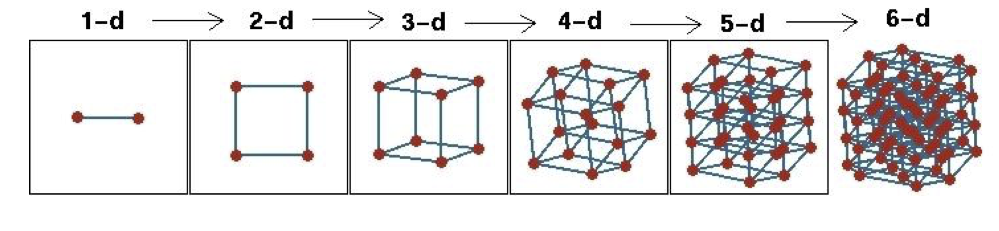
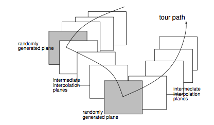

```{r setup, include=FALSE}
library(knitr)
knitr::opts_chunk$set(tidy = FALSE, 
                      message = FALSE,
                      warning = FALSE,
                      echo = FALSE, 
                      fig.width=8,
                      fig.height=6,
                      fig.align = "center",
                      fig.retina = 2)
options(htmltools.dir.version = FALSE)
library(magick)
```

class: split-30
layout: false

.column[.pad10px[
## Outline

- .green[Why]

]]
.column[.top50px[

.split-two[
.column[.content[
Plots provide a more detailed statistical summary. 

```{r out.width="90%", fig.width=5, fig.height=4}
library(tidyverse)
anscombe_tidy <- anscombe %>%
  gather(variable, value) %>%
  mutate(axis=substr(variable, 1, 1), 
         set=substr(variable, 2, 2),
         id=c(1:44, 1:44)) %>%
  select(-variable) %>%
  spread(axis, value)
ggplot(anscombe_tidy, aes(x=x, y=y)) +
  geom_smooth(method="lm", se=F, colour="grey50") +
  geom_point(colour="orange", size=3) +
  facet_wrap(~set, ncol=2) +
  xlab("") + ylab("")
```

[Anscombe's quartet](https://en.wikipedia.org/wiki/Anscombe%27s_quartet)

]]
.column[.content[
<br>
<br>
<br>
<br>
All of these sets of data have the same numerical statistical summary.

.font_small[.content[
```{r}
library(kableExtra)
anscombe_tidy %>% group_by(set) %>%
  summarise(mx=round(mean(x),1), my=round(mean(y),1), sx=round(sd(x),2), sy=round(sd(y), 2), r=round(cor(x,y), 2)) %>%
  kable() %>% kable_styling(bootstrap_options = c("striped", full_width = F)) %>%
  column_spec(1:6, border_right = T) %>%
  column_spec(1, border_left = T) %>%
  row_spec(0:4, hline_after = T, monospace = T) %>%
  row_spec(0, background="#CA6627")
```
]]
]]]
]]


---
class: split-30
layout: false

.column[.pad10px[
## Outline

- .green[Why]

]]
.column[.top50px[

.boxshadow[Why visualise? Very .orange[different data] can have the .orange[same numerical summaries].]

[Datasaurus dozen](https://www.autodeskresearch.com/publications/samestats): all have the same means, standard deviations and correlation, also.

```{r out.width="70%"}
library(datasauRus)
ggplot(filter(datasaurus_dozen, dataset != "slant_up"), aes(x=x, y=y)) +
  geom_point() +
  facet_wrap(~dataset, ncol=4) +
  xlab("") + ylab("") +
  theme(aspect.ratio=1)
```


]]

---
class: split-30
layout: false

.column[.pad10px[
## Outline

- .green[Why]

]]
.column[.top50px[
In machine learning visualisation is used for:

- .orange[initial data analysis]: to examine whether the data 
    - satisfies assumptions required for the method
    - has unexpected complications like outliers or nonlinearity
- .orange[assess the model fit]:    
    - predicted vs observed
    - residuals
    - boundaries between classes

    
]]

---
class: split-30
layout: false

.column[.pad10px[
## Outline

- Why
- .green[High-dim vis]

]]
.column[.top50px[
Common methods for visualising high-dimensions

- Tour
- Parallel coordinate plot
- Scatterplot matrix
- Mosaic plot

Most of what you find when you google "visualising high-dimensions" is awful, e.g. use colour and symbol after 3D to show 5D; PCA, MDS, tSNE, are visualisation methods; "you can't see beyond 3D".... Rubbish!
]]

---
class: split-30
layout: false

.column[.pad10px[
## Outline

- Why
- High-dim vis
- .green[Tours]
    - Dimension

]]
.column[.top50px[



- When you add another variable, you implicitly add another orthogonal axis. 
- The space is effectively a $p$-dimensional cube
- The data might not fill the cube, and then dimension reduction might make it a $k(<p)$-dimensional cube

]]

---
class: split-30
layout: false

.column[.pad10px[
## Outline

- Why
- High-dim vis
- .green[Tours]
    - Dimension
    - Grand

]]
.column[.top50px[

A .orange[grand tour] is by definition a movie of low-dimensional projections constructed in such a way that it comes arbitrarily close to showing all possible low-dimensional projections; in other words, a grand tour is a space-filling curve in the manifold of low-dimensional projections of high-dimensional data spaces.


]]
---
class: split-30
layout: false

.column[.pad10px[
## Outline

- Why
- High-dim vis
- .green[Tours]
    - Dimension
    - Grand
    - Notation

]]
.column[.top50px[

.split-60[
.column[
.content[
- ${\mathbf x}_i \in \mathcal{R}^p$, $i^{th}$ data vector
- $d$ projection dimension
- $F$ is a $p\times d$ orthonormal basis, $F'F=I_d$
- The projection of ${\mathbf x}$ onto $F$ is ${\mathbf y}_i=F'{\mathbf x}_i$.
- Its a movie, so the tour is indexed by time, $F(t)$, where $t\in [a, z]$. Starting and target frame denoted as $F_a = F(a), F_z=F(t)$.
- The animation of the projected data is given by a path ${\mathbf y}_i(t)=F'(t){\mathbf x}_i$.
]]
.column[
.content[

]]]
]]

---
class: split-30
layout: false

.column[.pad10px[
## Outline

- Why
- High-dim vis
- .green[Tours]
    - Dimension
    - Grand
    - Notation
    - Examples

]]
.column[.top50px[

```{r eval=FALSE, echo=FALSE, warning=FALSE}
library(tourr)
library(plotly)
library(htmltools)
data(flea)
set.seed(20190331)
bases <- save_history(flea[,1:3], grand_tour(2), 
    start=matrix(c(1,0,0,1,0,0), ncol=2, byrow=TRUE), 
    max = 10)
# Re-set start bc seems to go awry
bases[,,1] <- matrix(c(1,0,0,1,0,0), ncol=2, byrow=TRUE)
tour_path <- interpolate(bases, 0.1)
d <- dim(tour_path)
flea_std <- tourr::rescale(flea[,-7])
mydat <- NULL; myaxes <- NULL
for (i in 1:d[3]) {
  fp <- as.matrix(flea_std[,1:3]) %*% matrix(tour_path[,,i], ncol=2)
  fp <- tourr::center(fp)
  colnames(fp) <- c("d1", "d2")
  mydat <- rbind(mydat, cbind(fp, rep(i+10, 2*nrow(fp))))
  fa <- cbind(matrix(0, 3, 2), matrix(tour_path[,,i], ncol=2))
  colnames(fa) <- c("origin1", "origin2", "d1", "d2") 
  myaxes <- rbind(myaxes, cbind(fa, rep(i+10, 2*nrow(fa))))
}
colnames(mydat)[3] <- "indx"
colnames(myaxes)[5] <- "indx"
df <- as_tibble(mydat) %>% 
  mutate(species = rep(flea$species, d[3]))
dfaxes <- as_tibble(myaxes) %>%
  mutate(labels=rep(colnames(flea[,1:3]), d[3]))
p <- ggplot() +
       geom_segment(data=dfaxes, aes(x=d1/2, xend=origin1, 
                                     y=d2/2, yend=origin2, 
                                     frame = indx), colour="grey70") +
       geom_text(data=dfaxes, aes(x=d1/2, y=d2/2, label=labels, 
                                  frame = indx), colour="grey70") +
       geom_point(data = df, aes(x = d1, y = d2, colour=species, 
                                 frame = indx), size=1) +
       scale_colour_brewer(palette = "Dark2") +
       theme_void() +
       coord_fixed() +
  theme(legend.position="none")
pg <- ggplotly(p, width=400, height=400) %>%
  animation_opts(200, redraw = FALSE, 
                 easing = "linear", transition=0)
save_html(pg, file="flea3d.html")
```

$p=3, d=2$

<iframe src="flea3d.html" width="800" height="500" scrolling="yes" seamless="seamless" frameBorder="0"> </iframe>

]]

---
class: split-30
layout: false

.column[.pad10px[
## Outline

- Why
- High-dim vis
- .green[Tours]
    - Dimension
    - Grand
    - Notation
    - Examples

]]
.column[.top50px[

```{r eval=FALSE, echo=FALSE, warning=FALSE}
bases <- save_history(flea[,1:6], grand_tour(2),
    start=matrix(c(1,0,0,1,0,0,0,0,0,0,0,0), ncol=2, byrow=TRUE),
    max = 10)
# Re-set start bc seems to go awry
bases[,,1] <- matrix(c(1,0,0,1,0,0,0,0,0,0,0,0), ncol=2, byrow=TRUE)
tour_path <- interpolate(bases, 0.1)
d <- dim(tour_path)
flea_std <- tourr::rescale(flea[,-7])
mydat <- NULL; myaxes <- NULL
for (i in 1:d[3]) {
  fp <- as.matrix(flea_std[,1:6]) %*% matrix(tour_path[,,i], ncol=2)
  fp <- tourr::center(fp)
  colnames(fp) <- c("d1", "d2")
  mydat <- rbind(mydat, cbind(fp, rep(i+10, 2*nrow(fp))))
  fa <- cbind(matrix(0, 6, 2), matrix(tour_path[,,i], ncol=2))
  colnames(fa) <- c("origin1", "origin2", "d1", "d2") 
  myaxes <- rbind(myaxes, cbind(fa, rep(i+10, 2*nrow(fa))))
}
colnames(mydat)[3] <- "indx"
colnames(myaxes)[5] <- "indx"
df <- as_tibble(mydat) %>% 
  mutate(species = rep(flea$species, d[3]))
dfaxes <- as_tibble(myaxes) %>%
  mutate(labels=rep(colnames(flea[,1:6]), d[3]))
p <- ggplot() +
       geom_segment(data=dfaxes, aes(x=d1/2, xend=origin1, 
                                     y=d2/2, yend=origin2, 
                                     frame = indx), colour="grey70") +
       geom_text(data=dfaxes, aes(x=d1/2, y=d2/2, label=labels, 
                                  frame = indx), colour="grey70") +
       geom_point(data = df, aes(x = d1, y = d2, colour=species, 
                                 frame = indx), size=1) +
       scale_colour_brewer(palette = "Dark2") +
       theme_void() +
       coord_fixed() +
  theme(legend.position="none")
pg <- ggplotly(p, width=400, height=400) %>%
  animation_opts(200, redraw = FALSE, 
                 easing = "linear", transition=0)
save_html(pg, file="flea6d.html")
```

$p=6, d=2$

<iframe src="flea6d.html" width="800" height="500" scrolling="yes" seamless="seamless" frameBorder="0"> </iframe>

]]

---
class: split-30
layout: false

.column[.pad10px[
## Outline

- Why
- High-dim vis
- .green[Tours]
    - Dimension
    - Grand
    - Notation
    - Examples

]]
.column[.top50px[

```{r eval=FALSE, echo=FALSE, warning=FALSE}
track <- read_csv("data/womens_track.csv")
bases <- save_history(track[,1:7], grand_tour(2),
    start=matrix(c(1,0,0,1,0,0,0,0,0,0,0,0,0,0), ncol=2, byrow=TRUE),
    max = 10)
# Re-set start bc seems to go awry
bases[,,1] <- matrix(c(1,0,0,1,0,0,0,0,0,0,0,0,0,0), ncol=2, byrow=TRUE)
tour_path <- interpolate(bases, 0.1)
d <- dim(tour_path)
track_std <- tourr::rescale(track[,1:7])
mydat <- NULL; myaxes <- NULL
for (i in 1:d[3]) {
  fp <- as.matrix(track_std[,1:7]) %*% matrix(tour_path[,,i], ncol=2)
  fp <- tourr::center(fp)
  colnames(fp) <- c("d1", "d2")
  mydat <- rbind(mydat, cbind(fp, rep(i+10, 2*nrow(fp))))
  fa <- cbind(matrix(0, 7, 2), matrix(tour_path[,,i], ncol=2))
  colnames(fa) <- c("origin1", "origin2", "d1", "d2") 
  myaxes <- rbind(myaxes, cbind(fa, rep(i+10, 2*nrow(fa))))
}
colnames(mydat)[3] <- "indx"
colnames(myaxes)[5] <- "indx"
df <- as_tibble(mydat) %>%
  mutate(cnt = rep(1:55, d[3]))
dfaxes <- as_tibble(myaxes) %>%
  mutate(labels=rep(colnames(track[,1:7]), d[3]))
p <- ggplot() +
       geom_segment(data=dfaxes, aes(x=d1/2, xend=origin1, 
                                     y=d2/2, yend=origin2, 
                                     frame = indx), colour="grey70") +
       geom_text(data=dfaxes, aes(x=d1/2, y=d2/2, label=labels, 
                                  frame = indx), colour="grey70") +
       geom_point(data = df, aes(x = d1, y = d2, 
            frame = indx, label=cnt), size=1) +
       theme_void() +
       coord_fixed() +
  theme(legend.position="none")
pg <- ggplotly(p, width=400, height=400, tooltip = "label") %>%
  animation_opts(200, redraw = FALSE, 
                 easing = "linear", transition=0)
save_html(pg, file="track.html")
```

$p=7, d=2$

<iframe src="track.html" width="800" height="500" scrolling="yes" seamless="seamless" frameBorder="0"> </iframe>

]]
---
class: split-30
layout: false

.column[.pad10px[
## Outline

- Why
- High-dim vis
- .green[Tours]
    - Dimension
    - Grand
    - Notation
    - Examples

]]
.column[.top50px[
With the grand tour, you can get a good overall sense of the distribution (shape) of the data in its $p$-dimensional space:

- in the first data set, the primary shape are .orange[three well separated clusters]
- in the track data, the primary shape is that it lives in essentially a .orange[1-D] subspace, with a small amount of variation in other directions. It is also possible to see several .orange[outliers].
]]
---
class: split-30
layout: false

.column[.pad10px[
## Outline

- Why
- High-dim vis
- .green[Tours]
    - Dimension
    - Grand
    - Notation
    - Examples
    - Guided

]]
.column[.top50px[


.boxshadow[.font_small[.content[
Remember: projection pursuit

$$\mathop{\text{maximize}}_{\phi_{11},\dots,\phi_{p1}} f\left(\sum_{j=1}^p \phi_{j1}x_{ij}\right) \text{ subject to }
\sum_{j=1}^p \phi^2_{j1} = 1$$
]]]

The guided tour chooses new target projections by optimising a function of interest:
.font_small[
- `holes`: This is an inverse Gaussian filter, which is optimised wheren there is not much data in the center of the projection, i.e. a "hole" or donut shape in 2D.
- `central mass`: The opposite of holes, high density in the centre of the projection, and often "outliers" on the edges. 
- `LDA`: An index based on the linear discrimination dimension reduction, optimised by projections where the named classes are most separated.
]
]]

---
class: split-30
layout: false

.column[.pad10px[
## Outline

- Why
- High-dim vis
- .green[Tours]
    - Dimension
    - Grand
    - Notation
    - Examples
    - Guided

]]
.column[.top50px[
```{r eval=FALSE, echo=FALSE, warning=FALSE}
set.seed(20190401)
bases <- save_history(flea[,1:6], guided_tour(lda_pp(cl=flea$species)),
    max = 10)
tour_path <- interpolate(bases, 0.1)
d <- dim(tour_path)
flea_std <- tourr::rescale(flea[,-7])
mydat <- NULL; myaxes <- NULL
for (i in 1:d[3]) {
  fp <- as.matrix(flea_std[,1:6]) %*% matrix(tour_path[,,i], ncol=2)
  fp <- tourr::center(fp)
  colnames(fp) <- c("d1", "d2")
  mydat <- rbind(mydat, cbind(fp, rep(i+10, 2*nrow(fp))))
  fa <- cbind(matrix(0, 6, 2), matrix(tour_path[,,i], ncol=2))
  colnames(fa) <- c("origin1", "origin2", "d1", "d2") 
  myaxes <- rbind(myaxes, cbind(fa, rep(i+10, 2*nrow(fa))))
}
colnames(mydat)[3] <- "indx"
colnames(myaxes)[5] <- "indx"
df <- as_tibble(mydat) %>% 
  mutate(species = rep(flea$species, d[3]))
dfaxes <- as_tibble(myaxes) %>%
  mutate(labels=rep(colnames(flea[,1:6]), d[3]))
p <- ggplot() +
       geom_segment(data=dfaxes, aes(x=d1/2, xend=origin1, 
                                     y=d2/2, yend=origin2, 
                                     frame = indx), colour="grey70") +
       geom_text(data=dfaxes, aes(x=d1/2, y=d2/2, label=labels, 
                                  frame = indx), colour="grey70") +
       geom_point(data = df, aes(x = d1, y = d2, colour=species, 
                                 frame = indx), size=1) +
       scale_colour_brewer(palette = "Dark2") +
       theme_void() +
       coord_fixed() +
  theme(legend.position="none")
pg <- ggplotly(p, width=400, height=400) %>%
  animation_opts(200, redraw = FALSE, 
                 easing = "linear", transition=0)
save_html(pg, file="flea6d_lda.html")
```

$p=6, d=2,$ guidance using the LDA index

<iframe src="flea6d_lda.html" width="800" height="500" scrolling="yes" seamless="seamless" frameBorder="0"> </iframe>

]]

---
class: split-30
layout: false

.column[.pad10px[
## Outline

- Why
- High-dim vis
- .green[Tours]
    - Dimension
    - Grand
    - Notation
    - Examples
    - Guided
    - Usage

]]
.column[.top50px[

To run a tour live:

```{r eval=FALSE, echo=TRUE}
library(tourr)
# On a Mac use this graphics device
# quartz() 
animate_xy(flea[, 1:6])
animate(flea[, 1:6], tour_path=grand_tour(),
  display=display_xy(axes = "bottomleft"))
library(colorspace)
pal <- rainbow_hcl(length(levels(flea$species)))
col <- pal[as.numeric(flea$species)]
animate_xy(flea[,-7], col=col)
```

]]
---
class: split-30
layout: false

.column[.pad10px[
## Outline

- Why
- High-dim vis
- .green[Tours]
    - Dimension
    - Grand
    - Notation
    - Examples
    - Guided
    - Usage
    - Others

]]
.column[.top50px[

- .orange[Little]: Interpolates between all possible pairs of variables. Like the scatterplot matrix, but animated between them.
- .orange[Local]: Rocks back and forth from a given projection, so shows all possible projections within a radius.
- .orange[Frozen]: Fixes some of the values of the orthonormal projection matrix and allows the others to vary freely according to any of the other tour methods. 
- .orange[Manual]: Control the contribution of a single variable, and move along this axis. This is really useful to examine the sensitivity of structure (e.g. clustering) to the contribution of a variable. Maybe the variable can be "zero'd out" and the structure would not be affected, thus simplifying the "model". This is available in the .orange[spinifex] package.

]]
---
class: split-30
layout: false

.column[.pad10px[
## Outline

- Why
- High-dim vis
- .green[Tours]
    - Dimension
    - Grand
    - Notation
    - Examples
    - Guided
    - Usage
    - Others
    - Rendering

]]
.column[.top50px[

.boxshadow[
.content[
The projection dimension $d$ can be 1, 2, 3, ... It is just a projection of the data, and then you need to decide how to *render* the data.
]
]

- *d=1* : The projected data can be displayed as a dotplot, density, histogram, boxplot, ...
- *d>2* : Use stereo (for *d=3* ) or a scatterplot matrix (or parallel coordinate plot)

```{r eval=FALSE}
quartz()
animate_dist(flea[, 1:6])
animate_dist(flea[, 1:6], method = "hist")
```

]]
---
layout: false
# `r set.seed(2019); emo::ji("technologist")` Made by a human with a computer

### Slides at [https://monba.dicook.org](https://monba.dicook.org).
### Code and data at [https://github.com/dicook/Business_Analytics](https://github.com/dicook/Business_Analytics).
<br>

### Created using [R Markdown](https://rmarkdown.rstudio.com) with flair by [**xaringan**](https://github.com/yihui/xaringan), and [**kunoichi** (female ninja) style](https://github.com/emitanaka/ninja-theme).

<br> 
<a rel="license" href="http://creativecommons.org/licenses/by-sa/4.0/"></a><br />This work is licensed under a <a rel="license" href="http://creativecommons.org/licenses/by-sa/4.0/">Creative Commons Attribution-ShareAlike 4.0 International License</a>.
