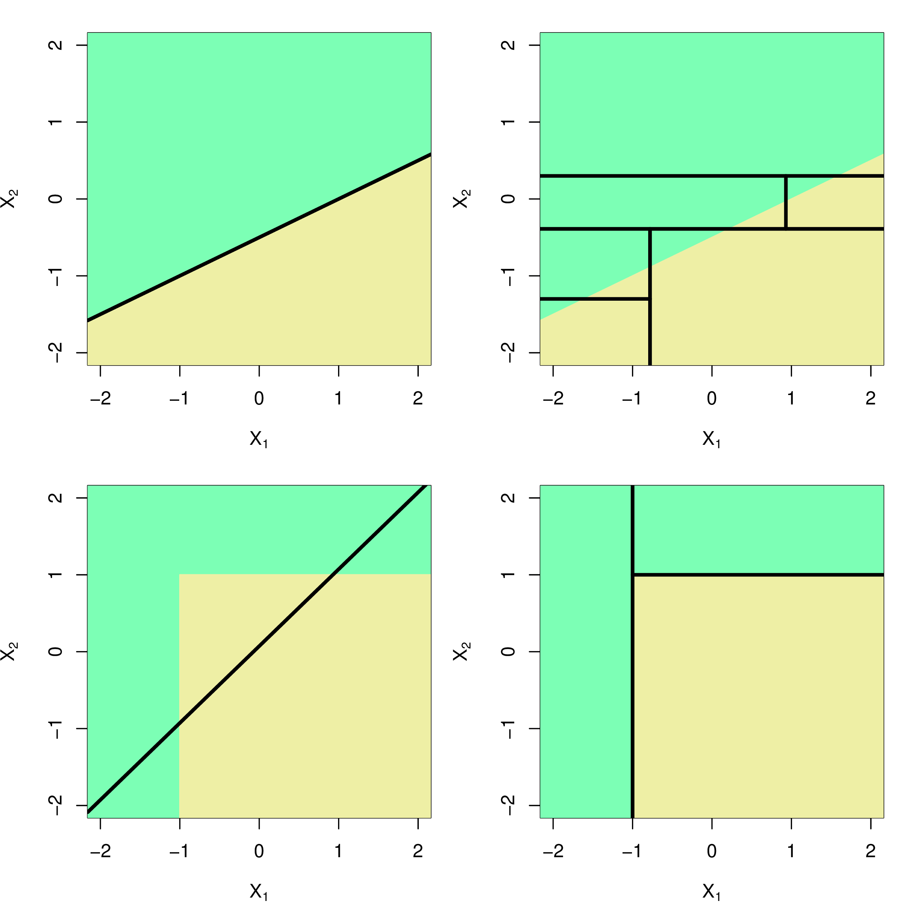

```{r setup, include=FALSE}
library(knitr)
knitr::opts_chunk$set(tidy = FALSE, 
                      message = FALSE,
                      warning = FALSE,
                      echo = FALSE, 
                      fig.width=8,
                      fig.height=6,
                      fig.align = "center",
                      fig.retina = 2)
options(htmltools.dir.version = FALSE)
library(magick)
```

class: split-30
layout: false

.column[.pad10px[
## Outline

- .green[Classification]
    - Split criteria
    - Model choice
- Comparison with linear
- Pros and cons

]]
.column[.top50px[

- A classification tree is used to predict a .orange[qualitative response] rather than a quantitative one
- We predict that each observation belongs to the .orange[most commonly occurring class] of training observations in the region to which it belongs
- Just as in the regression setting, we use recursive binary splitting to grow a classification tree
- However RSS cannot be used as a criterion for making the binary splits. A natural alternative to RSS is the classification error rate. 
]]

---
class: split-30
layout: false

.column[.pad10px[
## Outline

- .green[Classification]
    - Split criteria

]]
.column[.top50px[

.orange[Purity/Impurity metrics]

- The .orange[Gini index] measures total variance across the $K$ classes:
	$$G = \sum_{k =1}^K \hat{p}_{mk}(1 - \hat{p}_{mk})$$
- .orange[Entropy] is defined as
	$$D = - \sum_{k =1}^K \hat{p}_{mk} log(\hat{p}_{mk})$$ 
- If all $\hat{p}_{mk}$’s close to zero or one, $G$ and $D$ are small.
]]

---
class: split-30
layout: false

.column[.pad10px[
## Outline

- .green[Classification]
    - Split criteria
    - Example

]]
.column[.top50px[

Y: presence of heart disease (Yes/No)

X: heart and lung function measurements

```{r  out.width="90%", fig.width=6, fig.height=4}
library(tidyverse)
library(ISLR)
library(rpart)
library(rpart.plot)
library(caret)
heart <- read_csv("http://www-bcf.usc.edu/~gareth/ISL/Heart.csv") %>%
  select(-X1) %>% mutate(AHD=factor(AHD))
heart <- heart %>% filter(!is.na(Ca)) %>% filter(!is.na(Thal))
set.seed(3)
tr_indx <- createDataPartition(heart$AHD)$Resample1
heart_tr <- heart[tr_indx,]
heart_ts <- heart[-tr_indx,]
heart_finalrp <- rpart(AHD~., data=heart_tr, control=rpart.control(minsplit=6, cp=0.02))
prp(heart_finalrp)
```


]]

---
class: split-30
layout: false

.column[.pad10px[
## Outline

- .green[Classification]
    - Split criteria
    - Example

]]
.column[.top50px[

Reason for choice of model.

```{r out.width="80%", fig.width=6, fig.height=4}
# Decide on best model
heart_bigrp <- rpart(AHD~., data=heart_tr, control=rpart.control(minsplit=6, cp=0.005))
tr_err <- 1-confusionMatrix(factor(heart_tr$AHD), predict(heart_bigrp, newdata=heart_tr, type="class"))$overall[1]
ts_err <- 1-confusionMatrix(factor(heart_ts$AHD), predict(heart_bigrp, newdata=heart_ts, type="class"))$overall[1]
nnodes <- max(heart_bigrp$cptable[,2])+1
cp <- c(0.006, 0.007, 0.008, 0.009, 0.01, 0.02, 0.03, 0.04, 0.05, 0.1, 0.5)
for (i in 1:length(cp)) {
  heart_rp <- rpart(AHD~., data=heart_tr, control=rpart.control(minsplit=6, cp=cp[i]))
  tr_err <- c(tr_err, 1-confusionMatrix(heart_tr$AHD, predict(heart_rp, newdata=heart_tr, type="class"))$overall[1])
  ts_err <- c(ts_err, 1-confusionMatrix(heart_ts$AHD, predict(heart_rp, newdata=heart_ts, type="class"))$overall[1])
  nnodes <- c(nnodes, max(heart_rp$cptable[,2])+1)
}
heart_fit <- tibble(cp=c(0.005, cp), nnodes, train=tr_err, test=ts_err) %>% 
  gather(type, error, train, test) 
ggplot(heart_fit, aes(x=nnodes, y=error, colour=type)) + 
  geom_line() + scale_colour_brewer("", palette="Dark2") +
  xlab("Size of tree") + ylim(c(0,0.4))
```

```{r eval=FALSE}
# Cross-validation, but it transforms catagorical variables to numeric
library(e1071)
caret.control <- trainControl(method = "repeatedcv",
                              number = 10,
                              repeats = 1)
heart_rp <- train(AHD~., 
                  data=heart,
                  method = "rpart",
                  trControl = caret.control,
                  tuneLength = 100)
prp(heart_rp$finalModel, digits=2, roundint=FALSE)
```

]]

---
class: split-30
layout: false

.column[.pad10px[
## Outline

- .green[Classification]
    - Split criteria
    - Example
    - Model diagnostics

]]
.column[.top50px[

Tabulate true vs predicted to make a .orange[confusion table]. 

<center>
<table>
<tr> <td> </td> <td colspan="2" align="center"> true </td> </tr>
<tr> <td> </td> <td align="right" bgcolor="#3F9F7A"> C1 </td> <td align="right" bgcolor="#3F9F7A"> C2 </td> </tr>
<tr> <td bgcolor="#3F9F7A"> C1 </td> <td align="right"> <em>a</em> </td> <td align="right"> <em>b</em> </td> </tr>
<tr> <td bgcolor="#3F9F7A"> C2</td> <td align="right"> <em>c</em> </td> <td align="right"> <em>d</em> </td> </tr>
</table>
</center>

- Accuracy: *(a+d)/(a+b+c+d)*
- Error: *(b+c)/(a+b+c+d)*
- Sensitivity: *a/(a+c)*
- Specificity: *d/(b+d)*
- Balanced accuracy: *(sensitivity+specificity)/2*
- Precision: *a/(a+b)*
- Recall: *a/(a+c)*

]]

---
class: split-30
layout: false

.column[.pad10px[
## Outline

- .green[Classification]
    - Split criteria
    - Example
    - Model diagnostics
]]
.column[.top50px[

.split-50[
.column[.content[
Confusion table

Training

```{r}
confusionMatrix(heart_tr$AHD, predict(heart_finalrp, newdata=heart_tr, type="class"))$table
```

Test

```{r}
confusionMatrix(heart_ts$AHD, predict(heart_finalrp, newdata=heart_ts, type="class"))$table
```
]]
.column[.content[
Classification accuracy

Training

```{r}
confusionMatrix(heart_tr$AHD, predict(heart_finalrp, newdata=heart_tr, type="class"))$overall[1]
```

Test

```{r}
confusionMatrix(heart_ts$AHD, predict(heart_finalrp, newdata=heart_ts, type="class"))$overall[1]
```

]]
]
]]
---
class: split-30
layout: false

.column[.pad10px[
## Outline

- Classification
- .green[Comparison with linear]

]]
.column[.top50px[

```{r}
library(magick)
if (!file.exists("images/8.7.png"))
  image_write(image_read("http://www-bcf.usc.edu/~gareth/ISL/Chapter8/8.7.pdf", density = 300), "images/8.7.png", 
      format = "png", density = 300)
```

<a href="http://www-bcf.usc.edu/~gareth/ISL/Chapter8/8.7.pdf" target="_BLANK">   </a>


]]

---
class: split-30
layout: false

.column[.pad10px[
## Outline

- Classification
- .green[Comparison with linear]
    - Example

]]
.column[.top50px[

Physical measurements on WA crabs, males and females

```{r out.width="90%", fig.width=6, fig.height=4}
crab <- read.csv("http://www.ggobi.org/book/data/australian-crabs.csv")
crab <- subset(crab, species=="Blue", select=c("sex", "FL", "RW"))
crab_rp <- rpart(sex~FL+RW, data=crab, parms = list(split = "information"), 
                 control = rpart.control(minsplit=3))
prp(crab_rp)
```

.font_small[*Data source*: Campbell, N. A. & Mahon, R. J. (1974)]
]]

---
class: split-30
layout: false

.column[.pad10px[
## Outline

- Classification
- .green[Comparison with linear]
    - Example

]]
.column[.top50px[

```{r out.width="100%", fig.width=6, fig.height=4}
ggplot(data=crab, aes(x=FL, y=RW, color=sex, shape=sex)) + 
  geom_point(alpha=0.7, size=3) + 
  scale_colour_brewer(palette="Dark2") +
  theme(aspect.ratio=1) + 
  geom_vline(xintercept=16, linetype=2) + 
  geom_segment(aes(x=7, xend=16, y=12, yend=12), color="black", linetype=2) +
  geom_segment(aes(x=12, xend=12, y=12, yend=17), color="black", linetype=2) + 
  geom_segment(aes(x=7, xend=16, y=8.1, yend=8.1), color="black", linetype=2) +
  geom_segment(aes(x=11, xend=11, y=8.1, yend=12), color="black", linetype=2) +
  geom_segment(aes(x=11, xend=16, y=11, yend=11), color="black", linetype=2) +
  geom_segment(aes(x=11, xend=11, y=8.1, yend=11), color="black", linetype=2) +
  geom_segment(aes(x=12, xend=16, y=11, yend=11), color="black", linetype=2) +
  geom_segment(aes(x=14, xend=14, y=11, yend=12), color="black", linetype=2) +
  geom_segment(aes(x=16, xend=21.3, y=16, yend=16), color="black", linetype=2)
```
]]

---
class: split-50
layout: false

.column[.pad10px[

Classification tree

```{r out.width="80%", fig.height=4, fig.width=4}
crab_grid <- expand.grid(FL=seq(7,22,0.25), RW=seq(6,17,0.25))
crab_grid$sex <- predict(crab_rp, newdata=crab_grid, type="class")
ggplot(data=crab_grid, aes(x=FL, y=RW, color=sex)) + 
  geom_point(alpha=0.3, size=3) + 
  geom_point(data=crab, aes(x=FL, y=RW, color=sex), shape=2, size=3) + 
  scale_colour_brewer(palette="Dark2") +
  theme_bw() + 
  theme(aspect.ratio=1, legend.position="none") 

```
]]
.column[.top50px[

Linear discriminant classifier

```{r out.width="80%", fig.height=4, fig.width=4}
library(MASS)
crab_lda <- lda(sex~FL+RW, data=crab, prior=c(0.5,0.5))
crab_grid$sex <- predict(crab_lda, newdata=crab_grid)$class
ggplot(data=crab_grid, aes(x=FL, y=RW, color=sex)) + 
  geom_point(alpha=0.3, size=3) + 
  geom_point(data=crab, aes(x=FL, y=RW, color=sex), shape=2, size=3) + 
  scale_colour_brewer(palette="Dark2") +
  theme_bw() + 
  theme(aspect.ratio=1, legend.position="none") 
```

]]

---
class: split-30
layout: true

.column[.pad10px[
## Outline

- Classification
- Comparison with linear
- .green[Pros and cons]

]]
.column[.top50px[

.row[.content[
- The decision rules provided by trees are very easy to explain, and follow. A simple classification model.
]]
.row[.content[
- Trees can handle a mix of predictor types, categorical, quantitative, ....
]]
.row[.content[
- Trees efficiently operate when there are missing values in the predictors.
]]
.row[.content[
- Algorithm is greedy, a better final solution might be obtained by taking a second best split earlier
]]
.row[.content[
- When separation is in linear combinations of variables trees struggle to provide a good classification
]]
]]
---
class: fade-row2 fade-row3 fade-row4 fade-row5
count: false
---
class: fade-row3 fade-row4 fade-row5
count: false
---
class: fade-row4 fade-row5
count: false
---
class: fade-row5
count: false
---
count: false

---
layout: false
# `r set.seed(2019); emo::ji("technologist")` Made by a human with a computer

### Slides at [https://monba.dicook.org](https://monba.dicook.org).
### Code and data at [https://github.com/dicook/Business_Analytics](https://github.com/dicook/Business_Analytics).
<br>

### Created using [R Markdown](https://rmarkdown.rstudio.com) with flair by [**xaringan**](https://github.com/yihui/xaringan), and [**kunoichi** (female ninja) style](https://github.com/emitanaka/ninja-theme).

<br> 
<a rel="license" href="http://creativecommons.org/licenses/by-sa/4.0/"></a><br />This work is licensed under a <a rel="license" href="http://creativecommons.org/licenses/by-sa/4.0/">Creative Commons Attribution-ShareAlike 4.0 International License</a>.
