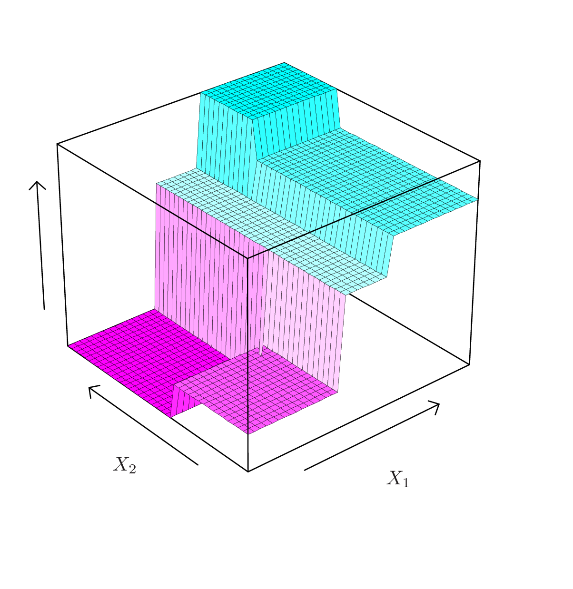

```{r setup, include=FALSE}
library(knitr)
knitr::opts_chunk$set(tidy = FALSE, 
                      message = FALSE,
                      warning = FALSE,
                      echo = FALSE, 
                      fig.width=8,
                      fig.height=6,
                      fig.align = "center",
                      fig.retina = 2)
options(htmltools.dir.version = FALSE)
```

class: split-30
layout: false

.column[.pad10px[
## Outline

- .green[What is a tree?]

]]
.column[.top50px[


```{r out.width="30%", fig.width=3, fig.height=3}
library(tidyverse)
library(ISLR)
library(rpart)
library(rpart.plot)
Hitters <- Hitters %>% filter(!is.na(Salary)) %>%
  mutate(lSalary = log10(Salary))
hitters_rp <- rpart(lSalary~Hits+Years, data=Hitters, control=rpart.control(cp=0.05))
prp(hitters_rp, digits=4, roundint=FALSE)
hitters_rp
```

]]

---
class: split-30
layout: false

.column[.pad10px[
## Outline

- .green[What is a tree?]
 

]]
.column[.top50px[


```{r out.width="80%", fig.width=7, fig.height=5}
library(viridis)
ggplot(Hitters, aes(x=Years, y=Hits, colour=lSalary)) + geom_point(alpha=0.7, size=3) +
  scale_colour_viridis() + 
  geom_vline(xintercept=4.5) + 
  annotate("segment", x=4.5, xend=25, y=117.5, yend=117.5) +
  annotate("text", x=c(2, 22, 22), y=c(240, 10, 200), label=c("2.2", "2.6", "2.9"), size=6, colour="orange")
```

]]

---

class: split-30
layout: false

.column[.pad10px[
## Outline

- .green[What is a tree?]


]]
.column[.top50px[


```{r out.width="100%"}
hitters_rp2 <- rpart(Salary~Hits+Years, data=Hitters, control=rpart.control(cp=0.012))
prp(hitters_rp2, digits=4, roundint=FALSE)
```

]]

---
class: split-30
layout: false

.column[.pad10px[
## Outline

- .green[What is a tree?]
 

]]
.column[.top50px[


```{r out.width="30%", fig.width=3, fig.height=3}
hitters_rp2
```

]]
---
class: split-30
layout: false

.column[.pad10px[
## Outline

- .green[What is a tree?]

]]
.column[.top50px[


```{r out.width="80%", fig.width=7, fig.height=5}
library(viridis)
ggplot(Hitters, aes(x=Years, y=Hits, colour=lSalary)) + geom_point(alpha=0.7, size=3) +
  scale_colour_viridis() + 
  geom_vline(xintercept=4.5) + 
  annotate("segment", x=4.5, xend=25, y=117.5, yend=117.5) +
  annotate("segment", x=4.5, xend=25, y=185, yend=185) +
  annotate("segment", x=5.5, xend=5.5, y=117.5, yend=185) 
```

]]

---
class: split-30
layout: false

.column[.pad10px[
## Outline

- What is a tree?
- .green[Regression]
    - Description

]]
.column[.top50px[


- We divide the predictor space - that is, the set of possible values for $X_1,X_2, . . .,X_p$ - into $J$ .orange[distinct] and .orange[non-overlapping] regions, $R_1,R_2, . . . , R_J$.
- The regions could have any shape. However, for simplicity and for ease of interpretation, we divide the predictor space into high-dimensional .orange[rectangles].
- We model the response as a constant $c_j$ in each region
$f(x) = \sum_{j = 1}^J c_j ~ I(x \in R_j)$

e.g.

 ${R_1} = \{X | Years < 4.5 \}$
 ${R_2} = \{X | Years \geq 4.5, Hits < 117.5 \}$
 ${R_3} = \{X | Years \geq 4.5, Hits \geq 117.5 \}$
]]

---

class: split-30
layout: false

.column[.pad10px[
## Outline

- What is a tree?
- .green[Regression]
    - Description

]]
.column[.top50px[

.split-two[
.row[.content[
- $R_1$, $R_2$, $R_3$ are .orange[terminal nodes] or .orange[leaves].
- The points where we split are .orange[internal nodes].
- The segments that connect the nodes are .orange[branches].
]]
.row[.content[
.split-70[
.column[.font_tiny[.content[
```{r}
hitters_rp
```
]]]
.column[.content[
```{r out.width="90%"}
ggplot(Hitters, aes(x=Years, y=Hits, colour=lSalary)) + geom_point(alpha=0.7, size=3) +
  scale_colour_viridis() + 
  geom_vline(xintercept=4.5) + 
  annotate("segment", x=4.5, xend=25, y=117.5, yend=117.5) +
  annotate("text", x=c(2, 22, 22), y=c(240, 10, 200), label=c("R1", "R2", "R3"), size=10, colour="orange")
```
]]
]]]
]
]]	
---
class: split-30
layout: false

.column[.pad10px[
## Outline

- What is a tree?
- .green[Regression]
    - Description

]]
.column[.top50px[

```{r}
if (!file.exists("images/8.3a.png"))
  image_write(image_chop(image_read("http://www-bcf.usc.edu/~gareth/ISL/Chapter8/8.3.pdf", density = 300), geometry=geometry_area(1200, 1200, 0, 0)), "images/8.3a.png", 
      format = "png", density = 300)
if (!file.exists("images/2.4.png"))
  image_write(image_read("http://www-bcf.usc.edu/~gareth/ISL/Chapter2/2.4.pdf", density = 300), "images/2.4.png", 
      format = "png", density = 300)
```

.split-40[
.column[


$f(X) = \beta_0 + \sum_{j = 1}^p X_j	\beta_j$


<a href="http://www-bcf.usc.edu/~gareth/ISL/Chapter2/2.4.pdf" target="_BLANK">   </a>

]

.column[.content[

<br>
<br>
<br>
.boxshadow[.content[
$$f(X) = \sum_{m = 1}^M c_m ~ I(X \in R_m)$$
]]

<a href="http://www-bcf.usc.edu/~gareth/ISL/Chapter8/8.3.pdf" target="_BLANK">  </a>


]]]
]]

---
class: split-30
layout: true

.column[.pad10px[
## Outline

- What is a tree?
- .green[Regression]
    - Description
    - Algorithm

]]
.column[.top50px[

.row[.content[
1. Given a partition $R_1, R_2, \dots, R_M$, what are the optimal values of $c_m$ if we want to minimize $\sum_i (y_i - f(x_i) )^2$?
2.  How do we construct the regions $R_1, . . .,R_M$?
]]
.row[.content[
 The best $c_m$ is just the average of $y_i$ in region $R_m$: $\hat{c}_m = \text{average}(y_i|x_i \in R_m).$
]]
.row[.content[
Finding the best binary partition in terms of minimum sum of squares is generally *computationally infeasible*. For this reason, we take a *top-down*, *greedy* approach that is known as .orange[recursive binary splitting].
]]

]]

---
class: fade-row2 fade-row3
count: false
---
class: fade-row3
count: false
---
count: false

---
class: split-30
layout: false

.column[.pad10px[
## Outline

- What is a tree?
- .green[Regression]
    - Description
    - Algorithm

]]
.column[.top50px[

- .orange[Top-down]: it begins at the top of the tree (all observations belong to a single region) and then successively splits the predictor space; each split is indicated via two new branches further down on the tree.
- .orange[Greedy]: at each step of the tree-building process, the best split is made at that particular step, rather than looking ahead and picking a split that will lead to a better tree in some future step.

]]

---
class: split-30
layout: false

.column[.pad10px[
## Outline

- What is a tree?
- .green[Regression]
    - Description
    - Algorithm

]]
.column[.top50px[

1. Start with a single region $R_1$ (entire input space), and iterate:

    a. Select a region $R_m$, a predictor $X_j$ , and a splitting point $s$, such that splitting $R_m$ with the criterion $X_j < s$ produces the largest decrease in RSS
    
    b.  Redefine the regions with this additional split.
    
2. Continues until stopping criterion reached.
]]	
---
class: split-30
layout: false

.column[.pad10px[
## Outline

- What is a tree?
- .green[Regression]
    - Description
    - Algorithm
    - Stopping

]]
.column[.top50px[

- $N_m < a$: Number of observations in $R_m$ is too small to further splitting (`minsplit`). (There is usually another control criteria, even if $N_m$ is large enough, you can't split it small number of observations off, e.g. 1 and $N_m-1$, `minbucket`. )
- RSS $< tol$: If reduction of error is too small to bother splitting further. (`cp` parameter in `rpart` measures this as a proportional drop. )

]]

---
class: split-30
layout: false

.column[.pad10px[
## Outline

- What is a tree?
- .green[Regression]
    - Description
    - Algorithm
    - Stopping
    - Diagnostics

]]
.column[.top50px[

.boxshadow[.content[Residual Sum of Squared Error]]

$$\mbox{RSS}(T) = \sum_{m = 1}^{|T|}  N_m Q_m(T), ~~ N_m = \#\{x_i \in R_m\},$$
where $Q_m(T) = \frac{1}{N_m } \sum_{x_i \in R_m} (y_i - \hat{c}_m)^2$ and $|T|$ is the number of terminal nodes in $T$.

]]
---
class: split-30
layout: true

.column[.pad10px[
## Outline

- What is a tree?
- .green[Regression]
    - Description
    - Algorithm
    - Stopping
    - Size of tree

]]
.column[.top50px[

.row[.content[
- It is possible to produce good predictions on the **training set**, but is likely to .orange[overfit] the data (trees are very flexible).
]]
.row[.content[
- A smaller tree with fewer splits (that is, fewer regions) might lead to .orange[lower variance] and better interpretation at the cost of a .orange[little bias].
]]
.row[.content[
- Tree size is a tuning parameter governing the **model’s complexity**, and the optimal tree size should be adaptively chosen from the data
]]
.row[.content[
- Produce splits only if RSS decrease exceeds some **(high) threshold** can mean that a low gain split early on, might stop the fitting, even though there may be a very good split later.
]]

]]
---
class: fade-row2 fade-row3 fade-row4
count: false
---
class: fade-row3 fade-row4
count: false
---
class: fade-row4
count: false
---
count: false

---
class: split-30
layout: false

.column[.pad10px[
## Outline

- What is a tree?
- .green[Regression]
    - Description
    - Algorithm
    - Stopping
    - Size of tree
    - Pruning

]]
.column[.top50px[

Grow a big tree, $T_0$, and then **prune** it back. The *pruning* procedure is:

- Starting with with the initial full tree $T_0$, replace a subtree with a leaf node to obtain a new tree $T_1$. Select subtree to prune by minimizing 
$$\frac{ \text{RSS}(T_1) - \text{RSS}(T_0) }{|T_1| - |T_0| }$$
- Iteratively prune to obtain a sequence $T_0, T_1, T_2, \dots, T_{R}$ where $T_{R}$ is the tree with a single leaf node.
- Select the optimal tree $T_m$ by cross validation

]]

---
class: split-30
layout: false

.column[.pad10px[
## Outline

- What is a tree?
- .green[Regression]
    - Description
    - Algorithm
    - Stopping
    - Size of tree
    - Pruning
    - Model selection

]]
.column[.top50px[

Using a 50-50 training test set split.

```{r out.width="80%", fig.width=6, fig.height=4}
set.seed(20190407)
library(caret)
hitters <- Hitters %>% filter(!is.na(Salary))
tr_indx <- createDataPartition(hitters$lSalary)$Resample1
hitters_tr <- hitters[tr_indx,]
hitters_ts <- hitters[-tr_indx,]
hitters_bigrp <- rpart(lSalary~Hits+Years, data=hitters_tr, control=rpart.control(minsplit=6, cp=0.005))
#prp(hitters_bigrp)

MSE_tr <- sum((hitters_tr$lSalary-predict(hitters_bigrp))^2)/length(hitters_tr$lSalary)
MSE_ts <- sum((hitters_ts$lSalary-predict(hitters_bigrp, hitters_ts))^2)/length(hitters_ts$lSalary)
nnodes <- max(hitters_bigrp$cptable[,2])+1
cp <- c(0.006, 0.007, 0.008, 0.009, 0.01, 0.02, 0.03, 0.04, 0.05, 0.1, 0.5)
for (i in 1:length(cp)) {
  hitters_rp <- rpart(lSalary~Hits+Years, data=hitters_tr, control=rpart.control(minsplit=6, cp=cp[i]))
  MSE_tr <- c(MSE_tr, sum((hitters_tr$lSalary-predict(hitters_rp))^2)/length(hitters_tr$lSalary))
  MSE_ts <- c(MSE_ts, sum((hitters_ts$lSalary-predict(hitters_rp, hitters_ts))^2)/length(hitters_ts$lSalary))
  nnodes <- c(nnodes, max(hitters_rp$cptable[,2])+1)
}
hitters_fit <- tibble(nnodes, train=MSE_tr, test=MSE_ts) %>% 
  gather(type, MSE, -nnodes) 
ggplot(hitters_fit, aes(x=nnodes, y=MSE, colour=type)) + 
  geom_line() + scale_colour_brewer("", palette="Dark2") +
  xlab("Size of tree") +
  geom_vline(xintercept=5)
```
]]

---
class: split-50
layout: false

.column[.pad10px[

Yielding this model: 

```{r out.width="100%"}
hitters_rp <- rpart(lSalary~Hits+Years, data=hitters_tr, control=rpart.control(minsplit=6, cp=0.03))
prp(hitters_rp, digits=4, roundint=FALSE)
```


]]
.column[.top10px[

<br>
<br>

```{r out.width="80%", fig.width=7, fig.height=5}
ggplot(Hitters, aes(x=Years, y=Hits, colour=lSalary)) + geom_point(alpha=0.7, size=3) +
  scale_colour_viridis() + 
  geom_vline(xintercept=4.5) + 
  annotate("segment", x=0, xend=4.5, y=111, yend=111) +
  annotate("segment", x=4.5, xend=25, y=103.5, yend=103.5) +
  annotate("segment", x=0, xend=4.5, y=33, yend=33) 
```

]]

---
class: split-50
layout: false

.column[.pad10px[

Cross-validation recommendation suggests more. 

```{r}
caret.control <- trainControl(method = "repeatedcv",
                              number = 10,
                              repeats = 1)
rpart.cvfit <- train(lSalary~., 
                  data = hitters[, c("Hits", "Years", "lSalary")],
                  method = "rpart",
                  trControl = caret.control,
                  tuneLength = 10)
prp(rpart.cvfit$finalModel, digits=4, roundint=FALSE)
```

]]
.column[.top10px[
<br>
<br>

```{r out.width="80%", fig.width=7, fig.height=5}
ggplot(Hitters, aes(x=Years, y=Hits, colour=lSalary)) + geom_point(alpha=0.7, size=3) +
  scale_colour_viridis() + 
  geom_vline(xintercept=4.5) + 
  geom_vline(xintercept=3.5) + 
  annotate("segment", x=0, xend=3.5, y=114, yend=114) +
  annotate("segment", x=4.5, xend=3.5, y=106, yend=106) +
  annotate("segment", x=4.5, xend=25, y=117.5, yend=117.5) +
  annotate("segment", x=6.5, xend=6.5, y=0, yend=117.5) +
  annotate("segment", x=6.5, xend=25, y=50.5, yend=50.5)
```
]]


---
layout: false
# `r set.seed(2019); emo::ji("technologist")` Made by a human with a computer

### Slides at [https://monba.dicook.org](https://monba.dicook.org).
### Code and data at [https://github.com/dicook/Business_Analytics](https://github.com/dicook/Business_Analytics).
<br>

### Created using [R Markdown](https://rmarkdown.rstudio.com) with flair by [**xaringan**](https://github.com/yihui/xaringan), and [**kunoichi** (female ninja) style](https://github.com/emitanaka/ninja-theme).

<br> 
<a rel="license" href="http://creativecommons.org/licenses/by-sa/4.0/"></a><br />This work is licensed under a <a rel="license" href="http://creativecommons.org/licenses/by-sa/4.0/">Creative Commons Attribution-ShareAlike 4.0 International License</a>.
