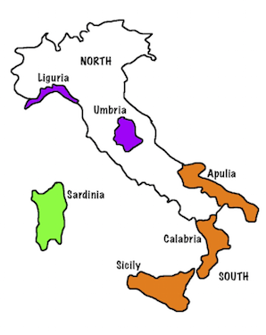

```{r setup, include=FALSE}
library(knitr)
knitr::opts_chunk$set(tidy = FALSE, 
                      message = FALSE,
                      warning = FALSE,
                      echo = FALSE, 
                      fig.width=8,
                      fig.height=6,
                      fig.align = "center",
                      fig.retina = 2)
options(htmltools.dir.version = FALSE)
library(magick)
```

class: split-30
layout: false

.column[.pad10px[
## Outline

- .green[Bootstrap aggregation]

]]
.column[.top50px[

- Take $B$ different *bootstrapped* training sets:
$$D_1, D_2, \dots, D_B$$
- Build a separate prediction model using each $D_{(\cdot)}$:
$$\hat{f}_1(x), \hat{f}_2(x), \dots, \hat{f}_B(x)$$
- Combine resulting predictions, e.g. average
$$\hat{f}_{\text{avg}}(x) = \frac1B \sum_{b = 1}^{B} \hat{f}_b(x)$$

]]

---
class: split-30
layout: false

.column[.pad10px[
## Outline

- .green[Bootstrap aggregation]
    - Bagging trees

]]
.column[.top50px[

.orange[Bagged trees]

- Construct $B$ regression trees using $B$ bootstrapped training sets, and average the resulting predictions. 
- Each individual tree has .orange[high variance, but low bias]. 
- Averaging these $B$ trees .orange[reduces the variance]. 
- For classification trees, there are several possible aggregation methods, but the simplest is the **majority vote**. 
	
]]

---
class: split-30
layout: false

.column[.pad10px[
## Outline

- .green[Bootstrap aggregation]
    - Bagging trees
    - Out-of-bag-error

]]
.column[.top50px[

- .orange[No need to use (cross-)validation] to **estimate the test error** of a bagged model (**debatable by some**).
- On average, each bagged tree makes use of around .orange[two-thirds of the observations]. (Check the textbook exercise.)
- The remaining observations not used to fit a given bagged tree are referred to as the .orange[out-of-bag (OOB)] observations.
- We can predict the response for the $i^{th}$ observation using each of the trees in which that observation was OOB. This will yield around .orange[B/3 predictions] for the $i^{th}$ observation.
- To obtain a single prediction for the $i^{th}$ observation, average these predicted responses (regression) or can take a majority vote (classification).
	
]]

---
class: split-30
layout: false

.column[.pad10px[
## Outline

- [Bootstrap aggregation](https://monba.dicook.org/lectures/week7/classification_forests.html#2)
- .green[Random forests]
    - Algorithm

]]
.column[.top50px[


1. Input: $L = {(x_i, y_i), i=1, ..., n}, y_i \in \{1, ..., k\}, m < p$, number of variables chosen for each tree, $B$ is the number of bootstrap samples.
2. For $b =1, 2, ..., B$:

    i. Draw a bootstrap sample, $L^{*b}$ of size $n^{*b}$ from $L$.
    
    ii. Grow tree classifier, $T^{*b}$. At each node use a random selection of $m$ variables, and grow to maximum depth without pruning.
    
    iii. Predict the class of each case not drawn in $L^{*b}$.
    
3. Combine the predictions for each case, by majority vote, to give predicted class.
	
]]

---
class: split-30
layout: false

.column[.pad10px[
## Outline

- Bootstrap aggregation
- .green[Random forests]
    - Algorithm
    - Diagnostics

]]
.column[.top50px[

```{r}
library(anicon)
```

`r anicon::nia(text=".orange[Useful by-products]", animate="burst", anitype="hover", rotate="5", speed="slow")`

- Error is computed automatically on the out-of-bag cases.
- .orange[Variable importance]: more complicated than one might think
- .orange[Vote matrix], $n\times K$: Proportion of times a case is predicted to the class $k$.
- .orange[Proximities], $n\times n$: Closeness of cases measured by how often they are in the same terminal node.

]]

---
layout: true

`r anicon::nia(text=".orange[Variable importance]", animate="burst", anitype="repeat", rotate="-5", speed="slow")`

.row[.content[
1.For every tree predict the oob cases and count the number of votes .orange[cast for the correct class]. 
]]
.row[.content[
2..orange[Randomly permute] the values on a variable in the oob cases and predict the class for these cases. 
]]
.row[.content[
3.Difference the votes for the correct class in the variable-permuted oob cases and the real oob cases. Average this number over all trees in the forest. If the .orange[value is large, then the variable is very important]. 
]]
.row[.content[
Alternatively, .orange[Gini importance] adds up the difference in impurity value of the descendant nodes with the parent node. Quick to compute.
]]
---
class: fade-row2 fade-row3 fade-row4
count: false
---
class: fade-row3 fade-row4
count: false
---
class: fade-row4
count: false
---
count: false

---
layout: false

.boxshadow[.orange[.content[
Vote matrix
]]]

- .orange[Proportion of trees] the case is predicted to be each class, ranges between 0-1
- Can be used to .orange[identify troublesome] cases.
- Used with plots of the actual data can help determine if it is the record itself that is the problem, or if method is biased.
- Understand the difference in accuracy of prediction for different classes.

---
layout: false

`r anicon::nia(text=".orange[Proximities]", animate="shake", speed="slow", flip="horizontal")`


- Measure how each pair of observations land in the forest
- Run both in- and out-of-bag cases down the tree, and increase proximity value of cases $i, j$ by 1 each time they are in the same terminal node. 
- Normalize by dividing by $B$.


---
class: split-30
layout: false

.column[.pad10px[
## Outline

- Bootstrap aggregation
- .green[Random forests]
    - Algorithm
    - Diagnostics
    - Example

]]
.column[.top50px[

.split-50[
.column[.content[

]]
.column[.content[

Olive oils data: Distinguish the region where oils were produced by their fatty acid signature. Quality control. Fraudulent marketing. 

Areas in the south:

1 North-Apulia <br>
2 Calabria <br>
3 South-Apulia <br>
4 Sicily
]]
]
]]
---
class: split-30
layout: false

.column[.pad10px[
## Outline

- Bootstrap aggregation
- .green[Random forests]
    - Algorithm
    - Diagnostics
    - Example

]]
.column[.top50px[

Classifying the olive oils in the south of Italy - difficult classification task.

```{r}
library(tidyverse)
olive <- read_csv("http://www.ggobi.org/book/data/olive.csv") %>%
  rename(name=X1)
olive <- olive %>%
  filter(region == 1)
```

```{r eval=FALSE}
library(tourr)
library(RColorBrewer)
pal <- brewer.pal(4, "Dark2")
col <- pal[olive$area]
quartz()
# drop eicosenoic, all low for south
animate_xy(olive[,4:10], axes="off", col=col) 
# Drop Sicily
animate_xy(olive[olive$area!=4,4:10], axes="off", col=col[olive$area!=4]) 
animate_xy(olive[,c(5, 7, 8)], axes="off", col=col) 
animate_xy(olive[olive$area!=4,c(5, 7, 8)], axes="off", col=col[olive$area!=4]) 
```

```{r eval=FALSE}
# create animation
library(plotly)
library(htmltools)
set.seed(20190411)
bases <- save_history(olive[,4:10], grand_tour(2), 
    start=matrix(c(1,0,0,1,0,0,0,0,0,0,0,0,0,0), ncol=2, byrow=TRUE), 
    max = 15)
# Re-set start bc seems to go awry
bases[,,1] <- matrix(c(1,0,0,1,0,0,0,0,0,0,0,0,0,0), ncol=2, byrow=TRUE)
tour_path <- interpolate(bases, 0.1)
d <- dim(tour_path)
olive_std <- tourr::rescale(olive[,4:10])
mydat <- NULL; 
for (i in 1:d[3]) {
  fp <- as.matrix(olive_std) %*% matrix(tour_path[,,i], ncol=2)
  fp <- tourr::center(fp)
  colnames(fp) <- c("d1", "d2")
  mydat <- rbind(mydat, cbind(fp, rep(i+10, nrow(fp))))
}
colnames(mydat)[3] <- "indx"
df <- as_tibble(mydat) 
df <- df %>%
  mutate(area=factor(rep(olive$area, d[3])))
p <- ggplot() +
       geom_point(data = df, aes(x = d1, y = d2, colour=area,
                                 frame = indx), size=1) +
       scale_colour_brewer("", palette="Dark2") +
       theme_void() +
       coord_fixed() +
  theme(legend.position="none")
pg <- ggplotly(p, width=400, height=400) %>%
  animation_opts(200, redraw = FALSE, 
                 easing = "linear", transition=0)
save_html(pg, file="olive1.html")
```

<iframe src="olive1.html" width="800" height="500" scrolling="yes" seamless="seamless" frameBorder="0"> </iframe>

]]

---
class: split-30
layout: false

.column[.pad10px[
## Outline

- Bootstrap aggregation
- .green[Random forests]
    - Algorithm
    - Diagnostics
    - Example

]]
.column[.top50px[

A single tree

```{r out.width="100%"}
library(caret)
library(rpart)
library(rpart.plot)
set.seed(20190411)
tr_indx <- createDataPartition(olive$area)$Resample1
olive_tr <- olive[tr_indx, 3:10]
olive_tr$area <- factor(olive_tr$area)
olive_ts <- olive[-tr_indx, 3:10]
olive_ts$area <- factor(olive_ts$area)
olive_rp <- rpart(area~., data=olive_tr, parms = list(split = "information"), 
                 control = rpart.control(cp=0.0001, minsplit=5))
olive_rp <- prune(olive_rp, cp=0.01)
prp(olive_rp)
```
]]
---
class: split-30
layout: false

.column[.pad10px[
## Outline

- Bootstrap aggregation
- .green[Random forests]
    - Algorithm
    - Diagnostics
    - Example

]]
.column[.top50px[
.split-50[
.column[.content[
Training confusion and error

```{r}
options(digits=2)
confusionMatrix(olive_tr$area, predict(olive_rp, newdata=olive_tr, type="class"))$table
tr_err <- 1-confusionMatrix(olive_tr$area, predict(olive_rp, newdata=olive_tr, type="class"))$overall[1]
as.numeric(tr_err)
tr_class_err <- 1-confusionMatrix(olive_tr$area, predict(olive_rp, newdata=olive_tr, type="class"))$byClass[,"Recall"]
tr_class_err[1:2]
tr_class_err[3:4]
```
]]
.column[.content[
Test confusion and error

```{r}
confusionMatrix(olive_ts$area, predict(olive_rp, newdata=olive_ts, type="class"))$table
ts_err <- 1-confusionMatrix(olive_ts$area, predict(olive_rp, newdata=olive_ts, type="class"))$overall[1]
as.numeric(ts_err)
ts_class_err <- 1-confusionMatrix(olive_ts$area, predict(olive_rp, newdata=olive_ts, type="class"))$byClass[,"Recall"]
ts_class_err[1:2]
ts_class_err[3:4]
```
]]
]
]]
---
class: split-30
layout: false

.column[.pad10px[
## Outline

- Bootstrap aggregation
- .green[Random forests]
    - Algorithm
    - Diagnostics
    - Example

]]
.column[.top50px[

```{r}
library(randomForest)
olive_rf <- randomForest(area~., data=olive_tr, importance=TRUE, proximity=TRUE)
olive_rf
```
]]

---
class: split-30
layout: false

.column[.pad10px[
## Outline

- Bootstrap aggregation
- .green[Random forests]
    - Algorithm
    - Diagnostics
    - Example

]]
.column[.top50px[

.split-50[
.column[.content[
Training confusion and error

```{r}
options(digits=2)
confusionMatrix(olive_tr$area, predict(olive_rf, newdata=olive_tr, type="class"))$table
tr_err <- 1-confusionMatrix(olive_tr$area, predict(olive_rf, newdata=olive_tr, type="class"))$overall[1]
as.numeric(tr_err)
tr_class_err <- 1-confusionMatrix(olive_tr$area, predict(olive_rf, newdata=olive_tr, type="class"))$byClass[,"Recall"]
tr_class_err[1:2]
tr_class_err[3:4]
```
]]
.column[.content[
Test confusion and error

```{r}
confusionMatrix(olive_ts$area, predict(olive_rf, newdata=olive_ts, type="class"))$table
ts_err <- 1-confusionMatrix(olive_ts$area, predict(olive_rf, newdata=olive_ts, type="class"))$overall[1]
as.numeric(ts_err)
ts_class_err <- 1-confusionMatrix(olive_ts$area, predict(olive_rf, newdata=olive_ts, type="class"))$byClass[,"Recall"]
ts_class_err[1:2]
ts_class_err[3:4]
```
]]
]
]]
---
class: split-30
layout: false

.column[.pad10px[
## Outline

- Bootstrap aggregation
- .green[Random forests]
    - Algorithm
    - Diagnostics
    - Example

]]
.column[.top50px[

Diagnostics: variable importance

```{r}
options(digits=2)
olive_rf$importance[,1:4]
olive_rf$importance[,5:6]
```

]]

---
class: split-30
layout: false

.column[.pad10px[
## Outline

- Bootstrap aggregation
- .green[Random forests]
    - Algorithm
    - Diagnostics
    - Example

]]
.column[.top50px[

Diagnostics: vote matrix

```{r}
head(olive_rf$votes, 20)
```

]]

---
class: split-50
layout: false

.column[.pad10px[

```{r out.width="100%", fig.width=6, fig.height=6}
vt <- data.frame(olive_rf$votes)
vt$area <- olive_tr$area
library(GGally)
ggscatmat(vt, columns=1:4, col="area") + 
  scale_colour_brewer("", palette="Dark2")
```


]]
.column[.top50px[

```{r out.width="100%", fig.width=6, fig.height=6}
f.helmert <- function(d)
{
  helmert <- rep(1/sqrt(d), d)
  for(i in 1:(d-1))
  {
    x <- rep(1/sqrt(i*(i+1)), i)
    x <- c(x, -i/sqrt(i*(i+1)))
    x <- c(x, rep(0, d - i - 1))
    helmert <- rbind(helmert, x)
  }
  rownames(helmert) <- paste("V", 1:d, sep="")
  return(helmert)
}
proj <- t(f.helmert(4)[-1,])
vtp <- as.matrix(vt[,-5])%*%proj
vtp <- data.frame(vtp, area=vt$area)
ggscatmat(vtp, columns=1:3, col="area") + 
  scale_colour_brewer("", palette="Dark2")
```

```{r eval=FALSE}
library(tourr)
library(RColorBrewer)
quartz()
pal <- brewer.pal(4, "Dark2")
col <- pal[as.numeric(vtp[, 4])]
animate_xy(vtp[,1:3], col=col, axes = "bottomleft")
```


]]
---
class: split-30
layout: false

.column[.pad10px[
## Outline

- Bootstrap aggregation
- .green[Random forests]
    - Algorithm
    - Diagnostics
    - Example
    - References

]]
.column[.top50px[

Cook & Swayne (2007) "Interactive and Dynamic Graphics for Data Analysis: With Examples Using R and GGobi" have several videos illustrating techniques for exploring high-dimensional data in association with trees and forest classifiers:

- [Trees video](http://www.ggobi.org/book/chap-class/Trees.mov)
- [Forests video](http://www.ggobi.org/book/chap-class/Forests.mov)

]]
---
class: split-30
layout: false

.column[.pad10px[
## Outline

- Bootstrap aggregation
- Random forests
- .green[Boosted trees]

]]
.column[.top50px[
Boosting iteratively fits multiple trees, sequentially putting .orange[more weight] on observations that have predicted inaccurately. 

1. Set $\hat{f}(x)=0$ and $r_i=y_i \forall i$ in training set
2. For b=1, 2, ..., B, repeat:<br>
    a. Fit a tree $\hat{f}^b$ with $d$ splits ( $d+1$ terminal nodes)<br>
    b. Update $\hat{f}$ by adding a shrunken version of the new tree $\hat{f}(x) = \hat{f}(x)+\lambda\hat{f}^b(x)$. <br>
    c. Update the residuals $r_i = r_i - \lambda\hat{f}^b(x_i)$ <br>
3. Output boosted model, $\hat{f}(x) = \sum_{b=1}^B\lambda\hat{f}^b(x)$
]]
---
layout: false
# `r set.seed(2019); emo::ji("technologist")` Made by a human with a computer

### Slides at [https://monba.dicook.org](https://monba.dicook.org).
### Code and data at [https://github.com/dicook/Business_Analytics](https://github.com/dicook/Business_Analytics).
<br>

### Created using [R Markdown](https://rmarkdown.rstudio.com) with flair by [**xaringan**](https://github.com/yihui/xaringan), and [**kunoichi** (female ninja) style](https://github.com/emitanaka/ninja-theme).

<br> 
<a rel="license" href="http://creativecommons.org/licenses/by-sa/4.0/"></a><br />This work is licensed under a <a rel="license" href="http://creativecommons.org/licenses/by-sa/4.0/">Creative Commons Attribution-ShareAlike 4.0 International License</a>.
