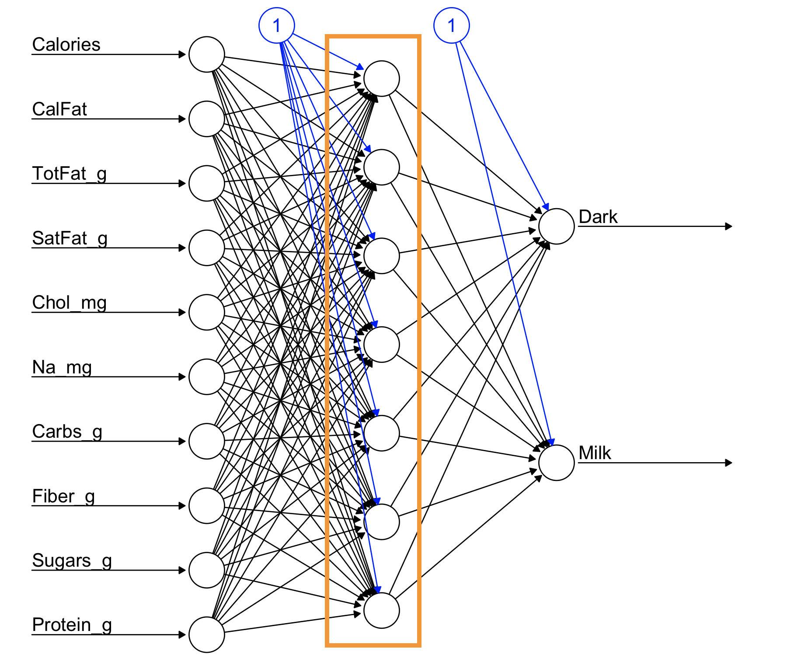

```{r setup, include=FALSE}
library(knitr)
knitr::opts_chunk$set(tidy = FALSE, 
                      message = FALSE,
                      warning = FALSE,
                      echo = FALSE, 
                      fig.width=8,
                      fig.height=6,
                      fig.align = "center",
                      fig.retina = 2)
options(htmltools.dir.version = FALSE)
library(magick)
```

class: split-30
layout: false

.column[.pad10px[
## Outline

- .orange[Logistic regression]


]]
.column[.top50px[

Remember the logistic function:

\begin{align}
y &=& \frac{e^{\beta_0+\sum_{j=1}^p\beta_jx_j}}{1+e^{\beta_0+\sum_{j=1}^p\beta_jx_j}}\\
  &=& \frac{1}{1+e^{-(\beta_0+\sum_{j=1}^p\beta_jx_j})}
\end{align}

Alternatively,

$$\log_e\frac{y}{1 - y} = \beta_0+\sum_{j=1}^p\beta_jx_j$$
]]

---
class: split-50
layout: false

.column[.top50px[

What the .orange[logistic function] looks like:

\begin{align}
y =\frac{1}{1+e^{-(\beta_0+\sum_{j=1}^p\beta_jx_j})}
\end{align}

]]

.column[.top50px[


```{r out.width="80%", fig.width=4, fig.height=4}
library(tidyverse)
x <- seq(-2, 2, 0.1)
y <- exp(1+3*x)/(1+exp(1+3*x))
df2 <- tibble(x, y)
ggplot(df2, aes(x=x, y=y)) + 
  geom_line() +
  geom_hline(yintercept=0.5, colour="orange") +
  annotate("text", x=0.75, y=0.6, label="Activation threshold", colour="orange") +
  geom_hline(yintercept=c(0,1), linetype=2)
```


]]
---
class: middle

```{r out.width="100%"}
library(memer)
meme_get("ThinkAboutIt")
```

<center>
.font_large[Hang on to this idea....]
</center>
---
class: split-30
layout: false

.column[.pad10px[
## Outline

- [Logistic regression](#2)
- .orange[Network explanation]
    - Linear regression as a network

]]
.column[.top50px[

.split-50[

.column[
$$\hat{y} =\beta_0+\sum_{j=1}^p\beta_jx_j$$

Drawing as a network model: 


]
.column[

<br>
<br>
<br>
<br>
<br>
<br>
$p$ .orange[inputs] (predictors), multiplied by .orange[weights] (coefficients), summed, add a .orange[constant], predicts .orange[output] (response)
]
]
]]

---
class: split-30
layout: false

.column[.pad10px[
## Outline

- [Logistic regression](#2)
- .orange[Network explanation]
    - Linear regression as a network
    - Hidden layer

]]
.column[.top50px[

$$\hat{y} =\alpha_{0}+\sum_{k=1}^s(\alpha_{k}(\beta_{j0}+\sum_{j=1}^p\beta_{jk}x_j))$$

A linear regression model nested within a linear regression model allows for intrinsic dimension reduction, or expansion.


]]

---
class: split-30
layout: false

.column[.pad10px[
## Outline

- [Logistic regression](#2)
- [Network explanation](#4)
- .orange[Neural network model]
    - Two layer perceptron

]]
.column[.top50px[

This is a single output, 2 layer, perceptron (neural network), with a linear threshold.

\begin{align}
\hat{y} =\alpha_{0}+\sum_{k=1}^s(\alpha_{k}(\beta_{j0}+\sum_{j=1}^p\beta_{jk}x_j))
\end{align}


]]

---
class: split-30
layout: false

.column[.pad10px[
## Outline

- [Logistic regression](#2)
- [Network explanation](#4)
- .orange[Neural network model]
    - Two layer perceptron
    - History

]]
.column[.top50px[

"A logical calculus of the ideas immanent in nervous activity" (1943)
Warren S. McCulloch & Walter Pitts

Mathematical model for a neuron.


```{r, animation.hook='gifski'}
library(ggpubr)
library(png)
fls <- list.files("images/neuron")
plot.new()
for (i in fls) {
  name <- paste0("images/neuron/", i)
  p <- readPNG(name)
  print(ggplot() +
    background_image(p))
}
```

]]


---

Back to logistic regression: When the proportion gets to 0.5, it .orange[activates] an event to happen $(Y=1)$.

```{r out.width="50%", fig.width=4, fig.height=4}
library(tidyverse)
x <- seq(-2, 2, 0.1)
y <- exp(1+3*x)/(1+exp(1+3*x))
df2 <- tibble(x, y)
ggplot(df2, aes(x=x, y=y)) + 
  geom_line() +
  geom_hline(yintercept=0.5, colour="orange") +
  annotate("text", x=0.75, y=0.6, label="Activation threshold", colour="orange") +
  geom_hline(yintercept=c(0,1), linetype=2)
```

---
class: split-30
layout: false

.column[.pad10px[
## Outline

- [Logistic regression](#2)
- [Network explanation](#4)
- .orange[Neural network model]
    - Two layer perceptron
    - History
    - Activation functions

]]
.column[.top50px[

\begin{align}
\hat{y} =\color{orange}g\color{orange}(\alpha_{0}+\sum_{k=1}^s(\alpha_{k}\color{orange}f\color{orange}(\beta_{j0}+\sum_{j=1}^p\beta_{jk}x_j)\color{orange})\color{orange})
\end{align}

Let $u=\beta_0+\sum_{j=1}^p\beta_jx_j$
- Logistic: $\color{orange}{\frac{1}{1+e^{-u}}}$
- Gaussian radial: $\color{orange}{\frac{1}{\sqrt{2\pi}}e^{-u^2/2}}$
- Hyperbolic tangent: $\color{orange}{\frac{e^u-e^{-u}}{e^u+e^{-u}}}$

]]

---
class: split-30
layout: false

.column[.pad10px[
## Outline

- [Logistic regression](#2)
- [Network explanation](#4)
- .orange[Neural network model]
    - Two layer perceptron
    - History
    - Activation functions
    - Neurons

]]
.column[.top50px[


]]
---
class: split-30
layout: false

.column[.pad10px[
## Outline

- [Logistic regression](#2)
- [Network explanation](#5)
- [Neural network model](#7)
- .orange[Fitting procedures]

]]
.column[.top50px[

$$RSS = \sum_{i=1}^{n} (y_i-\hat{y}_i)^2$$

Often combined with some shrinkage criterion (covered in "Regularization" section).

$$RSS + \lambda \sum_{k} w_k^2$$

where $w$ indicates the set of weights in the model, labelled $\alpha, \beta$ earlier. Forces some of the weights to zero (or close to), to alleviate over-parametrization, and over-fitting.

]]

---
class: split-30
layout: false

.column[.pad10px[
## Outline

- [Logistic regression](#2)
- [Network explanation](#5)
- [Neural network model](#7)
- [Fitting procedures](#12)
- .orange[Example]

]]
.column[.top50px[

```{r}
library(reshape)
choc <- read_csv("data/chocolates.csv")
choc_std <- rescaler(choc)
library(caret)
set.seed(20190426)
tr_indx <- createDataPartition(choc$Type)$Resample1
choc_tr <- choc_std[tr_indx,-c(1:3)]
choc_ts <- choc_std[-tr_indx,-c(1:3)]
```

```{r echo=TRUE}
library(neuralnet)
set.seed(108)
choc_nn <- neuralnet(Type~., data=choc_tr, hidden=7)
pred <- predict(choc_nn, choc_ts)
choc_ts$pred <- pred[,1] < 0.5
table(choc_ts$Type, choc_ts$pred)
```

```{r out.width="50%", fig.width=4, fig.height=3}
#choc_tr$pred <- predict(choc_nn, choc_tr)[,1] < 0.5
#table(choc_tr$Type, choc_tr$pred)
choc_ts$predy <- pred[,1]
ggplot(choc_ts, aes(x=Type, y=predy, colour=Type)) +
  geom_jitter(width=0.2, height=0, alpha=0.5) + 
  scale_colour_brewer(palette="Dark2") +
  ylab("Predicted")
```

```{r eval=FALSE}
plot(choc_nn, show.weights=FALSE)
```
]]

---
class: split-40
layout: false

.column[

## Fitted model


]
.column[

```{r}
wgts1 <- choc_nn$weights[[1]][[1]]
rownames(wgts1) <- c("intercept", colnames(choc_tr[,-1]))
colnames(wgts1) <- paste0("s", 1:7)
round(wgts1, 2)
wgts2 <- choc_nn$weights[[1]][[2]]
rownames(wgts2) <- c("intercept", paste0("s", 1:7))
colnames(wgts2) <- c("Dark", "Milk")
round(wgts2, 2)
```
]

---
class: split-40
layout: false

.column[.top50px[




]]
.column[.top50px[


```{r out.width="100%", fig.width=10, fig.height=4}
logit <- function(x) {
  1/(1+exp(-x))
}
neurons <- as.matrix(choc_tr[,-1])%*%wgts1[-1,] + rep(wgts1[1,], nrow(choc_tr))
neurons <- as_tibble(neurons) %>% bind_cols(choc_tr[,1]) %>%
  mutate_at(vars(contains("s")), logit) %>%
  gather(neuron, prediction, -Type)
ggplot(neurons, aes(x=prediction, fill=Type)) + 
  geom_vline(xintercept=0.5, colour="grey60", linetype=2) +
  geom_histogram(binwidth=0.1) +
  facet_grid(Type~neuron) + 
  scale_fill_brewer("", palette="Dark2") +
  theme(legend.position="none")
```

Mistakes made by each neuron

```{r}
neurons %>%
  group_by(neuron) %>%
  mutate(predcl = ifelse(prediction<0.5, "Dark", "Milk")) %>%
  filter(Type != predcl) %>%
  tally() %>% spread(neuron, n)
```

]]

---
class: split-40
layout: false

.column[.top50px[


]]
.column[.top50px[


Weights of each neuron reflect their strength

```{r}
neurons %>%
  group_by(neuron) %>%
  mutate(predcl = ifelse(prediction<0.5, "Dark", "Milk")) %>%
  filter(Type != predcl) %>%
  tally() %>% spread(neuron, n)

round(wgts2, 2)
```

```{r eval=FALSE}
# Check what the two neurons give, whether they confirm each other
fit1 <- neurons %>% 
  mutate(obs = rep(1:44, 7)) %>%
  spread(neuron, prediction)
fit <- as.matrix(fit1[, 3:9])%*%wgts2[-1,] + matrix(rep(wgts2[1,], nrow(choc_tr)), byrow=T, ncol=2)
fit <- fit %>% as_tibble() %>% mutate(Type=fit1$Type, obs=fit1$obs)
fit <- fit %>% mutate(prediction = ifelse(Dark > Milk, "Dark", "Milk"))
ggplot(fit, aes(x=Dark, y=Milk, colour=prediction)) + geom_point() + geom_abline(intercept=0, slope=1) + scale_colour_brewer(palette="Dark2")
```

]]

---
class: split-70
layout: false

.column[.pad50px[

Are the same observations misclassifed by each neuron, or do some neurons do unique work?

```{r}
obs_err <- neurons %>%
  mutate(obs = rep(1:44, 7)) %>%
  mutate(predcl = ifelse(prediction<0.5, "Dark", "Milk")) %>%
  mutate(correct = ifelse(Type == predcl, 0, 1)) %>%
  select(obs, neuron, correct) %>%
  spread(neuron, correct) %>%
  mutate(nerr = s1+s2+s3+s4+s5+s6+s7)
obs_err %>% arrange(desc(nerr)) %>% print(n=11)
```

It's .orange[not the same] observations that are misclassifed by each neuron.

]]
.column[.top50px[

.orange[Obs 10]: `r choc[tr_indx[10],1:3]`

.orange[Obs 16]: `r choc[tr_indx[16],1:3]`

.orange[Obs 14]: `r choc[tr_indx[14],1:3]`

.orange[Obs 24]: `r choc[tr_indx[24],1:3]`

*Note: Mars Dark choc was not in training set.*
]]

---
class: split-60
layout: false

.column[.pad50px[

.font_tiny[.content[
```{r}
wgts1 <- choc_nn$weights[[1]][[1]]
rownames(wgts1) <- c("intercept", colnames(choc_tr[,-1]))
colnames(wgts1) <- paste0("s", 1:7)
round(wgts1, 2)
```
]]

.orange[Variable importance]

Because the variables have all been standardised, the .orange[magnitude] of the weights reflect their importance.

]]
.column[.top50px[


```{r out.width="100%", fig.width=5, fig.height=7}
wgts1_df <- as_tibble(wgts1[-1,]) %>%
  mutate_all(., abs) %>%
  mutate(var=rownames(wgts1[-1,])) %>%
  gather(neuron, weight, -var)
ggplot(wgts1_df, aes(x=var, y=weight)) + geom_col() + 
  facet_wrap(~neuron, ncol=2, scales="free_x") + 
  coord_flip()
```

]]
---
class: split-30
layout: false

.column[.pad10px[
## Outline

- [Logistic regression](#2)
- [Network explanation](#5)
- [Neural network model](#7)
- [Fitting procedures](#12)
- [Example](#13)
- .orange[Stability]

]]
.column[.top50px[

Different random .orange[start] could lead to a .orange[different model]. .orange[Choice of] $s$ also needs to be made, ideally by cross-validation.

```{r echo=TRUE}
choc_nn <- neuralnet(Type~., data=choc_tr, hidden=7)
```

```{r}
pred <- predict(choc_nn, choc_ts)
choc_ts$pred <- pred[,1] < 0.5
table(choc_ts$Type, choc_ts$pred)
```

```{r}
choc_nn <- neuralnet(Type~., data=choc_tr, hidden=7)
pred <- predict(choc_nn, choc_ts)
choc_ts$pred <- pred[,1] < 0.5
table(choc_ts$Type, choc_ts$pred)
```

```{r}
choc_nn <- neuralnet(Type~., data=choc_tr, hidden=7)
pred <- predict(choc_nn, choc_ts)
choc_ts$pred <- pred[,1] < 0.5
table(choc_ts$Type, choc_ts$pred)
```

]]


---
class: split-30
layout: false

.column[.pad10px[
## Outline

- [Logistic regression](#2)
- [Network explanation](#5)
- [Neural network model](#7)
- [Fitting procedures](#12)
- [Example](#13)
- [Stability](#19)
- .orange[Multiple classes]

]]
.column[.top50px[

Response is coded as a binary matrix, which allows $K>2$.

```{r}
set.seed(5)
choc_tr %>% mutate(Dark = ifelse(Type == "Dark", 1, 0), 
                Milk = ifelse(Type == "Milk", 1, 0)) %>%
  select(Type, Dark, Milk) %>%
  sample_n(10)
```

]]
---
class: split-30
layout: false

.column[.pad10px[
## Outline

- [Logistic regression](#2)
- [Network explanation](#5)
- [Neural network model](#7)
- [Fitting procedures](#12)
- [Example](#19)
- [Multiple classes](#20)
- .orange[Deep learning]

]]
.column[

.split-30[
.column[.pad10px[

Deep learning models are neural networks.

Example of image processing through hidden layers generated by different .orange[pixel aggregations].

]]
.column[

<br>


]]
]]
---

## Resources

- [Neural Networks: A Review from a Statistical Perspective](https://projecteuclid.org/euclid.ss/1177010638)
- [A gentle journey from linear regression to neural networks](https://towardsdatascience.com/a-gentle-journey-from-linear-regression-to-neural-networks-68881590760e)
- [McCulloch-Pitts Neuron -- Mankind’s First Mathematical Model Of A Biological Neuron](https://towardsdatascience.com/mcculloch-pitts-model-5fdf65ac5dd1)

---
layout: false
# `r set.seed(2019); emo::ji("technologist")` Made by a human with a computer

### Slides at [https://monba.dicook.org](https://monba.dicook.org).
### Code and data at [https://github.com/dicook/Business_Analytics](https://github.com/dicook/Business_Analytics).
<br>

### Created using [R Markdown](https://rmarkdown.rstudio.com) with flair by [**xaringan**](https://github.com/yihui/xaringan), and [**kunoichi** (female ninja) style](https://github.com/emitanaka/ninja-theme).

<br> 
<a rel="license" href="http://creativecommons.org/licenses/by-sa/4.0/"></a><br />This work is licensed under a <a rel="license" href="http://creativecommons.org/licenses/by-sa/4.0/">Creative Commons Attribution-ShareAlike 4.0 International License</a>.
