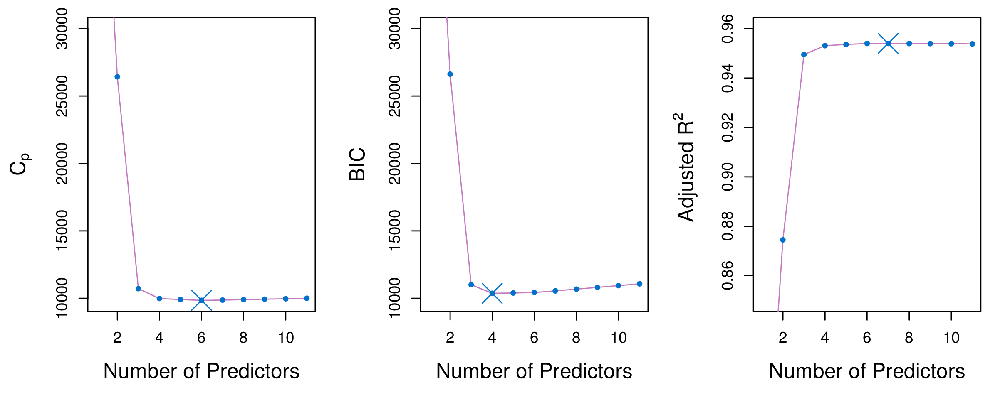
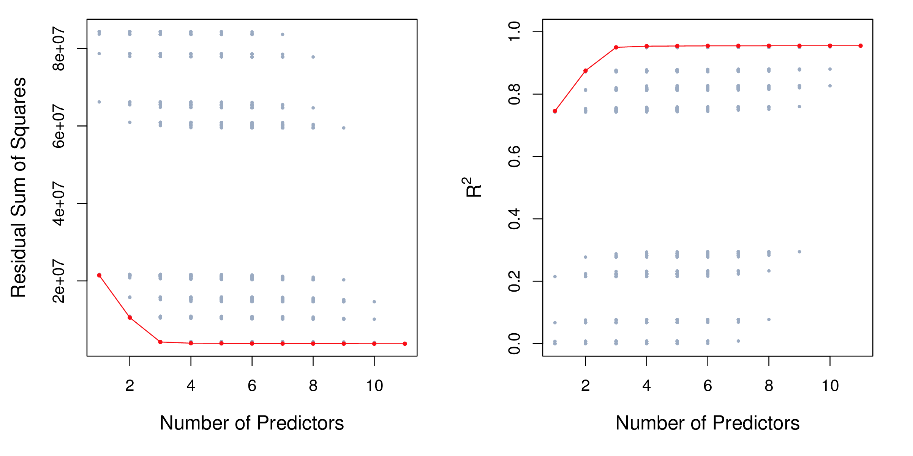

```{r setup, include=FALSE}
library(knitr)
knitr::opts_chunk$set(tidy = FALSE, 
                      message = FALSE,
                      warning = FALSE,
                      echo = FALSE, 
                      fig.width=8,
                      fig.height=6,
                      fig.align = "center",
                      fig.retina = 2)
options(htmltools.dir.version = FALSE)
library(magick)
```


class: split-30
layout: false

.column[.pad10px[
## Outline

- .orange[Too many variables]

]]
.column[.top50px[

Fitting a linear regression model requires:

\begin{align*}
		%\underset{{\beta} \in \mathbb{R}^{p} }{\operatorname{minimize}}~& \sum_{i = 1}^n (y_i - \beta_0 - \sum_{j = 1}^p \beta_j x_{ij})^2 \\
		\underset{{\beta} \in \mathbb{R}^{p} }{\text{minimize}}& \left\{ \sum_{i = 1}^n \left(y_i - \beta_0 - \sum_{j = 1}^p \beta_j x_{ij} \right)^2 \right\} \\
		\equiv \underset{{\beta} \in \mathbb{R}^{p} }{\operatorname{minimize}}~& ({y} - {X}{\beta})' ({y} - {X}{\beta}) 
\end{align*}

The least square solution for $\beta$ is

$$ {\hat \beta} = \color{orange}{({X}' {X})^{-1}} {X}' {y} $$

To .orange[invert] a matrix, requires it to be .orange[full rank], fills the $p$ dimensions.

]]

---

## Example: using simulation

- 20 observations
- 2 classes: A, B
- One variable with separation, 99 noise variables

```{r out.width="100%", fig.width=8, fig.height=3}
library(tidyverse)
library(gridExtra)
set.seed(20190428)
tr <- matrix(rnorm(20*100),ncol=100)
colnames(tr) <- paste0("x", 1:100)
tr[1:10,1] <- tr[1:10,1]+5
tr <- scale(tr)
tr <- as_tibble(tr) %>% mutate(cl=c(rep("A",10), rep("B",10)))
p1 <- ggplot(data=tr, aes(x=x1, y=x2, colour=cl, shape=cl)) + 
  geom_point(size=3) + 
  scale_color_brewer(palette="Dark2") +
  theme_bw() + 
  theme(legend.position="none", aspect.ratio=1) +
  ggtitle("Gap in x1")
p2 <- ggplot(data=tr, aes(x=x2, y=x3, colour=cl, shape=cl)) + 
  geom_point(size=3) + 
  scale_color_brewer(palette="Dark2") +
  theme_bw() + 
  theme(legend.position="none", aspect.ratio=1) +
  ggtitle("Noise")
grid.arrange(p1, p2, ncol=2)

# Generate test data
ts <- matrix(rnorm(10*100),ncol=100)
colnames(ts) <- paste0("x", 1:100)
ts[1:5,1] <- ts[1:5,1]+5
ts <- scale(ts)
ts <- as_tibble(ts) %>% mutate(cl=c(rep("A",5), rep("B",5)))
```


---

Fit linear discriminant analysis on .orange[first two variables].

```{r}
library(MASS)
tr_lda <- lda(cl~., data=tr[,c(1:2,101)], prior=c(0.5,0.5))
tr_lda
```

Coefficient for `x1` MUCH higher than `x2`. .orange[As expected!]

---
class: split-50

.column[.pad50px[
Predict the training and test sets


```{r}
tr_p <- predict(tr_lda, tr)
table(tr$cl, tr_p$class)

ts_p <- predict(tr_lda, ts)
table(ts$cl, ts_p$class)
```

```{r out.width="80%", fig.width=4, fig.height=2}
ggplot(data=data.frame(LD1=tr_p$x, cl=tr$cl), aes(x=LD1, y=cl)) +
         geom_point(size=5, alpha=0.5) +
         ylab("Class") + xlim(c(-10,10)) +
  geom_point(data=data.frame(LD1=ts_p$x, cl=ts$cl), 
             shape=2, size=5, colour="red")
```


]]
.column[.pad50px[
```{r out.width="150%"}
library(memer)
meme_get("AllTheThings") %>% meme_text_bottom(txt="Beauty!")
```
]]

---

What happens to test set (and predicted training values) as number of noise variables increases:

```{r, animation.hook='gifski', out.width="100%", fig.width=4, fig.height=2}
for (i in 2:20) {
  tr_lda <- lda(cl~., data=tr[,c(1:i,101)], prior=c(0.5,0.5))
  tr_p <- predict(tr_lda, tr)
  ts_p <- predict(tr_lda, ts)
  t1 <- table(tr$cl, tr_p$class)
  t2 <- table(ts$cl, ts_p$class)
  tr_err <- (t1[1,2]+t1[2,1])/sum(t1)
  ts_err <- (t2[1,2]+t2[2,1])/sum(t2)

  print(
    ggplot(data=data.frame(LD1=tr_p$x, cl=tr$cl), aes(x=LD1, y=cl)) +
         geom_point(size=5, alpha=0.5) +
         ylab("Class") + xlim(c(-10,10)) +
      geom_point(data=data.frame(LD1=ts_p$x, cl=ts$cl), 
             shape=2, size=5, colour="red") +
      ggtitle(paste0("p = ", i, " train = ", tr_err, " test = ", ts_err))
  )
}
```

---

Estimated coefficients as dimensions of noise increase:

```{r, animation.hook='gifski', out.width="100%", fig.width=6, fig.height=3}
for (i in 2:20) {
  tr_lda <- lda(cl~., data=tr[,c(1:i,101)], prior=c(0.5,0.5))
  coef <- tibble(var=colnames(tr)[1:20], coef=c(1,rep(0,19)))
  coef$var <- factor(coef$var, levels=c(paste0("x",1:20)))
  coef$coef[1:i] <- abs(tr_lda$scaling)/sqrt(sum(tr_lda$scaling^2))
  print(
    ggplot(data=coef, aes(x=var, y=coef)) +
    geom_col() + ylim(c(0,1)) + xlab("Variable") + 
    ylab("Coefficient") +
    ggtitle(paste0("p = ", i))
  )
}
```
---
class: split-30
layout: true

.column[.pad10px[
## Outline

- [Too many variables](#2)
- .orange[Subset selection]


]]
.column[.top50px[

.row[.content[
Identify a subset $s$ of the $p$ predictors, most related to response.

\begin{align*}
	& \underset{{\beta}}{\text{minimize}} \left\{ \sum_{i = 1}^n \left(y_i - \beta_0 - \sum_{j = 1}^p \beta_j x_{ij} \right)^2 \right\} \\
	& \text{subject to}\sum_{j = 1}^p {I}(\beta_j \neq 0) \leq k, \quad  k \geq 0.
\end{align*}
where $k \geq 0$ is a tuning parameter.
]]
.row[.content[
- Need to consider ${p \choose k}$ models containing $s$ predictors computationally infeasible when $p$ and $s$ are large
- Stepwise procedures: forward, backward, etc.
]]

]]
---
class: fade-row2

---
count: false

---
class: split-30
layout: false

.column[.pad10px[
## Outline

- [Too many variables](#2)
- .orange[Subset selection]
    - Model fit statistics

]]
.column[.top50px[

- $MSE = RSS/n$, but the training $MSE$ is an under-estimate of test $MSE$, and it will decrease with larger $p$.
- Methods for adjusting the training error for model size include Mallows $C_p$, Akaike Information Criterion (AIC), Bayesian Information Criterion (BIC) and adjusted $R^2$.

*Fit statistics computer for the Credit data.*

```{r}
if (!file.exists("images/6.2.png"))
  image_write(image_read("http://www-bcf.usc.edu/~gareth/ISL/Chapter6/6.2.pdf", density = 300), "images/6.2.png", 
      format = "png", density = 300)
```

<a href="http://www-bcf.usc.edu/~gareth/ISL/Chapter6/6.2.pdf" target="_BLANK">  </a>


]]
---
class: split-30
layout: false

.column[.pad10px[
## Outline

- [Too many variables](#2)
- .orange[Subset selection]
    - Model fit statistics
    - $C_p$

]]
.column[.top50px[

For a fitted least squares model containing $d$ predictors, a reasonable estimate of the test MSE is:

$$C_p = \frac{1}{n} (RSS+2d\hat{\sigma}^2)$$
where $\hat{\sigma}^2$ is an estimate of the variance of the error $\varepsilon$, computed from the full model containing all predictors. 

The additional part penalises the training RSS to adjust for the under-estimation of test error.

]]
---
class: split-30
layout: false

.column[.pad10px[
## Outline

- [Too many variables](#2)
- .orange[Subset selection]
    - Model fit statistics
    - $C_p$
    - AIC, BIC

]]
.column[.top50px[

$$AIC = \frac{1}{n\hat{\sigma}^2} (RSS+2d\hat{\sigma}^2)$$
and hence is $\propto C_p$. 

$$BIC = \frac{1}{n\hat{\sigma}^2} (RSS+\log(n)d\hat{\sigma}^2)$$

all tend to take on low values for models with small test error.

]]
---
class: split-30
layout: false

.column[.pad10px[
## Outline

- [Too many variables](#2)
- .orange[Subset selection]
    - Model fit statistics
    - $C_p$
    - AIC, BIC
    - Adjusted $R^2$

]]
.column[.top50px[

<br>
<br>

$$\mbox{Adjusted }R^2 = 1-\frac{RSS/(n-d-1)}{TSS/(n-1)}$$

The intuition is that once all of the correct variables have been included in the model, adding additional *noise* variables will lead to only a very small decrease in RSS.
]]
---
class: split-60
layout: false

.column[.pad50px[


1. Let ${\mathcal M}_o$ denote the null model, which contains no predictors. This
model simply predicts the sample mean for each observation.
2. For $k=1,2,...,p$:<br>
    a. Fit all ${p \choose k}$ models that contain exactly $k$ predictors.<br>
    b. Pick the best among these ${p \choose k}$ models, and call it ${\mathcal M}_k$. Best means smallest RSS (or largest $R^2$).
3. Select a single best model from among ${\mathcal M}_o$, . . . , ${\mathcal M}_p$ using cross- validated prediction error, $C_p$ (AIC), BIC, or adjusted $R^2$.
]]
.column[.pad50px[

.orange[Best subset selection] algorithm applied to the 11 predictors of the Credit data.

```{r}
if (!file.exists("images/6.1.png"))
  image_write(image_read("http://www-bcf.usc.edu/~gareth/ISL/Chapter6/6.1.pdf", density = 300), "images/6.1.png", 
      format = "png", density = 300)
```

<a href="http://www-bcf.usc.edu/~gareth/ISL/Chapter6/6.1.pdf" target="_BLANK">  </a>

]]

---
class: split-60
layout: false

.column[.pad50px[


1. Let ${\mathcal M}_o$ denote the null model, which contains no predictors. This
model simply predicts the sample mean for each observation.
2. For $k=0,1,2,...,p-1$:<br>
    a. Consider all ${p - k}$ models that augment ${\mathcal M}_k$ with *one additional predictor*.<br>
    b. Pick the best among these ${p - k}$ models, and call it ${\mathcal M}_{k+1}$. Best means smallest RSS (or largest $R^2$).
3. Select a single best model from among ${\mathcal M}_o$, . . . , ${\mathcal M}_p$ using cross- validated prediction error, $C_p$ (AIC), BIC, or adjusted $R^2$.
]]
.column[.pad50px[

.orange[Forward stepwise selection] is a computationally efficient alternative to best subset selection. It considers a much smaller set of models.

When $p = 20$, best subset selection requires fitting 1,048,576 models, whereas forward stepwise selection requires fitting only 211 models.

]]
---
class: split-30
layout: true

.column[.pad10px[
## Outline

- [Too many variables](#2)
- .orange[Subset selection]


]]
.column[.top50px[

- Backward stepwise starts with all variables in the model, and removes the variable with smallest RSS. 
- Forward and backwards stepwise procedures are not guaranteed to provide the best model. 
- Backwards stepwise requires that $n>p$, but forward stepwise does not, and can stop adding variables once $n (<p)$ is reached.
]]

---

layout: false
# `r set.seed(2019); emo::ji("technologist")` Made by a human with a computer

### Slides at [https://monba.dicook.org](https://monba.dicook.org).
### Code and data at [https://github.com/dicook/Business_Analytics](https://github.com/dicook/Business_Analytics).
<br>

### Created using [R Markdown](https://rmarkdown.rstudio.com) with flair by [**xaringan**](https://github.com/yihui/xaringan), and [**kunoichi** (female ninja) style](https://github.com/emitanaka/ninja-theme).

<br> 
<a rel="license" href="http://creativecommons.org/licenses/by-sa/4.0/"></a><br />This work is licensed under a <a rel="license" href="http://creativecommons.org/licenses/by-sa/4.0/">Creative Commons Attribution-ShareAlike 4.0 International License</a>.
