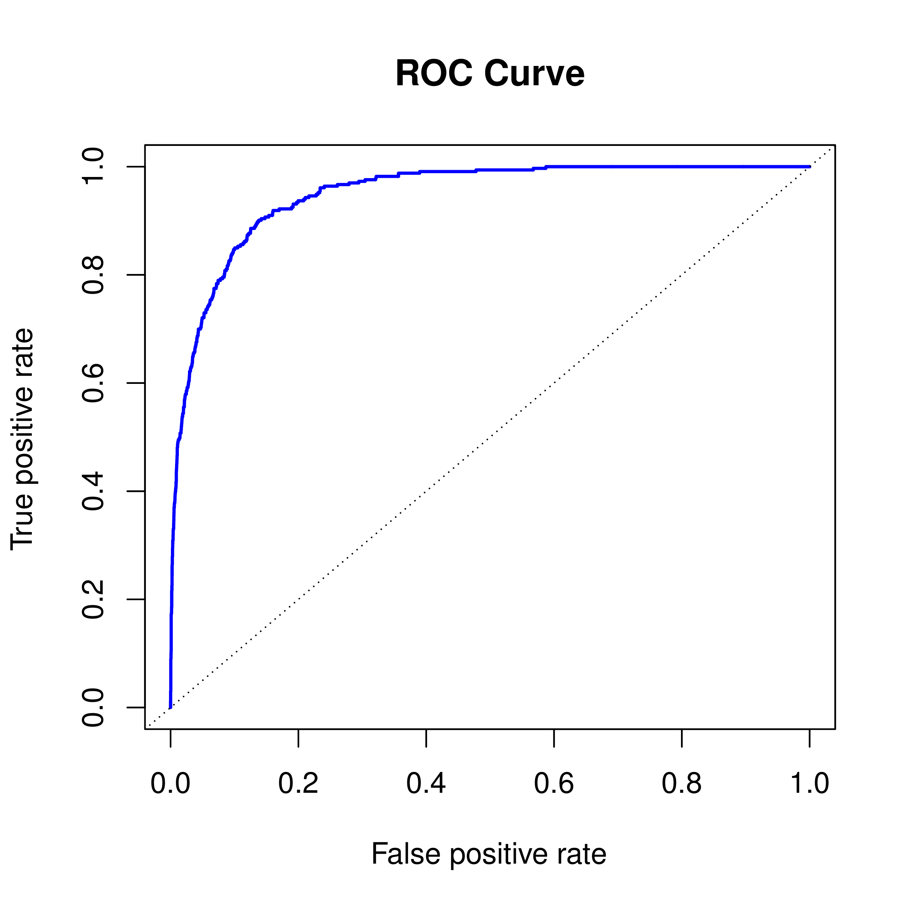
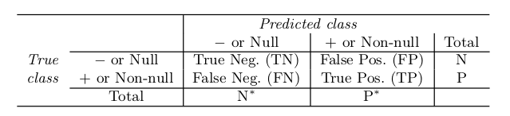
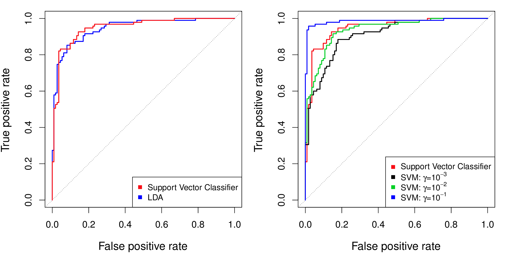
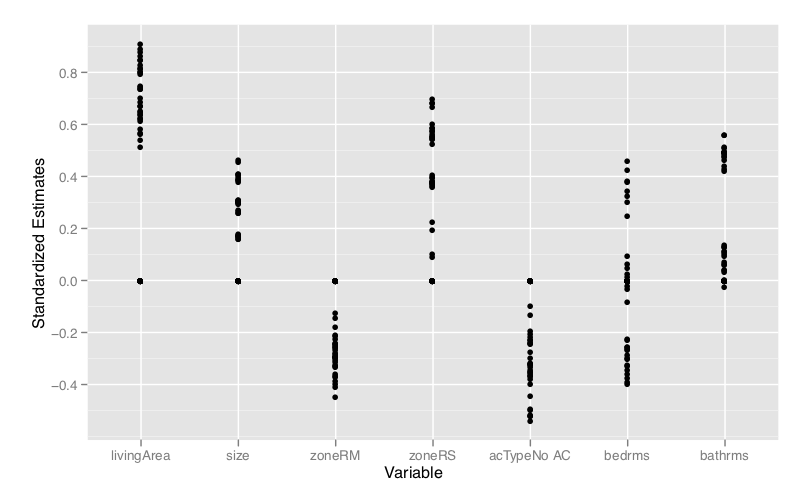
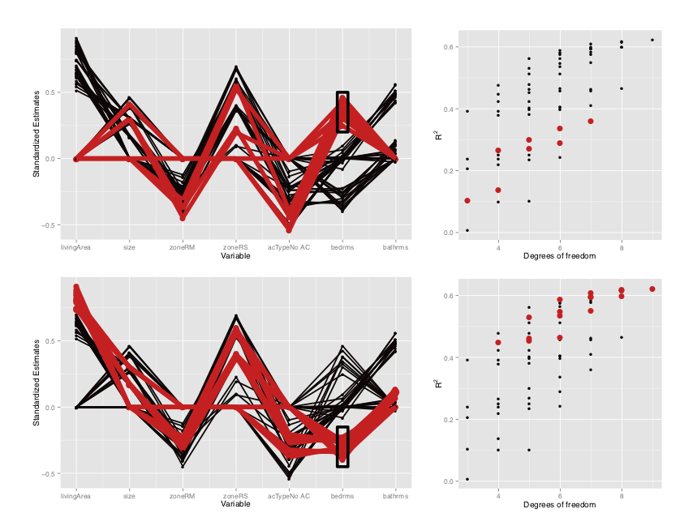

```{r setup, include=FALSE}
library(knitr)
knitr::opts_chunk$set(tidy = FALSE, 
                      message = FALSE,
                      warning = FALSE,
                      echo = FALSE, 
                      out.width = "100%",
                      fig.width=8,
                      fig.height=6,
                      fig.align = "center",
                      fig.retina = 2)
options(htmltools.dir.version = FALSE)
library(magick)
```


class: split-30
layout: true

.column[.pad10px[
## Outline

- Getting started

]]
.column[.top50px[

.split-two[
.row[.content[
```{r echo=TRUE}
library(statquotes)
search_quotes(search="Holdane", fuzzy=TRUE)
```
]]
.row[.content[
<br>
<br>

```{r echo=TRUE}
statquote(source="Box")
```
]]]
]]

---

class: fade-row2
count: false

---

count: false 


---
layout: true
class: shuriken-full white 

.blade1.bg-green[.content[
.white.font_large[Know your data.] `r set.seed(1);emo::ji("airplane")`<br>Quantitative or qualitative response?  Predictors all quantitative? Do you have independent observations? 
]]
.blade2.bg-purple[.content[
.white.font_large[Plot your data.] `r set.seed(1);emo::ji("painting")`<br>Is there a relationship between response and predictors?  Is the relationship linear? Are boundaries linear?Is variability heterogeneous? Are groups distinct? Are there unusual observations? 
]]
.blade3.bg-deep-orange[.content[
.white.font_large[Check for missing values.] `r set.seed(1);emo::ji("tool")`<br>Do some variables have too many missings to use them? Do some observations have too many missings to use them? What would be a useful imputation method to fix the sporadic missing value? 
]]
.blade4.bg-pink[.content[
.white.font_large[Fit a versatile model.] `r set.seed(1);emo::ji("computer")` <br>Compute and plot model diagnostics Where doesn't the model do well? How can it be refined? 
]]

---

class: hide-blade2 hide-blade3 hide-blade4 hide-hole

---

class: hide-blade3 hide-blade4 hide-hole
count: false

---

class: hide-blade4 hide-hole
count: false

---

class: hide-hole
count: false

---

count: false 

---

class: split-30
layout: false

.column[.pad10px[
## Outline

- [Getting started](#2)
- .orange[Comparing fits]
    - ROC for classification

]]
.column[.top50px[
The .orange[ROC curve] is a popular graphic for simultaneously displaying the two types of errors for all possible thresholds. It is a common method for comparing classification models. 

```{r}
if (!file.exists("images/4.8.png"))
  image_write(image_read("http://www-bcf.usc.edu/~gareth/ISL/Chapter4/4.8.pdf", density = 300), "images/4.8.png", 
      format = "png", density = 300)
```

<a href="http://www-bcf.usc.edu/~gareth/ISL/Chapter4/4.8.pdf" target="_BLANK">  </a>

ROC curve for the LDA classifier on the training set of CREDIT data. 

.font_tiny[Fig 4.8]

]]

---

class: split-50
layout: false

.column[.pad10px[

<a href="http://www-bcf.usc.edu/~gareth/ISL/Chapter4/4.8.pdf" target="_BLANK">  </a>


]]
.column[.top50px[


The true positive rate is the .orange[sensitivity]: the fraction of defaulters that are correctly identified, using a given threshold value. 

The false positive rate is .orange[1-specificity]: the fraction of non-defaulters that we classify incorrectly as defaulters, using that same threshold value.

The dotted line is "no information" classifier; class and predictor are not associated.

The .orange[ideal ROC curve hugs the top left corner], indicating a high true positive rate and a low false positive rate.

]]

---
class: split-two
layout: false

.row[
Possible outcomes with a two class classification model:



]
.row[
.split-50[
.column[.pad50px[
`+` .orange[has disease] (class = 1 or "P")

`-` does .orange[NOT] have disease (class = 0 or "N")

True = we get it .orange[right]

False = we got it .orange[wrong] 
]]
.column[.pad50px[

.orange[False positive rate] = FP/N, also known as Type I error or 1-specificity

.orange[True positive rate] = TP/P, also known as power, sensitivity, recall
]]
]]
---
class: split-50
layout: false

.column[.pad10px[

<a href="http://www-bcf.usc.edu/~gareth/ISL/Chapter4/4.8.pdf" target="_BLANK">  </a>

]]
.column[.pad10px[
```{r}
library(anicon)
nia(text=".orange[How do we calculate different TPR/FPR?]", , animate="shake", speed="slow", flip="horizontal")
```

If the classifier returns a prediction between 0 and 1, interpret as the probability of a positive, then threshold this at different values, e.g. 0.1, 0.2, 0.3, 0.4, 0.5, ...

]]
---
class: split-30
layout: false

.column[.pad10px[
## Outline

- [Getting started](#2)
- .orage[Comparing fits]
    - ROC for classification


]]
.column[.top50px[

```{r}
library(magick)
if (!file.exists("images/9.10.png"))
  image_write(image_read("http://www-bcf.usc.edu/~gareth/ISL/Chapter9/9.10.pdf", density = 300), "images/9.10.png", 
      format = "png", density = 300)
```

<a href="http://www-bcf.usc.edu/~gareth/ISL/Chapter9/9.10.pdf" target="_BLANK">  </a>

(left) LDA and SVM similar.

(right) SVM radial basis with $\gamma=10^{-1}$ is the best. 

.font_tiny[Fig 9.10]
]]
---

class: split-30
layout: false

.column[.pad10px[
## Outline

- [Getting started](#2)
- [Comparing fits](#3)
- .orange[Outliers]
    - Multivariate outliers


]]
.column[.top50px[

.orange[Mahalanobis distance] measures the distance from the mean, relative to the variance-covariance matrix, and is useful for .orange[outlier detection]: $D^2 = (X-\mu)'\Sigma^{-1}(X-\mu)$

```{r fig.width=8, fig.height=4, out.width="100%", results='hide'}
library(tidyverse)
library(ISLR)
library(broom)
library(mvtnorm)
library(gridExtra)
set.seed(20190505)
x <- rmvnorm(500, mean=rep(0,2), sigma = matrix(c(1,-0.8, -0.8, 1), ncol=2, byrow=TRUE))
df <- as_tibble(x) %>% bind_rows(tibble(V1=2, V2=2))
p1 <- ggplot(df, aes(x=V1, y=V2)) + geom_point() +
  annotate("text", 2.3, 2.2, label="outlier", colour="orange") +
  annotate("point", 2, 2, colour="orange") +
  coord_equal()
df <- df %>% mutate(mah=mahalanobis(df[,1:2], center=c(0,0), cov=cov(df)))
p2 <- ggplot(df, aes(x=mah)) + geom_histogram() + 
  xlab("Mahalanobis distance") +
  annotate("text", 33, 10, label="outlier", colour="orange") 
grid.arrange(p1, p2, ncol=2)
```

Related to "leverage" in regression diagnostics.

]]

---

class: split-30
layout: false

.column[.pad10px[
## Outline

- [Getting started](#2)
- [Comparing fits](#3)
- .orange[Outliers]
    - Multivariate outliers
    - Influential observations


]]
.column[.top50px[

.orange[Cook's distance] measures the change in the model estimates due to the observation: $D_i = \frac{e_i^2}{MSE\times p}\frac{h_i}{(1-h_i)^2}$ where $h_i$ is the leverage of observation $i$. 

```{r fig.width=8, fig.height=4, out.width="90%", results='hide'}
set.seed(20190505)
x <- rmvnorm(500, mean=rep(0,2), sigma = matrix(c(1,-0.8, -0.8, 1), ncol=2, byrow=TRUE))
df <- as_tibble(x) %>% bind_rows(tibble(V1=5, V2=2))
p1 <- ggplot(df, aes(x=V1, y=V2)) + geom_point() +
  annotate("text", 4.5, 2.2, label="influential", colour="orange") +
  annotate("point", 5, 2, colour="orange") 
fit <- lm(V2~V1, data=df)
df <- augment(fit, df)
p2 <- ggplot(df, aes(x=.cooksd)) + geom_histogram() + 
  xlab("Cooks distance") +
  annotate("text", 1.7, 15, label="influential", colour="orange") 
grid.arrange(p1, p2, ncol=2)
```

Developed by Dennis Cook, University of Minnesota. 
]]

---

class: split-30
layout: false

.column[.pad10px[
## Outline

- [Getting started](#2)
- [Comparing fits](#3)
- .orange[Outliers]
    - Multivariate outliers
    - Influential observations
    - Utilising bagging


]]
.column[.top50px[

Remember vote matrix available from random forests:

$$V = (V_1  V_2 ... V_K) \\
  = \left[ \begin{eqnarray*}
                          p_{11} & p_{12} & ... & p_{1K}\\
                          p_{21} & p_{22} & ... & p_{2K}\\
                          ...   &  ...    &     & ...\\
                          p_{n1} & p_{n2} & ... & p_{nK}
                          \end{eqnarray*} \right]$$

With bagging, multiple out of bag predictions produces uncertainty measure for each observation. Its possible that observations with .orange[higher uncertainty are outliers].

]]

---

class: split-30
layout: false

.column[.pad10px[
## Outline

- [Getting started](#2)
- [Comparing fits](#3)
- [Outliers](#8)
- .orange[Important variables]


]]
.column[.top50px[

.orange[Variable importance]

- Working with .orange[standardised variables] helps, because magnitude of coefficients is then directly interpreted as importance
- .orange[Permutation] approach in random forests is useful more broadly. Compare magnitude of coefficients between models built on original and permuted variable.
- .orange[Effect of one predictor with the response] can depend on their relationship with one another. Called multicollinearity in regression. 

]]

---
layout: false

.orange[All possible model fits] to housing data with 7 variables, from [Wickham et al (2015) Removing the Blindfold](http://onlinelibrary.wiley.com/doi/10.1002/sam.11271/abstract)


---
class: split-60
layout: false

.column[.pad10px[

]]
.column[.pad10px[
.font_small[Three typical estimates for bedrooms: big positive, close to 0, big negative.] 

.font_small[Models with big .orange[positive coefficients] for bedrooms tend to have .orange[weaker fits]. They tend to occur with models that have no livingArea contribution, and more negative coefficients for zoneRM, and no air con.]

.font_small[Models with big .orange[negative coefficients] on bedrooms tend to have .orange[stronger fits]. All contrast with livingArea (high positive coefficients).]

.font_small[If bedrooms contribute to the model, bathrooms do not.]

]]

---

class: split-30
layout: false

.column[.pad10px[
## Outline

- [Getting started](#2)
- [Comparing fits](#3)
- [Outliers](#8)
- [Important variables](#11)
- .orange[Model choice - robustness of conclusions]


]]
.column[.top50px[

Whatever way you model the data, the .orange[interpretations should be consistent]. 

- Bias can explain difference in predictions between models, flexible vs inflexible can provide a spectrum on what the data predicts.
- Broad changes in a model when some cases or some variables are not used, should evoke suspicions (your "spidey sense"). 
- Model fit statistics are a measure of predictive power. A weak model can still be useful if there is a large cost involved.  

]]
---

layout: false
# `r set.seed(2019); emo::ji("technologist")` Made by a human with a computer

### Slides at [https://monba.dicook.org](https://monba.dicook.org).
### Code and data at [https://github.com/dicook/Business_Analytics](https://github.com/dicook/Business_Analytics).
<br>

### Created using [R Markdown](https://rmarkdown.rstudio.com) with flair by [**xaringan**](https://github.com/yihui/xaringan), and [**kunoichi** (female ninja) style](https://github.com/emitanaka/ninja-theme).

<br> 
<a rel="license" href="http://creativecommons.org/licenses/by-sa/4.0/"></a><br />This work is licensed under a <a rel="license" href="http://creativecommons.org/licenses/by-sa/4.0/">Creative Commons Attribution-ShareAlike 4.0 International License</a>.
