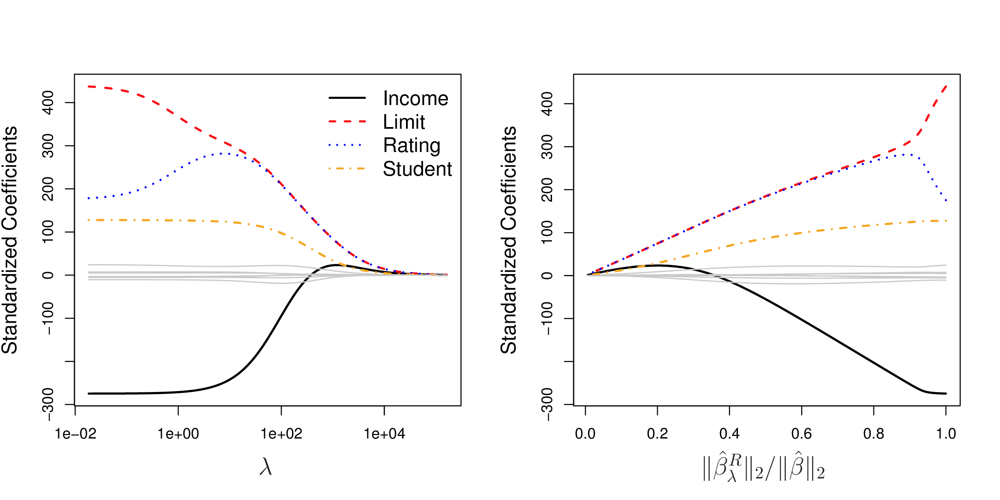
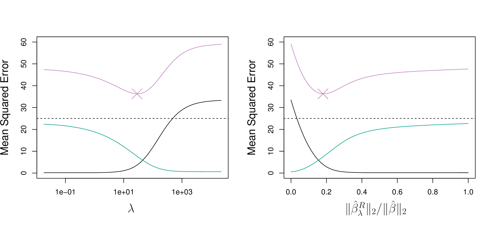
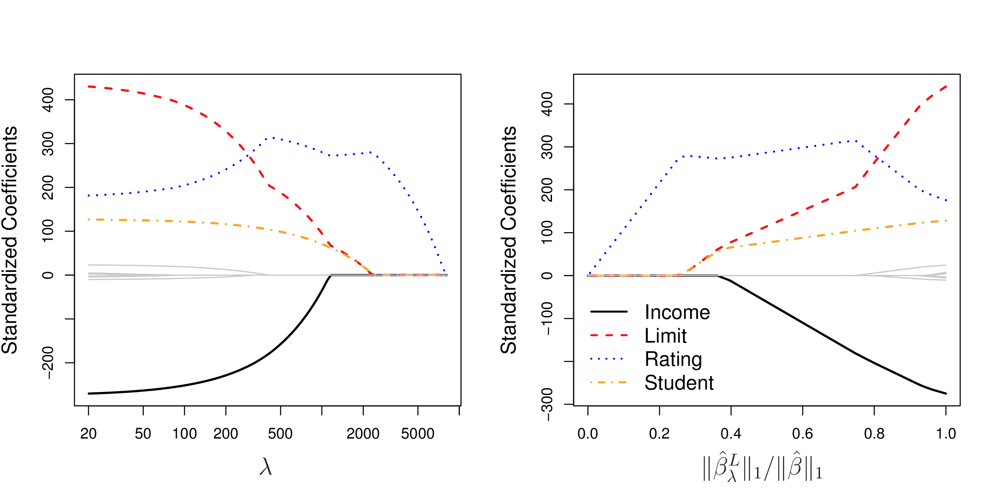
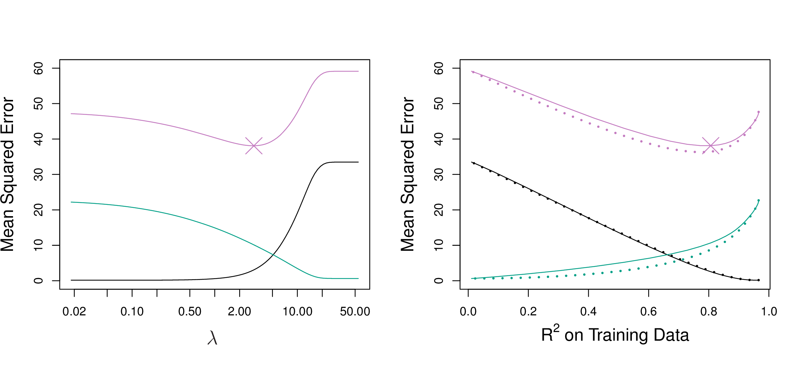
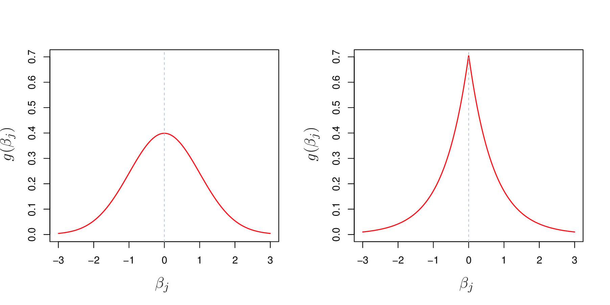
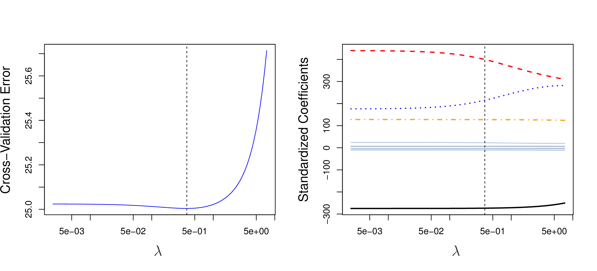
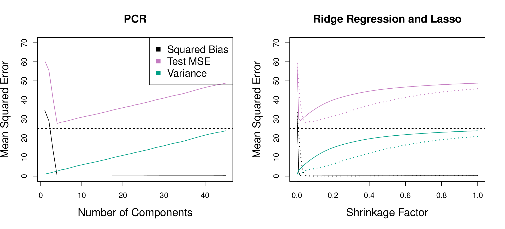
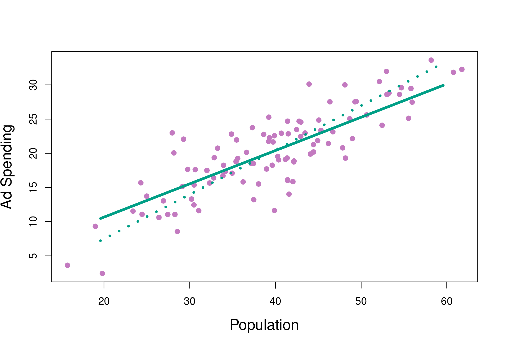

```{r setup, include=FALSE}
library(knitr)
knitr::opts_chunk$set(tidy = FALSE, 
                      message = FALSE,
                      warning = FALSE,
                      echo = FALSE, 
                      fig.width=8,
                      fig.height=6,
                      fig.align = "center",
                      fig.retina = 2)
options(htmltools.dir.version = FALSE)
library(magick)
```


class: split-30
layout: false

.column[.pad10px[
## Outline

- .orange[Shrinkage methods]


]]
.column[.top50px[

<br>


.orange[Shrinkage methods] fit a model containing all $p$ predictors using a technique that constrains or regularizes the coefficient estimates, or equivalently, that .orange[shrinks some of the coefficient estimates towards zero].

<br>
.boxshadow[There are two main methods: .orange[ridge] regression and .orange[lasso].]

]]

---

class: split-30
layout: false

.column[.pad10px[
## Outline

- Shrinkage Methods
    - Ridge regression


]]

.column[.top50px[

\begin{align*}
	& \mbox{RSS} =  \sum_{i = 1}^n \left(y_i - \beta_0 - \sum_{j = 1}^p \beta_j x_{ij} \right)^2 
\end{align*}

Least squares: 

\begin{align*}
	& \underset{{\beta}}{\text{minimize}} \mbox{ RSS}
\end{align*}

.orange[Ridge] regression: 

\begin{align*}
	& \underset{{\beta}}{\text{minimize}} \mbox{ RSS} \color{orange}{+ \lambda \sum_{j=1}^p \beta_j^2}
\end{align*}
where $\lambda \geq 0$ is a tuning parameter.

]]
---
class: split-30
layout: false

.column[.pad10px[
## Outline

- Shrinkage Methods
    - Ridge regression


]]
.column[.top50px[

$$\lambda \sum_{j=1}^p \beta_j^2$$ 
is called a .orange[shrinkage penalty]. It is small when $\beta_1, ..., \beta_p$ are close to 0.

$\lambda$ serves as a .orange[tuning parameter], controlling the relative impact of these two terms on the regression coefficient estimates. When it is 0, the penalty term has no effect on the fit. 

Ridge regression will produce a .orange[different set of coefficients] for each $\lambda$, call them $\hat{\beta}_{\lambda}^R$. Tuning $\lambda$, typically by cross-validation, is critical component of fitting the model. 
]]

---
class: split-60
layout: false

.column[.pad10px[
Standardized ridge regression coefficients for the Credit data set. 

```{r}
library(magick)
if (!file.exists("images/6.4.png"))
  image_write(image_read("http://www-bcf.usc.edu/~gareth/ISL/Chapter6/6.4.pdf", density = 300), "images/6.4.png", 
      format = "png", density = 300)
```

<a href="http://www-bcf.usc.edu/~gareth/ISL/Chapter6/6.4.pdf" target="_BLANK">  </a>

.font_tiny[(Chapter6/6.4.pdf)]

```{r}
library(ISLR)
data(Credit)
```
]]
.column[.top50px[

- $p=10$
- Left side of plot corresponds to least squares.
- When $\lambda$ is extremely large, then all of the ridge coefficient estimates are basically zero, which is the null model.
- 4 of 10 variables have larger coefficients, and one, Rating, initially increases with $\lambda$. 
- Right-side plot, $x$-axis indicates amount the coefficients shrink to 0, value of 1 indicates LS.
]]


---
class: split-50
layout: false

.column[.pad10px[

The scale of variables can affect ridge regression performance.

```{r}
library(anicon)

nia(text=".orange[It is important to standardise the scale of predictors prior to ridge regression.]", , animate="shake", speed="slow", flip="horizontal")
```


$$\tilde{x}_{ij} = \frac{x_{ij}}{\sigma_{x_{j}}}$$
]]
.column[.pad10px[

Simulation scenario! Ridge regression improves on least squares, for large number of variables, in the bias-variance tradeoff. It .orange[sacrifices some bias] for the benefit of .orange[decreased variance].  

```{r}
if (!file.exists("images/6.5.png"))
  image_write(image_read("http://www-bcf.usc.edu/~gareth/ISL/Chapter6/6.5.pdf", density = 300), "images/6.5.png", 
      format = "png", density = 300)
```

<a href="http://www-bcf.usc.edu/~gareth/ISL/Chapter6/6.5.pdf" target="_BLANK">  </a>

.black[bias]
.green[variance]
.purple[test error]


.font_tiny[(Chapter6/6.5.pdf)]

]]
---
class: split-30
layout: false

.column[.pad10px[
## Outline

- Shrinkage Methods
    - [Ridge regression](#3)
    - Lasso


]]
.column[.top50px[

Ridge regression: 

\begin{align*}
	& \underset{{\beta}}{\text{minimize}} \mbox{ RSS} + \lambda \sum_{j=1}^p \beta_j^2
\end{align*}

.orange[Lasso]:

\begin{align*}
	& \underset{{\beta}}{\text{minimize}} \mbox{ RSS} + \lambda \sum_{j=1}^p \color{orange}{|\beta_j|}
\end{align*}

and same $\lambda \geq 0$ is a tuning parameter.

]]

---
class: split-60
layout: false

.column[.pad10px[
Standardized lasso coefficients for the Credit data set. 

```{r}
library(magick)
if (!file.exists("images/6.6.png"))
  image_write(image_read("http://www-bcf.usc.edu/~gareth/ISL/Chapter6/6.6.pdf", density = 300), "images/6.6.png", 
      format = "png", density = 300)
```

<a href="http://www-bcf.usc.edu/~gareth/ISL/Chapter6/6.6.pdf" target="_BLANK">  </a>

.font_tiny[(Chapter6/6.6.pdf)]

```{r}
library(ISLR)
data(Credit)
```
]]
.column[.top50px[

- $p=10$
- Has the effect of forcing some variables exactly to 0.
- Cleaner solution than ridge regression.
]]

---

Simulation scenario! Bias-variance tradeoff with lasso, and comparison against ridge regression.

```{r}
if (!file.exists("images/6.8.png"))
  image_write(image_read("http://www-bcf.usc.edu/~gareth/ISL/Chapter6/6.8.pdf", density = 300), "images/6.8.png", 
      format = "png", density = 300)
```

<a href="http://www-bcf.usc.edu/~gareth/ISL/Chapter6/6.8.pdf" target="_BLANK">  </a>

.black[bias]
.green[variance]
.purple[test error]


.font_tiny[(Chapter6/6.5.pdf)]


---
class: split-50
layout: false

.column[.pad10px[
.orange[Bayesian] interpretation:  Ridge regression is the posterior mode for $\beta$ under a Gaussian prior (left);  The lasso is the posterior mode for $\beta$ under a double-exponential prior (right).

```{r}
if (!file.exists("images/6.11.png"))
  image_write(image_read("http://www-bcf.usc.edu/~gareth/ISL/Chapter6/6.11.pdf", density = 300), "images/6.11.png", 
      format = "png", density = 300)
```

<a href="http://www-bcf.usc.edu/~gareth/ISL/Chapter6/6.11.pdf" target="_BLANK">  </a>

.font_tiny[(Chapter6/6.11.pdf)]

]]
.column[.pad10px[

.orange[Cross-validation] on the Credit example, yields a suggestion to use $\lambda=0.5$ for ridge regression model.

```{r}
if (!file.exists("images/6.12.png"))
  image_write(image_read("http://www-bcf.usc.edu/~gareth/ISL/Chapter6/6.12.pdf", density = 300), "images/6.12.png", 
      format = "png", density = 300)
```

<a href="http://www-bcf.usc.edu/~gareth/ISL/Chapter6/6.12.pdf" target="_BLANK">  </a>

.font_tiny[(Chapter6/6.12.pdf)]

]]

---
class: split-30
layout: false

.column[.pad10px[
## Outline

- .orange[Shrinkage methods]
    - [Ridge regression](#3)
    - [Lasso](#7)
    - Penalised LDA


]]
.column[.top50px[

Recall: LDA involves the eigen decomposition of $\color{orange}{\Sigma^{-1}\Sigma_B}$, where

$$\Sigma_B = \frac{1}{K}\sum_{i=1}^{K} (\mu_i-\mu)(\mu_i-\mu)'$$

$$\Sigma = \frac{1}{n} \sum_{i=1}^{n} (x_i-\mu_i)(x_i-\mu_i)'$$

The eigen-decomposition is an analytical solution to a sequential optimisation problem: 


\begin{align*}
& \underset{{\beta_k}}{\text{maximize}} \beta_k^T\hat{\Sigma}_B \beta_k \\
& \mbox{ subject to  }  \beta_k^T\hat{\Sigma} \beta_k \leq 1, \beta_k^T\hat{\Sigma}\beta_j = 0 \mbox{  } \forall i<k
\end{align*}
]]

---
class: split-30
layout: false

.column[.pad10px[
## Outline

- .orange[Shrinkage methods]
    - [Ridge regression](#3)
    - [Lasso](#7)
    - Penalised LDA


]]
.column[.top50px[

The problem is inverting $\color{orange}{\Sigma^{-1}}$, fix it by

\begin{align*}
& \underset{{\beta_k}}{\text{maximize}} \left(\beta_k^T\hat{\Sigma}_B \beta_k + \lambda_k \sum_{j=1}^p |\hat{\sigma}_j\beta_{kj}|\right)\\
& \mbox{ subject to  }  \beta_k^T\tilde{\Sigma} \beta_k \leq 1
\end{align*}

where $\hat{\sigma}_j$ is the within-class standard deviation for variable $j$. This is 
.orange[penalised LDA], and see [reference](https://faculty.washington.edu/dwitten/Papers/JRSSBPenLDA.pdf), and the [R package](https://cran.r-project.org/web/packages/penalizedLDA/index.html). 

```{r}
library(penalizedLDA)
```

]]

---
class: split-30
layout: false

.column[.pad10px[
## Outline

- .orange[Shrinkage methods]
    - [Ridge regression](#3)
    - [Lasso](#7)
    - [Penalised LDA](#11)
    - PDA Index


]]
.column[.top50px[

Penalised LDA projection pursuit index. Available in the `tourr` package. 

\begin{align*}
I_{PDA}(A,\lambda) =
1-\frac{\Big|A'\big\{(1-\lambda)\hat{\Sigma}+n\lambda I_p\big\}A\Big|} {\Big|A'\big\{(1-\lambda)(\hat{\Sigma}_B +\hat{\Sigma})+n\lambda I_p\big\} A\Big|}
\end{align*}

Optimising this function over $p\times d$ projection matrix $A$. 

```{r}
library(tourr)
```

]]

---
class: split-30
layout: false

.column[.pad10px[
## Outline

- [Shrinkage methods](#2)
- Dimension reduction
    - Principal component regression


]]
.column[.top50px[

The .orange[principal components regression (PCR)] approach involves constructing the first $M$ principal components, $Z_1, ..., Z_M$, and then using these components as the predictors in a linear regression model, that is fit using least squares.

]]
---

PCR, ridge regression, and the lasso compared on simulated data. PCR does well when the response is related to few PCs. 

```{r}
if (!file.exists("images/6.19.png"))
  image_write(image_read("http://www-bcf.usc.edu/~gareth/ISL/Chapter6/6.19.pdf", density = 300), "images/6.19.png", 
      format = "png", density = 300)
```

<a href="http://www-bcf.usc.edu/~gareth/ISL/Chapter6/6.19.pdf" target="_BLANK">  </a>

.black[bias]
.green[variance]
.purple[test error]

.font_tiny[(Chapter6/6.19.pdf)]

---
class: split-30
layout: false

.column[.pad10px[
## Outline

- [Shrinkage methods](#2)
- Dimension reduction
    - Principal component regression
    - Partial least squares


]]
.column[.top50px[

.orange[Partial least squares (PLS)], a supervised alternative to PCR. 

```{r}
if (!file.exists("images/6.21.png"))
  image_write(image_read("http://www-bcf.usc.edu/~gareth/ISL/Chapter6/6.21.pdf", density = 300), "images/6.21.png", 
      format = "png", density = 300)
```

<a href="http://www-bcf.usc.edu/~gareth/ISL/Chapter6/6.21.pdf" target="_BLANK">  </a>

Two predictors are shown: .green[Solid line is PLS], dashed line is PCR. 


]]
---
class: split-30
layout: false

.column[.pad10px[
## Outline

- [Shrinkage methods](#2)
- Dimension reduction
    - Principal component regression
    - Partial least squares


]]
.column[.top50px[

1. .orange[Standardise] all variables
2. Find $Z_1=\phi_{1j}X_j$ by setting $\phi_{1j}$ to be the coefficient from a .orange[simple linear regression] model $Y$ ~ $X_j$.
3. To find $Z_2$, first regress each variable on $Z_1$ and use the .orange[residuals], call these $X^r_j$. Then find $Z_2 = \phi_{2j}X^r_j$ by setting $\phi_{2j}$ to be the coefficient from a simple linear regression model $Y$ ~ $X^r_j$.
4. Repeat steps 2-3 until we have $Z_1, ..., Z_M$. 

Final model fitted for $Y$ using $Z_1, ..., Z_M$.

Performance is no better than ridge regression or PCR. Can reduce bias, has potential to increase variance. .orange[PLS is similar to partial regression], where new variables are first regressed on predictors that are already in the model, and it is the residuals that are used.

]]
---

layout: false
# `r set.seed(2019); emo::ji("technologist")` Made by a human with a computer

### Slides at [https://monba.dicook.org](https://monba.dicook.org).
### Code and data at [https://github.com/dicook/Business_Analytics](https://github.com/dicook/Business_Analytics).
<br>

### Created using [R Markdown](https://rmarkdown.rstudio.com) with flair by [**xaringan**](https://github.com/yihui/xaringan), and [**kunoichi** (female ninja) style](https://github.com/emitanaka/ninja-theme).

<br> 
<a rel="license" href="http://creativecommons.org/licenses/by-sa/4.0/"></a><br />This work is licensed under a <a rel="license" href="http://creativecommons.org/licenses/by-sa/4.0/">Creative Commons Attribution-ShareAlike 4.0 International License</a>.
