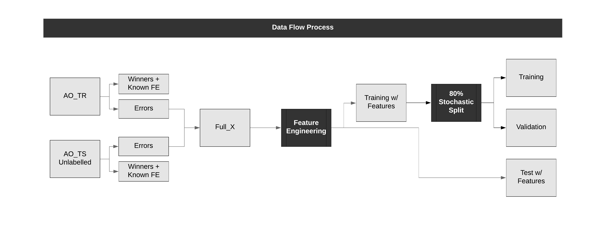
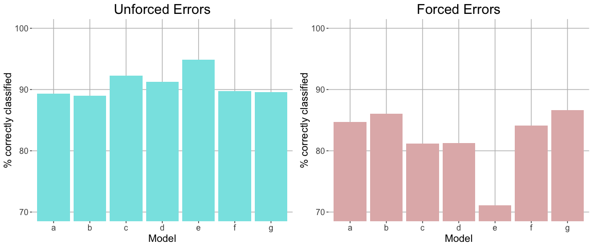

class: top, left

## Methodology

### Our methodology consisted of the following steps:

#### 1. Data Cleaning and Extracting Winners 
  It was possible to deduce all observations that are winners, according to the following cases: <br>
  - ‘rally’ is an odd number AND ‘serverwon’ is TRUE, OR
  - ‘rally’ is an even number AND ‘serverwon’ is FALSE. <br>
  
Where the remaining outcomes were either forced or unforced errors**. 

#### 2. Feature Engineering:
  - Dimensionality Reduction 
  - Temporal Feature Engineering 
  - Manual Feature Engineering 

---

class: top, left

### Manual Feature Engineering 

```{r include=FALSE}
library(tidyverse)
library(ggpubr)
load("ao_training.rda")

ao_tr$winner<-((ao_tr$rally %% 2 == 0)*(ao_tr$serverwon == FALSE)) + 
  ((ao_tr$rally %% 2 != 0)*(ao_tr$serverwon == TRUE))
ao_tr_error<- ao_tr %>% filter(as.numeric(outcome)!=3)
```

```{r echo=FALSE, out.width=800, fig.height=5, fig.retina = 3}

g1 <- ggplot(data = data.frame(ao_tr_error)) +
  aes(x = depth, fill = outcome) +
  geom_density(adjust = 1,alpha=0.5) +
  theme_minimal() +
  ggtitle("PDF for Depth of Shot") +
  xlab("Depth (m)") +
  ylab("Density")

g2 <- ggplot(data = data.frame(ao_tr_error)) +
  aes(x = speed, fill = outcome) +
  geom_density(adjust = 1, alpha=0.5) +
  theme_minimal() +
  ggtitle("PDF for Speed of Shot") +
  xlab("Speed (km/h)") +
  ylab("Density")

ggarrange(g1, g2, ncol=2, common.legend = TRUE)

```


---

class: top, left

### 3. Ensemble Modelling 

- A series of 12 first level models with different architectures or features were created, of which 7 models were selected and predictions from each model were ensembled, primarily to assist with marginal cases that single models tended to misclassify.


### 4. Data Processing 



---

class: top, left
## Modelling - Neural Nets

## Result
- Model G achieved a validation accuracy of `0.882` and an average score of `0.93007` cross the public and private leader boards

