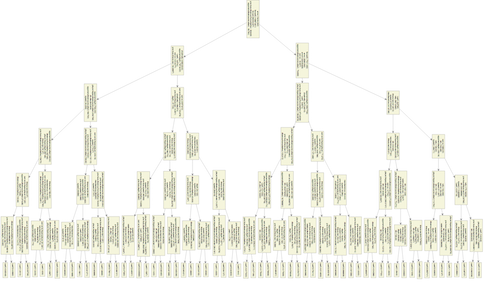
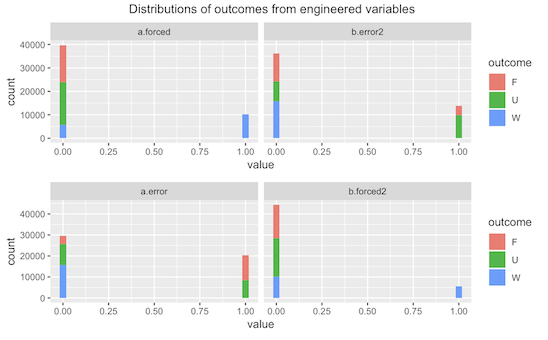
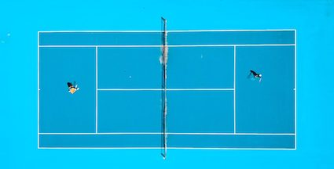

```{r setup, include=FALSE}
knitr::opts_chunk$set(
  message = FALSE,
  warning = FALSE,
  collapse = TRUE,
  echo=FALSE,
  comment = "",
  fig.height = 4,
  fig.width = 8,
  fig.align = "center",
  cache = FALSE
)

```

```{r}
## Loading the libraries
library(ggplot2)
library(ggthemes)
library(stringr)
library(broom)
library(tidyverse)
library(randomForest)
library(caret)
library(RColorBrewer)
library(GGally)
library(plotly)
library(tourr)
library(rpart)
library(rpart.plot)
library(MASS)
library(caret)
library(xgboost)
library(gbm)
library(class)
library(neuralnet)
library(BBmisc)
library(gmodels)
library(kableExtra)
# library(giphyr)


```


# Overview

<big>
1. Introduction
2. Model Selection
3. Feature Engineering
4. Q&A
<big>

---

# Introduction

<small>The main focus of our project was to determine if we can automate the classification system of a tennis point outcome. The tennis data had the following characteristics:

- Multi-class classification problem
- Near-balanced classes (0.317, 0.366, 0.316)
- Data was retrieved from a high speed camera with its own errors

Steps to improve model:

- Model selection
- Feature engineering 

.center[]


---

# Model Selection: General

The following steps were made to choose the final model:

- Splitting into train and test data
- Transformation of variables (standardisation)
- Parameter sweeping for each model via greedy method

Models that were chosen:

- Random Forest (baseline)
- XGBoost
- Neural Network
- KNN

```{r}
df <- tibble(Algorithm = c("Random Forest", "XGBoost", "Neural Network", "KNN"), "Classification Accuracy" = c(0.908, 0.918, 0.9, 0.8))

df %>%
  kable()


```


---

# Model Selection: XGBoost

Final outcome:

- XGBoost was the chosen model
- Optimised parameters were chosen for XGBoost 
- Cross validation of entire original training data set

Advantages:
- Regularisation
- Interpretability
- Efficiency

.center[]
---

# Feature Engineering


```{r}
x<-tibble(`Server Won ` = c('Winner', 'Forced / Unforced Error' ), `Server Lost` = c('Forced/ Unforced Error', 'Winner'))
rownames(x)<- c('Player Was Server', 'Player Not Server')
x %>% kable()
```

.center[]


---

# Feature Engineering
<small>
The assumption here is that being closer to the net relative to your opponent is a better position.

- Closer -> more likely leading to a winning point outcome. 
- Further -> more likely to result in a forced error.

$$ d = opponent.depth - player.impact.depth$$

$$
div.dist=
\begin{cases}
{d\over opponent.depth+1}, \ \ for \ d > 0\\
{d\over player.impact.depth+1}, \ \ for \ d < 0\\
0, \ \ for \ d = 0
\end{cases}
$$
<small>
.center[]

---


# Thank you


.center[]
