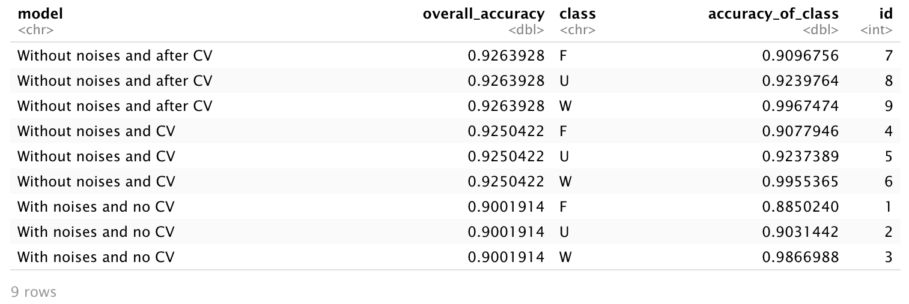

```{r setup, include=FALSE}
library(knitr)
knitr::opts_chunk$set(tidy = FALSE, 
                      message = FALSE,
                      warning = FALSE,
                      echo = FALSE)
options(htmltools.dir.version = FALSE)
```


.deep-purple[
# Methodology
]

.font1[
- We chose to use .green[XGboost] because it utilises gradient boosting which combines the least impactful variables together in order to make them more relevant to the model.

- Compared to the benchmark random forest model, XGboost will recursively produce trees that correct errors from past trees. Something the random forest method does not do.

- This means a lower Mean Squared Error and higher accuracy for our model, given we take out noise to prevent overfitting.
]

.img-fill[]
---

class: split-two with-border border-black hide-row3-col1 hide-row4-col1


.column.bg-main1[
  .split-four[
  .row.bg-main1[.font_large[.content[
    *Step 1* :  Reading the training data and it's outcomes.
  ]]]
  .row.bg-main2[.font_large[.content[
    *Step 2* :  Analysing the variable importance, transforming variables, and removing noise variables.
  ]]]
  .row.bg-main3[.font_large[.content[
    *Step 3* :  Building a gradient boosting model using the XGboost package
  ]]]
  .row.bg-main4[.font_large[.content[
    *Step 4* : Tuning parameters through cross-validation in order to prevent overfitting variables
  ]]]
]]
.column.bg-main1[
  .split-two[
  .row.bg-main1[.content[

<br> .font1[ .green[Confusion Matrix]]
]]
  .row.bg-main2[.content[

<br> .font1[ .green[Variable Importance after removing noises and cross validation]]
]]]]

---


.deep-purple[
# Results
]

.font2[
- The final model produced a prediction accuracy of .deep-orange[0.92691] on 50% of the testing data, and .deep-orange[0.92499] on the final 50% of the testing data. 

- There isn't a huge disparity between both accuracy rates indicating we have a stable model

- This is a improvement of .green[over 3%] compared to the benchmark model of 89%. 

]

---

.deep-purple[
# Improvements & Conclusion
]

.font2[
- Drastically improved precision of predicting each outcome, finally achieving .deep-orange[99.7%] precision for predicting winning shots, .deep-orange[91%] for forced errors, and .deep-orange[92.4%] for unforced errors

- With enough testing, further research into the individual variables, or using other methods such as neural networks, the accuracy could definitely reach above 95%, and automation of coding points would be achievable. 
]